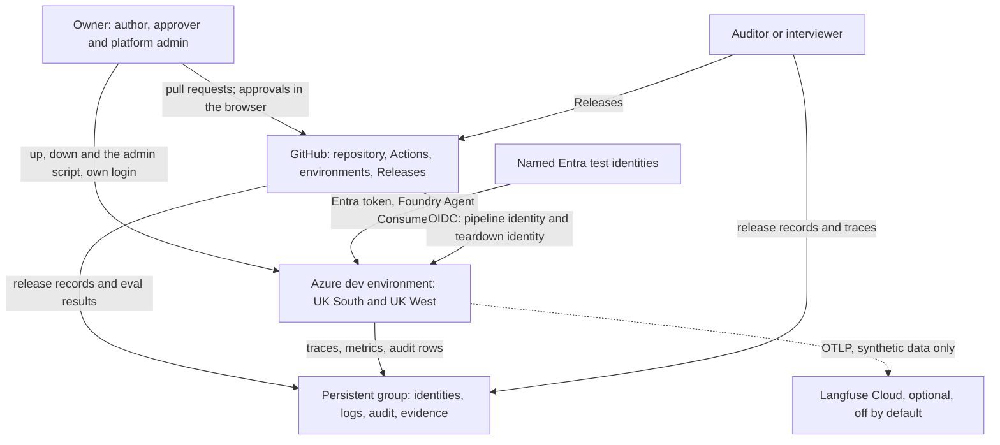
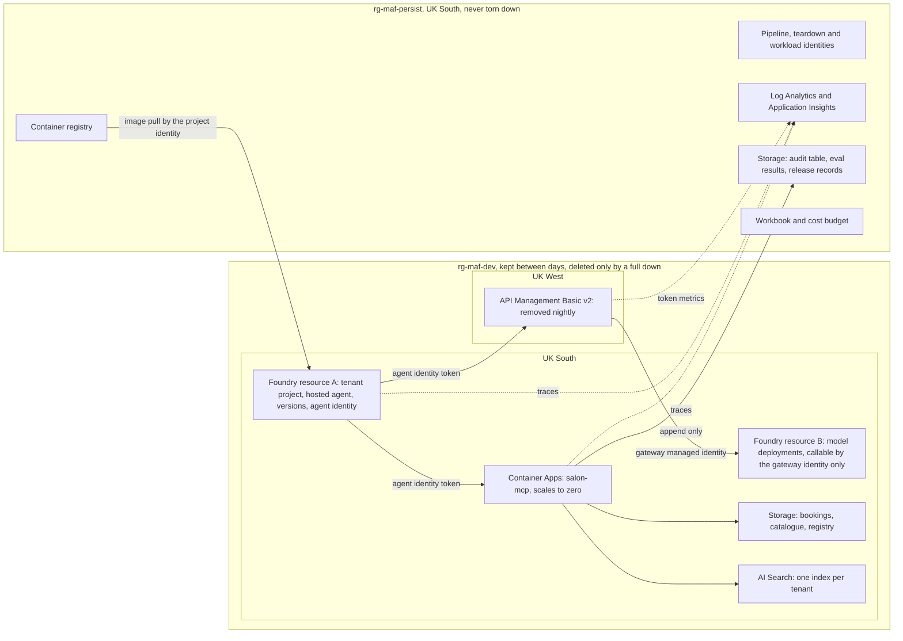
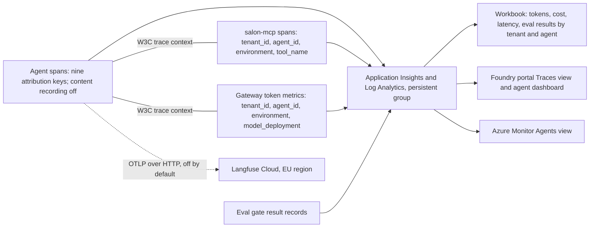

# Principal engineer review: docs/spec-phase-0-1.md

Date: 2026-10-03. Artifact reviewed: docs/spec-phase-0-1.md, revised after council review 03, at commit dea7217.
Method: a single-reviewer pass with a currency audit, not a council run. The owner asked for it after council review 03 and before deciding on acceptance. The owner's decisions on it are D56 to D70 in docs/intent.md revision 13.
Reviewer lens: AI platform engineering on Azure, Microsoft Foundry, LangGraph, evaluation, guardrails and AgentOps.
Reads: docs/intent.md revision 12 (D1 to D55), docs/council/03-spec-phase-0-1-review.md, docs/research.md, docs/journal/02-spec-gate.md, CLAUDE.md, and Anthropic's AI-Native SDLC playbook.
Method: every statement about what a product does today cites a page opened on 2026-10-03, listed in section 13. Quotations are pasted from the page text. Four research subagents ran the currency audit; the quotations behind every verdict that is not "current" were checked against the page, and the two that reverse a statement in the spec (traffic splitting; evaluating an agent version through the project API) were re-read in full by the reviewer. Where a claim could not be verified the text says "unverified". The council's findings are not repeated; this review looks for what the council did not see.

## 1. Verdict

**Accept with changes.** The design is sound, unusually well evidenced, and uses the platform the way Microsoft documents it today; but the eval gate cannot yet detect the regressions it is meant to detect, three dependencies have moved or are missing from the preview table, the identity hop the write path depends on rests on an undocumented capability, and the spec has one picture where a design of this size needs six and a mapping to the platform it runs on.

The five changes marked "must" in section 11 are all cheap in words and none changes the architecture. They should be made before the implementation plan is written, because Stage 3 will otherwise plan tests that cannot prove what section 9 claims.

## 2. Findings ranked by impact

Each finding: where in the spec; why it matters; what the current source says; the change proposed; the URL. Decisions touched are named so the owner can see what a change reopens.

**F1. The eval gate cannot detect the regressions it is meant to detect, and its harness is a thin wrapper around an API the pipeline could call directly.** Section 5.8; D35, D44.
Why: with 20 rows per intent the standard error of a pass rate of 0.90 is about 0.067, so two versions must differ by about 13 points before the difference is distinguishable from chance. Thresholds are to be set from one version run twice, which gives one difference and no spread. The Action judges single turns, so the two intents that write are judged by nobody. And the Action "declares no output a script can read" (spec 5.8), so spike S6 must find a way to parse a page.
Source: the Action's own code resolves the exact version with `agents.get_version` and targets `{"type": "azure_ai_agent", "name": ..., "version": ...}`, writing only to `GITHUB_STEP_SUMMARY` [eval-action-code]. The project API documents the same target: "Send queries to a Foundry agent at runtime and evaluate the responses by using the `azure_ai_target_completions` data source type with an `azure_ai_agent` target. This scenario works for both prompt agents and hosted agents", with `"version": "1"  # Optional. Uses latest version if omitted.` [eval-targets]. The same API family offers "comparison results between a baseline and treatment evaluation runs" with "statistical analysis", and "multi-turn conversation evaluations over agent traces" from an agent's recent traces or named trace ids [foundry-mcp-tools]. Batch evaluations are listed for UK South [eval-regions].
Change: (a) 50 rows per judged intent; (b) S6 runs the sound version five times and sets each threshold at the mean minus two run-to-run standard deviations, and 5.8 states the smallest regression the gate detects; (c) S6 runs the Action and a direct call to the project evaluation API side by side, since they are the same request underneath, and the gate step reads whichever gives a machine-readable result; the project API, not DeepEval, becomes the named fallback; (d) the scripted write conversations' traces are judged with task completion and tool evaluators as a second check on the write intents, alongside the end-state assertions; (e) the dataset's hash goes into the release record.

**F2. Three dependencies are missing from the preview table or have moved.** Sections 3.1, 5.1, 5.2, 7, 12.
Why: section 7 is the spec's promise that every preview part is pinned with a fallback. Three are not there.
Source: the durable state store behind `FoundryCheckpointSaver`: "During preview, the state store is available only to hosted agents"; items are "Up to 1 MB of serialized JSON"; the default idle expiry is 30 days [state-store]. The README adds "Use an in-memory or database-backed LangGraph saver for local development" [lc-azure]. The hosting extras are beta packages: `azure-ai-agentserver-core>=2.1.0b2` and `-responses>=2.1.0b2` [pypi-lcazure]; the azd extension registry's latest is `azure.ai.agents` 1.0.0-beta.18, "Foundry agents (Beta)" [azd-registry]. The MCP stack: the specification is now 2026-07-28, which removed sessions and the initialize handshake [mcp-spec]; `mcp` 2.3.0 and FastMCP 4.0.10 are current, while python-mcp-demos locks FastMCP 3.2.4 and `langchain-mcp-adapters` 0.2.2, a package whose README says "Please migrate to langchain[mcp]" [mcp-demos-lock], [lc-mcp-adapters]. Container protocol 1.0.0 "is no longer supported" [isolate].
Change: add rows to section 7 for the state store (fallback: `CosmosDBSaver`, already S3's), the hosting protocol libraries, the azd extension version, and the MCP server and client versions; answer section 12's open question with a plain `mcp` client, because the graph's nodes call tools by code and need no LangChain adapter; state container protocol 2.0.0 as the pinned contract; say that local tests use `MemorySaver` or the file-backed store, because the Foundry saver cannot run locally.

**F3. The identity path the write intents depend on is undocumented; the documented path is a project connection with an audience.** Sections 4, 5.2, 6.2 S2; D52.
Why: D52 makes the direct call from the graph to salon-mcp the primary path and the Toolbox the fallback. Spike S2 tests both, but the spec's expectation is backwards.
Source: the in-container credential is documented only for the Foundry scope, "token = DefaultAzureCredential().get_token("https://ai.azure.com/.default").token" [migrate-preview]; a connection with an audience is documented: `azd ai connection create ... --auth-type agentic-identity --audience "<entra-audience>"` [mcp-auth]; "The audience must match the resource identifier of the downstream service, not the URL of the MCP server itself" [agent-identity]. Entra Agent ID is "now generally available" [agent-id-new]. An Entra-protected MCP server "must accept v2 access tokens" and "The MCP authorization specification requires every HTTP MCP server to serve a PRM document and to reference it from the WWW-Authenticate header of its 401 responses" [mcp-entra]. The python-mcp-demos Entra sample is "FastMCP's built-in Azure OAuth proxy", a user sign-in flow, not agent identity [mcp-demos-readme].
Change: S2 tests the connection route first and the direct call second; 5.2 gains the two server requirements (v2 tokens; protected resource metadata document); the sample base is cited for its azd and Container Apps layout, not its authentication.

**F4. One diagram, and no mapping to the platform's own lifecycle.** Sections 3, 4, 5.
Why: the owner's stated need is to understand the agent framework and AgentOps as deployed on Azure and how the salon agent maps to it. The spec's text supports that; nothing in it shows it.
Change: the six views in section 4 of this review and the mapping table in section 5.2, which also marks where the spec builds something the platform already provides.

**F5. The attribution keys should use the OpenTelemetry GenAI names where one exists.** Section 5.6; intent section 5; D54.
Why: Foundry's and Azure Monitor's agent views key on the standard names; custom names will not light them up.
Source: the LangChain tracer emits `gen_ai.agent.name`, `gen_ai.agent.id`, `gen_ai.conversation.id`, `gen_ai.request.model`, `gen_ai.provider.name`, and "Any metadata key starting with `gen_ai.` is also forwarded as a span attribute" [lc-traces]. The agent span convention names `gen_ai.agent.id`, `gen_ai.agent.name`, `gen_ai.agent.version`, `gen_ai.conversation.id`, `gen_ai.tool.name` [semconv-agent], [semconv-spans]. Azure Monitor's Agents view "is based on OpenTelemetry Generative AI Semantics" [agents-view], and Foundry's dashboard asks you to "Instrument your agent to comply with the semantic conventions for generative AI solutions" [agent-dashboard]. The conventions moved to a new repository in June 2026 and are still marked "Development" [semconv-agent].
Change: `agent_id` becomes `gen_ai.agent.id`, `agent_version` becomes `gen_ai.agent.version`, `conversation_id` becomes `gen_ai.conversation.id`, `tool_name` becomes `gen_ai.tool.name`, `model_deployment` becomes `gen_ai.request.model`; `tenant_id`, `environment`, `turn_id` and `graph_node` stay custom under one prefix. The rule "nine keys on every agent span" stands; only the names change.

**F6. Release evidence can be a verifiable chain for free, and the spec stops at a record.** Sections 5.9, 9.1; D42, D43.
Source: artifact attestations give "SLSA v1.0 Build Level 2" and "are only available for public repositories" on Free, Pro and Team, which this repository is [gh-attest-concept], [gh-attest-plans]; container images are verified with `gh attestation verify oci://...` [gh-attest-use]; new work "should use `actions/attest` instead" of `attest-build-provenance` [gh-attest-bp]. Immutable releases have been generally available since 28 October 2025 and "creating an immutable release automatically generates a release attestation" [gh-immutable-new], [gh-immutable-ga]; `gh release verify` checks "a release exists and is immutable" [gh-release-verify]. A repository setting "Require actions to be pinned to a full-length commit SHA" exists [gh-sha-policy]. Container Apps has no documented signature enforcement; only AKS does [acr-ratify].
Change: the candidate job attests the image digest; the promote job runs `gh attestation verify` on the digest before moving the selector; the repository setting replaces the lint check in 9.1; the immutable releases citation moves to the current page.

**F7. The traffic-splitting statement is contradicted by a newer Learn page.** Section 5.9.
Source: "An agent endpoint serves one version at a time and routes 100% of its traffic to that version. Traffic splitting between versions isn't supported" [ha]; "Traffic splitting between agent versions isn't supported. Configure one `FixedRatio` rule with `traffic_percentage` set to `100`" [manage]. Against both: "A canary deployment sends a small share of production traffic to a candidate version while the stable version serves the rest ... Change only the version selection rules to send 10% to the candidate and 90% to the stable version", using `azd ai agent endpoint update`, on a page carrying the preview banner [azd-prod].
Change: state the discrepancy in 5.9; keep the pinned-session evaluation as the gate, because for test-only traffic it is better than a canary; spend five minutes in S5 applying two rules to see which page is right; record the answer as a Phase 2 option.

**F8. Guardrail facts the spec should state.** Section 5.7, 7, 6.2 S1.
Source: "Set `rai_policy_name` to the full ARM resource ID of your guardrail's RAI policy" [guardrail]; tool-call and tool-response screening apply to listed Foundry tools only, "Azure AI Search, Azure Functions, OpenAPI, Sharepoint Grounding, Fabric Data Agent, Bing Grounding, Bing Custom Search, and Browser Automation" [intervention]; "The agentic guardrail fully overrides the model's guardrail" [guardrail-overview]; on the model deployment, "Prompt Shields for indirect attacks | GA | Off" by default [content-filters]; network egress controls, in preview, live in the same policy with "Audit/Enforce modes and HTTP 403 on deny" [guardrail-egress].
Change: 5.7 states the resource-id form and that screening of the container's own tools is a platform limit, not a scope cut; the section 7 fallback says the indirect-attack shield must be switched on and passages wrapped in document delimiters; egress controls become S1's first fallback, since they close the bypass path from inside the sandbox.

**F9. Safety evaluation and red teaming cannot run from UK South, and the docs already say so.** Sections 5.8, 6.2 S6; D53.
Source: UK South is listed for batch evaluations but absent from the risk and safety table; "AI red teaming is supported in the following regions. - East US 2 - North Central US" on the regions page and "East US 2, France Central, Sweden Central, Switzerland West, and US North Central" on the concept page; "Foundry hosted container agents | Supported"; "Function tool calls | Not supported" [eval-regions], [red-team]. UK West appears in no evaluation table.
Change: drop the UK South safety test from S6, since the documentation answers it; record a Phase 2 decision on a second Foundry project in an EU region for safety evaluators and the Red Teaming Agent, with synthetic data only, which D29 permits.

**F10. Platform observability features the spec does not use or cite.** Section 5.6; intent Phase 6.
Source: the Foundry Agent Monitoring Dashboard and the Azure Monitor "Agents (Preview)" view, both keyed on the GenAI attributes [agent-dashboard], [agents-view]; Insights in Foundry, which "analyzes traces from your production agents and organizes recurring behavior into reviewable Insights" in categories including "Cost & tokens, Hallucinations, Latency ... Security & risk" [insights]; traces converted into evaluation datasets [traces-dataset]; continuous evaluation as "scheduled evaluation runs for hosted agents" [foundry-mcp-tools]. The Foundry portal shows traces from the last 90 days [stored-completions].
Change: 5.6 keeps the Workbook for what the platform cannot do (cost in pounds; the tenant join) and cites the built-in views for the rest. The Maintain stage note in section 10 of this review follows from this.

**F11. Harness currency.** Section 6.1; D10, D20, D36.
Source: `@azure/mcp` "2.0 is now generally available", latest stable 2.0.5, while 3.0.0-beta.49 is the newest beta [azure-mcp-readme], [azure-mcp-npm]; the Microsoft Foundry Skill installs in Claude Code with `/plugin install azure@claude-plugins-official` and covers deployment, evaluation, "dataset curation from traces" and troubleshooting [foundry-skill]; Claude Code hooks can "escalate to the user with "ask"" and a `PermissionRequest` event exists [cc-hooks]; "Custom commands have been merged into skills" [cc-skills].
Change: pin `@azure/mcp` to 2.0.5 unless a 3.0 feature is named; add the Foundry skill beside the four project skills; note in 6.1 that an "ask" hook on Azure writes is a one-file change should D20 ever be revisited (not a proposal to revisit it).

**F12. Small corrections.** UK South's API Management v2 gap is "temporarily unavailable" [apim-region]; the daily quota period starts at "the UTC timestamp truncated to the unit", so a gate run across midnight sees two quotas [apim-limit]; `langchain-azure-ai` 1.2.10 needs Python 3.11 [pypi-lcazure]; UK West is on the hosted agents list but absent from the Agent Service regions table, so confirm it in the portal [ha], [agent-regions]; `azure-ai-agentserver-langgraph` is "Removed" [migrate-preview]; the `v3-beta` tag resolves to commit 22a09a8f of 12 March 2026 while main has moved on [eval-action-tags]; Langfuse real-time ingestion wants the header `x-langfuse-ingestion-version: 4` [langfuse]; the Foundry roles were renamed, and the spec already uses the new names [ha-perm].

## 3. Currency audit (task 1)

Verdicts: **current** (the spec matches the source today), **superseded** (a newer version or path exists), **status changed** (preview or GA status moved), **unverified** (could not be checked). The spec's own citation keys are given in square brackets where the row checks one of them.

### 3.1 Hosting, framework and models

| Item | Spec says | Source says today | Verdict | Impact | URL |
|---|---|---|---|---|---|
| Hosting path [lg-hosted] | `langchain_azure_ai.agents.hosting`, `ResponsesHostServer`, Responses protocol; `from_langgraph` superseded | Still the documented path: "Install langchain-azure-ai version 1.2.9 or later with the hosting extra". PyPI latest 1.2.10 (14 September 2026, Python 3.11 or later); the extra installs `azure-ai-agentserver-core>=2.1.0b2` and `-responses>=2.1.0b2`. The old adapter is "Removed" and the old backend "supported only until August 20, 2026" | Current | Pin the beta protocol libraries in section 7; Python 3.11 | https://learn.microsoft.com/azure/foundry/how-to/develop/langchain-hosted-agents |
| `FoundryCheckpointSaver` [lc-azure] | On Foundry's durable state store; needs container protocol 2.0.0 | Confirmed: "intended for a Foundry-hosted agent using container protocol 2.0.0 ... Use an in-memory or database-backed LangGraph saver for local development". The store is preview; items up to 1 MB; 30-day idle expiry by default | Current; store is preview | Add to section 7; local tests cannot use it | https://github.com/langchain-ai/langchain-azure/blob/main/libs/azure-ai/README.md |
| Interrupt surfacing and durable checkpointer [lg-hosted], [sample-hitl] | `mcp_approval_request` and `mcp_approval_response`; durable checkpointer for production; azd extension `>=1.0.0-beta.9` | Both quotations verbatim. The sample also accepts a `function_call_output` whose `call_id` matches the interrupt, pins `langgraph==1.2.11`, `langchain-azure-ai[hosting]==1.2.9`, 0.5 vCPU and 1 GiB, protocol 2.0.0, and uses `FoundryCheckpointSaver(user_isolation=True)`. Extension registry latest: 1.0.0-beta.18, "Foundry agents (Beta)" | Current | Pin the extension; note `user_isolation=True` in the sample, which matters for the two-tenant story | https://github.com/microsoft-foundry/foundry-samples/blob/main/samples/python/hosted-agents/langgraph/responses/07-human-in-the-loop/azure.yaml |
| Hosted agents GA, regions, sizes, idle, billing [ha], [agent-regions] | GA 9 July 2026; UK South and UK West; 0.5 vCPU and 1 GiB; idle 2 to 60, default 15; billed during active sessions | Learn says GA without a date; the Foundry blog says "general availability for Hosted Agents on July 9". Sizes, idle range and billing basis confirmed. UK West is on the hosted agents list and absent from the Agent Service regions table | Current | Confirm UK West in the portal before S1 | https://learn.microsoft.com/azure/foundry/agents/concepts/hosted-agents |
| Release flow [release], [cicd] | One `FixedRatio` rule at 100; default follows latest; delete is not rollback; `version_ref` sessions | All confirmed. New: a preview page documents a 90/10 canary with two `FixedRatio` rules through `azd ai agent endpoint update`, contradicting the concepts and manage pages; draft versions (preview) and disable/enable | Status changed (contradiction) | F7 | https://learn.microsoft.com/azure/foundry/agents/how-to/deploy-hosted-agent-production |
| LangGraph | Current version; durable execution | 1.2.12 (21 September 2026). `Durability = Literal['sync', 'async', 'exit']`; `interrupt()` pauses and `Command(resume=...)` resumes; a checkpointer is required for interrupts | Current | Pin 1.2.12 or the sample's 1.2.11 | https://pypi.org/pypi/langgraph/json |
| Microsoft Agent Framework | Not chosen; the intent keeps LangGraph | Framework 1.0 GA on 3 April 2026; its Foundry hosting package is prerelease. Hosted agents are "framework-agnostic"; tracing is "generally available for prompt and hosted agents" with "out-of-the-box instrumentation for Microsoft Agent Framework and LangChain"; guardrails are applied per protocol. The only framework-specific item is the Toolbox client | Status changed (GA), no impact | No evidence that LangGraph is disadvantaged on tracing, evaluation or guardrails. D-level choice stands | https://learn.microsoft.com/agent-framework/hosting/foundry-hosted-agent |
| Models [model-regions], [retire], [model-upgrade] | gpt-5.4-nano and gpt-5.4-mini 2026-03-17, Global Standard in UK South, retire 2027-09-21, `NoAutoUpgrade` | All confirmed. model-router is Global Standard only in North Europe and Sweden Central. Newer families exist (gpt-5.5, gpt-5.6, gpt-6, gpt-6.1); no newer nano or mini. Azure CLI "currently not possible to update the version upgrade option", so set it at creation | Current | D50 stands | https://learn.microsoft.com/azure/foundry/foundry-models/concepts/models-sold-directly-by-azure-region-availability |
| Application Insights injection [ha] | Platform injects the connection string; traces by default | Verbatim; the variable is `APPLICATIONINSIGHTS_CONNECTION_STRING` | Current | None | https://learn.microsoft.com/azure/foundry/agents/concepts/hosted-agents |

### 3.2 Evaluation and guardrails

| Item | Spec says | Source says today | Verdict | Impact | URL |
|---|---|---|---|---|---|
| ai-agent-evals Action [eval-action], [eval-repo] | `v3-beta`, preview, `agent-name:version`, baseline comparison, confidence intervals, single `query` rows, summary only, no outputs, needs a judge deployment | All true. The page is still "(preview)". `v3-beta` resolves to commit 22a09a8f (12 March 2026); main has a later untagged commit. `action.yml` has `inputs:` and `runs:` only; `action.py` writes to `GITHUB_STEP_SUMMARY`. The code resolves the exact version with `agents.get_version` and targets `azure_ai_agent` by name and version, so a non-served version can be evaluated | Current | S6's first go criterion is answered by the code; the result-reading question is answered by F1 | https://github.com/microsoft/ai-agent-evals |
| Evaluators [agent-evals] | Task adherence and intent resolution (preview), groundedness; tool call accuracy unused | Statuses unchanged. New: Task Completion (preview), Tool Selection, Tool Input Accuracy, Tool Output Utilization, Tool Call Success, composites Output Quality and Tool Use Quality (preview); "Agent evaluators support the following tools: File Search, Function Tool (user-defined tools), MCP, Knowledge-based MCP" | Current, with additions | The tool evaluators fit the write intents judged on traces (F1) | https://learn.microsoft.com/azure/foundry/concepts/evaluation-evaluators/agent-evaluators |
| Evaluator regions [eval-regions] | Risk and safety evaluators not offered in UK South | UK South: batch evaluations yes; risk and safety no; red teaming no; UK West in no table | Current | F9 | https://learn.microsoft.com/azure/foundry/concepts/evaluation-regions-limits-virtual-network |
| Evaluation SDK route | Not cited; DeepEval named as fallback (D35) | `azure-ai-projects` 2.7.0 runs cloud evaluations against an `azure_ai_agent` target with an optional `version`, for hosted agents on the Responses protocol; results are polled from the run. Local `evaluate()` in `azure-ai-evaluation` 1.18.7 is now documented as "(preview) (classic)" | Superseded (the local SDK path); current (the cloud path) | F1: the project API is the natural fallback, not DeepEval | https://learn.microsoft.com/azure/foundry/observability/how-to/cloud-evaluation-targets |
| AI Red Teaming Agent | Not adopted (D46) | Concept and cloud pages carry no preview label; the local how-to does. Cloud regions: East US 2, France Central, Sweden Central, Switzerland West, North Central US. "Foundry hosted container agents | Supported"; "Function tool calls | Not supported". Billed on the evaluations meter; price not rendered | Status unclear; cost unverified | F9 | https://learn.microsoft.com/azure/foundry/concepts/ai-red-teaming-agent |
| DeepEval (D35 fallback) | Fallback judged harness | 4.2.8 (2 October 2026); Azure OpenAI judge via `AzureOpenAIModel` | Current | None, but F1 proposes a better fallback | https://pypi.org/project/deepeval/ |
| Agent guardrail [guardrail], [guardrail-overview], [cs-regions] | `rai_config.rai_policy_name`; 400 `content_filter`; preview; fails open if the policy is missing; tool-response screening is preview; Prompt Shields in UK South | All six verbatim. Additions: the name "must be the full ARM resource ID"; on `invocations` a policy "without `invocations_moderation` is inert"; tool screening applies to listed Foundry tools only; Task Adherence guardrail is global and data-zone only; "The agentic guardrail fully overrides the model's guardrail" | Current, with additions | F8 | https://learn.microsoft.com/azure/foundry/agents/how-to/add-hosted-agent-guardrails |
| Model-deployment guardrail (section 7 fallback) | Applies to all Foundry models sold by Azure | Applies to all except audio transcription. Default policy: "Prompt Shields for direct attacks (jailbreak) | GA | On"; "Prompt Shields for indirect attacks | GA | Off" | Status changed in part | F8: the fallback needs the indirect shield switched on | https://learn.microsoft.com/azure/ai-foundry/openai/how-to/content-filters |
| Defender for Cloud threat protection for AI | Not in the spec | "Release state | Generally available (GA)"; alerts for "data leakage, data poisoning, jailbreak, credential theft"; "30-day free trial, capped at 75 billion tokens"; text tokens only. Agent-level protection "require[s] a Microsoft Agent 365 license" from 1 July 2026 and covers "only ... published Microsoft Foundry agents" | Status changed | Challenge C10: a detection control on the model path for the trial period | https://learn.microsoft.com/azure/defender-for-cloud/ai-threat-protection |
| Content recording [lc-traces] | `enable_content_recording=False` | Confirmed; "Content recording is enabled by default" | Current | None | https://learn.microsoft.com/azure/foundry/how-to/develop/langchain-traces |

Could not verify in this cluster: the price of the evaluations meter and of Defender for AI Services after the trial; a GA label for the Red Teaming Agent; any pytest guidance for the local SDK; anything about UK West for evaluation.

### 3.3 Gateway, identity and MCP

| Item | Spec says | Source says today | Verdict | Impact | URL |
|---|---|---|---|---|---|
| API Management v2 in UK South [apim-region] | No v2 tier can be created in UK South | All three v2 columns for UK South carry the footnote "New instance creation temporarily unavailable". UK West: Basic v2 and Standard v2; no Premium v2 | Current, but temporary | D22 stands. Say "temporarily" in 2.2 and 3.1, and let `up` take the region as a parameter | https://learn.microsoft.com/en-us/azure/api-management/api-management-region-availability |
| `llm-token-limit` [apim-limit] | Counter key, 20,000 a minute, daily quota, 429 and 403, per-gateway counters, concurrency overshoot, streaming estimates, not on Consumption | All confirmed. Periods "Hourly, Daily, Weekly, Monthly, Yearly"; a period starts at "the UTC timestamp truncated to the unit"; v2 tiers "use a token bucket algorithm". Nothing on counters after delete or purge | Current | State the midnight UTC reset. D39's purge assumption stays with S1 | https://learn.microsoft.com/en-us/azure/api-management/llm-token-limit-policy |
| `llm-emit-token-metric` [apim-metric] | Five dimensions, 100 values each, 1,000 series | Confirmed verbatim | Current | None | https://learn.microsoft.com/en-us/azure/api-management/llm-emit-token-metric-policy |
| `validate-azure-ad-token`; gateway role [apim-auth] | Tenant, audience, caller checks; "Cognitive Services OpenAI User" | Policy supports `tenant-id`, `client-application-ids`, `audiences`, `required-claims`. The role name is unchanged on both pages | Current | None | https://learn.microsoft.com/en-us/azure/api-management/api-management-authenticate-authorize-ai-apis |
| API Management in front of MCP servers (intent section 12) | Preview on v2 | Both modes on all v2 tiers; no preview label, no GA statement; management "require[s] API Management REST API version 2025-09-01-preview"; the external server "must conform to MCP version 2025-06-18 or later"; native OAuth 2.1 for MCP servers since March 2026 | Status unverified | Phase 1 does not use it; correct the intent's row | https://learn.microsoft.com/en-us/azure/api-management/mcp-server-overview |
| Foundry's AI Gateway integration [ai-gw], [apim-aigw] | Preview; portal only; limits per project | "AI gateway in Microsoft Foundry (preview)"; "by using the Foundry portal"; "Create new: Creates a Basic v2 SKU instance"; "Limits apply at the project level". No CLI, REST or Bicep route found | Current | D47's desk check will find no automatable route; say so and save the half day | https://learn.microsoft.com/en-us/azure/api-management/genai-gateway-capabilities |
| Hosted agent identity and permissions [ha], [ha-perm] | Per-agent identity; implicit model access; `agents/write` covers version and selector; Foundry Agent Consumer; `x-ms-user-identity` custom role | All confirmed; "Foundry User and Foundry Owner no longer" grant impersonation; the Foundry roles were renamed | Current | Section 7 should name container protocol 2.0.0 | https://learn.microsoft.com/en-us/azure/foundry/agents/concepts/hosted-agent-permissions |
| Entra Agent ID [mcp-entra], [agent-token] | Marker claim `xms_par_app_azp`; four checks | "Microsoft Entra Agent ID is now generally available." Marker claim and four checks confirmed. MCP server "must accept v2 access tokens" and must serve a PRM document referenced from `WWW-Authenticate` on 401 | Status changed (GA) | F3 | https://learn.microsoft.com/en-us/entra/agent-id/whats-new-agent-id |
| Foundry MCP tool authentication [mcp-auth], [toolbox-ha] | Connection with `agentic-identity` and an audience; Toolbox fallback | Five modes; `azd ai connection create --auth-type agentic-identity --audience` documented; the LangGraph Toolbox client is `AzureAIProjectToolbox`; in-container tokens are shown only for `https://ai.azure.com/.default` | Current, with a gap | F3 | https://learn.microsoft.com/en-us/azure/foundry/agents/how-to/mcp-authentication |
| MCP specification, SDKs, sample base [mcp-demos] | MCP 2025-06-18 or later; FastMCP from python-mcp-demos; client open | Specification 2026-07-28: sessions removed, "Make MCP stateless: remove the initialize/notifications/initialized handshake". `mcp` 2.3.0; FastMCP 4.0.10 needs `mcp>=2.0,<3`. python-mcp-demos locks FastMCP 3.2.4 and `langchain-mcp-adapters` 0.2.2 (last commit 9 September 2026); its Entra sample is the user OAuth proxy. LangChain's MCP client is now `langchain[mcp]>=1.4.0` (beta) on FastMCP 4; the adapters package pins `mcp<2` and asks users to migrate | Superseded | F2 | https://modelcontextprotocol.io/specification/2026-07-28/changelog |

Could not verify in this cluster: a GA statement for API Management's MCP support; a non-portal route for Foundry's AI Gateway; an in-container token for a custom audience; what a purge does to a token counter.

### 3.4 Observability, release evidence and harness

| Item | Spec says | Source says today | Verdict | Impact | URL |
|---|---|---|---|---|---|
| `AzureAIOpenTelemetryTracer` [lc-traces] | GenAI-convention spans; `enable_content_recording=False` | Confirmed. Operations `invoke_agent`, `chat`, `execute_tool`; attributes `gen_ai.agent.name`, `gen_ai.agent.id`, `gen_ai.conversation.id`, `gen_ai.request.model`, `gen_ai.provider.name`, `gen_ai.usage.*`; "Any metadata key starting with `gen_ai.` is also forwarded as a span attribute" | Current | F5: the keys can be stamped through metadata | https://learn.microsoft.com/azure/foundry/how-to/develop/langchain-traces |
| GenAI semantic conventions | Nine custom attribute names | Conventions moved to `open-telemetry/semantic-conventions-genai` in June 2026; opentelemetry.io pages are stubs; status "Development"; `gen_ai.system` removed, `gen_ai.provider.name` current. Agent spans: `gen_ai.agent.id`, `gen_ai.agent.name`, `gen_ai.agent.version`, `gen_ai.conversation.id`; tool spans: `gen_ai.tool.name` required, `gen_ai.tool.call.id` recommended | Status changed (location) | F5 | https://github.com/open-telemetry/semantic-conventions-genai/blob/main/docs/gen-ai/gen-ai-agent-spans.md |
| Built-in agent monitoring | Workbook v0 | Foundry Agent Monitoring Dashboard (preview) and Azure Monitor "Agents (Preview)", both on the GenAI conventions, keyed on `gen_ai.agent.id`, `gen_ai.agent.name`, `gen_ai.usage.*`; Microsoft ships Grafana dashboards, no Workbook | Status changed | F10 | https://learn.microsoft.com/azure/azure-monitor/app/agents-view |
| Baggage [otel-baggage] | Not added to spans automatically; travels in headers | Confirmed | Current | None | https://opentelemetry.io/docs/concepts/signals/baggage/ |
| Langfuse [langfuse] | EU OTLP endpoint, Basic auth, HTTP only; free tier figures | Confirmed; "gRPC is not supported yet"; add `x-langfuse-ingestion-version: 4` for real-time ingestion | Current | F12 | https://langfuse.com/integrations/native/opentelemetry |
| Log Analytics retention [la-retention] | 30 days; 90 for some; Application Insights 90 free | Confirmed verbatim | Current | None | https://learn.microsoft.com/azure/azure-monitor/logs/data-retention-configure |
| Immutable releases [gh-immutable] | Assets locked; title and notes editable | GA since 28 October 2025; both quotations hold; "creating an immutable release automatically generates a release attestation"; `gh release verify` and `verify-asset`; the spec's URL redirects | Status changed (GA) | F6 | https://docs.github.com/en/code-security/concepts/supply-chain-security/immutable-releases |
| Artifact attestations | Not in the spec | `actions/attest@v4`; `attest-build-provenance` is now a wrapper; free on public repositories on all current plans; SLSA Build Level 2; `gh attestation verify oci://` for images | Superseded (action name) | F6 | https://docs.github.com/en/actions/how-tos/secure-your-work/use-artifact-attestations/use-artifact-attestations |
| Image signing | Not in the spec | Notation with Key Vault is current; enforcement documented only for AKS (Ratify, Image Integrity preview); nothing for Container Apps | Current (signing); unverified (enforcement on Container Apps) | Verify in CI, not at runtime | https://learn.microsoft.com/azure/container-registry/container-registry-tutorial-sign-build-push |
| SHA pinning [gh-secure] | "currently the only way" | Sentence unchanged; repository setting "Require actions to be pinned to a full-length commit SHA"; immutable actions still public preview | Current | F6 | https://docs.github.com/en/actions/reference/security/secure-use |
| OIDC to Azure [gh-oidc] | User-assigned identity; federated credential per environment | Confirmed; entity type Environment; `azure/login@v2`; `id-token: write` | Current | None | https://learn.microsoft.com/azure/developer/github/connect-from-azure-openid-connect |
| Claude Code harness [cc-hooks], [cc-perms], [cc-skills], [cc-agents] | Hooks are not boundaries; skills under `.claude/skills/`; agents under `.claude/agents/` | All quotations hold. Hooks can "escalate to the user with "ask""; a `PermissionRequest` event exists; "Custom commands have been merged into skills"; plan mode as described | Current | F11 | https://code.claude.com/docs/en/hooks |
| `@azure/mcp` (D10) | 3.0.0-beta.49 | `latest` dist-tag is 3.0.0-beta.49 (2 October 2026); "Azure MCP Server 2.0 is now generally available"; latest stable 2.0.5 | Status changed (a GA line exists) | F11 | https://github.com/microsoft/mcp/blob/main/servers/Azure.Mcp.Server/README.md |

Could not verify in this cluster: a sentence on docs.github.com stating immutable releases on the Free plan (the docs feature file lists `fpt`); signature enforcement on Container Apps; immutable actions GA; a Microsoft-published Workbook for agents.

## 4. Architecture and diagrams (task 2a)

The spec has one picture, the component flowchart in section 3.1. The text behind it is strong: section 4 is a complete identity table, section 5.9 a complete pipeline, section 3.2 a complete resource list. What a reader cannot do is see the whole at once, follow a request through the hops, or see what the nightly teardown removes. A high-level design for this system needs six views. Each is drafted below in Mermaid so that it can go into the spec unchanged if accepted. Each draft is built only from statements already in the spec; nothing new is asserted by a picture.

| View | Why it is needed | Proposed home |
|---|---|---|
| Context | Who touches the system and through what: the owner with two logins, the test identities, GitHub, the two resource groups, Langfuse. Section 4 hop 7 and section 11 only make sense when the owner's two roles are visible | New section 3.0 |
| Deployment | Two groups, two regions, what is removed nightly, what survives a full rebuild. The teardown debate in council review 03 was about this picture | Section 3.2 |
| Identity flow | Section 4 as a sequence: eight hops, principals, audiences, the checks each receiver makes. The strongest part of the spec, invisible as a table | Section 4 |
| Booking conversation | The confirmation interrupt, the checkpoint save and restore across an idle sandbox, and the write. This is what spike S3 and the scripted tests exercise | Section 5.1 |
| Release pipeline | The gates in order, what each blocks, where the owner acts, the rollback edge | Section 5.9 |
| Telemetry | What emits which keys, where it lands, what reads it, the optional Langfuse edge | Section 5.6 |

### 4.1 Context



### 4.2 Deployment



### 4.3 Identity flow

```mermaid
sequenceDiagram
  participant T as Test identity or pipeline
  participant F as Foundry agent endpoint
  participant A as Agent container, agent identity
  participant G as Gateway, UK West
  participant M as Model resource
  participant S as salon-mcp
  participant D as Table Storage and AI Search
  T->>F: Entra user token or federated token, audience Foundry
  F->>F: endpoints/interact/action at agent scope, else 403
  F->>A: request with conversation and session ids
  A->>G: token for the gateway audience
  G->>G: validate-azure-ad-token, registry lookup, llm-token-limit
  G->>M: gateway managed identity, Cognitive Services OpenAI User
  M-->>G: completion
  G-->>A: completion; token metric emitted
  A->>S: token for the salon-mcp audience
  S->>S: signature, issuer, tenant, audience, agent marker claim, registry lookup
  S->>D: workload identity with data roles; tenant_id from the lookup
  D-->>S: result
  S->>S: append one audit row
  S-->>A: tool result
  A-->>F: response
  F-->>T: response
```

### 4.4 Booking conversation with the confirmation interrupt

```mermaid
sequenceDiagram
  participant C as Client
  participant H as ResponsesHostServer
  participant G as LangGraph graph
  participant K as FoundryCheckpointSaver
  participant S as salon-mcp
  C->>H: POST /responses: book a cut with Sam on Friday at three
  H->>G: invoke; thread keyed by the conversation
  G->>G: classify and extract, small model
  G->>G: validate in code: hours, duration, stylist, future slot
  G->>S: get_availability(date, service, stylist)
  S-->>G: free slots
  G->>K: save checkpoint
  G-->>H: interrupt() with the normalised booking
  H-->>C: mcp_approval_request item
  Note over C,H: the sandbox may be deprovisioned at the idle timeout
  C->>H: mcp_approval_response: approve
  H->>K: load checkpoint and resume
  G->>S: create_booking(slot, service, stylist, name, contact, idempotency_key)
  S->>S: entity group transaction; unique keys; audit row
  S-->>G: booking reference
  G-->>H: confirmation
  H-->>C: response with the reference
```

### 4.5 Release pipeline and its gates

```mermaid
flowchart LR
  pr["Pull request: lint, pytest, Bicep build, secret scan"] --> merge["Merge to protected main"]
  merge --> cand["Candidate job: environment dev, no approval"]
  cand --> pin["Pin the served version: one FixedRatio rule at 100"]
  pin --> build["Build and push the image; record and attest the digest"]
  build --> ver["Create the agent version; selector untouched"]
  ver --> sess["Session pinned to the candidate: version_ref"]
  sess --> smoke["Smoke test"]
  smoke --> evalj["Judged eval against the served version"]
  smoke --> evals["Scripted write tests: approve, decline, tool error"]
  smoke --> guard["Guardrail negative test; poisoned passage"]
  evalj --> gate{"All gates pass?"}
  evals --> gate
  guard --> gate
  gate -->|"no"| stop["Stop: the candidate stays unserved"]
  gate -->|"yes"| wait["Promote job: environment dev-promote, waits for the owner"]
  wait -->|"owner approves in the browser"| check["Candidate still active; served unchanged; attestation verified"]
  check --> move["Move the selector to the candidate"]
  move --> rec["Release record to persistent storage; GitHub Release with assets"]
  rec --> verify["Served-image check: served digest equals the latest record"]
  move -.->|"rollback"| back["Selector back to the recorded previous version"]
```



### 4.6 Telemetry



## 5. AgentOps on Azure and how the salon agent maps to it (task 2b)

### 5.1 The Foundry hosted agent lifecycle, as Microsoft describes it today

Every statement below is from a page opened on 2026-10-03 (section 13 gives the keys).

**Resource, project, agent.** A Foundry resource holds model deployments and projects. A project has a system-assigned managed identity, used "for infrastructure operations", and it is "not the agent's runtime identity" [ha]. A hosted agent is "your own code packaged as a container image" that the platform pulls from Azure Container Registry [ha]. Under the new agent object model an agent carries `agent_endpoint`, `protocol_configuration`, `authorization_schemes`, `version_selector`, `blueprint`, `instance_identity` and `agent_card`; the older Agent Application and Deployment resources are legacy, with "Agent Application deprecation announced" as a planned step [migrate]. The spec's design uses the new model.

**Versions.** "Each call to create a version produces an immutable agent version", a snapshot of image, resources, environment variables and protocols [ha]. A version moves through `creating` (typically 2 to 5 minutes), `active`, `failed` [manage]. Draft versions, in preview and needing subscription enablement, are "never resolved as the agent's latest version" and "can't be a traffic-routing target" [manage].

**Endpoint and routing.** "An agent endpoint serves one version at a time and routes 100% of its traffic to that version. Traffic splitting between versions isn't supported" [ha]. The selector is one `FixedRatio` rule at 100 [manage]. The default "follows the latest version", which is why the spec pins before it deploys [manage]. A newer preview page contradicts the first statement with a documented 90/10 canary (F7) [azd-prod]. An agent can be disabled and enabled without deleting anything [manage]. Rollback is moving the selector back; "Deleting the agent or a version isn't a rollback operation" [manage].

**Sessions, conversations and state.** Each session runs in a "per-session VM-isolated sandbox" with a persistent `$HOME`; the idle timeout is 2 to 60 minutes, default 15; "The platform permanently deletes a session after 30 days of inactivity" [ha]. "An existing session is bound to its version when it's created" [manage]. A session can be created pinned to a version with a `version_indicator` of type `version_ref` [manage]. Under the Responses protocol the platform keeps conversation history by conversation id [ha]. The durable state store, in preview, is a "server-backed key-value store" that can hold "framework checkpoints for a bring-your-own framework such as LangGraph", with per-user isolation derived from the platform's call id and an item cap of 1 MB [state-store].

**Identity.** "Every Hosted agent deployed to a Foundry project gets its own dedicated Microsoft Entra ID (agent identity) and dedicated endpoint, both created automatically at deploy time" [ha]. The identity is a service principal created from an agent identity blueprint; at tool time the service exchanges the identity token for one "scoped to the audience of the downstream service" [agent-identity]. MCP and A2A connections use the `AgenticIdentityToken` auth type [agent-identity]. Entra Agent ID is generally available [agent-id-new]; the Entra admin centre inventories every agent identity and can apply Conditional Access to them [agent-identity]. The agent "has implicit access to core capabilities within its own project, such as model inferencing" [ha-perm].

**Callers.** Interacting with an agent endpoint needs `Microsoft.CognitiveServices/accounts/AIServices/endpoints/interact/action` "at the scope of the Foundry project or at the scope of the specific agent"; "Foundry Agent Consumer is the least-privilege built-in role" [ha-perm]. The platform "identifies each caller from their Microsoft Entra token and keeps their data private to that identity" [isolate]. Passing an end user needs the `x-ms-user-identity` header and a custom role [ha-perm]. Container protocol 1.0.0 "is no longer supported"; 2.0.0 needs `azure-ai-agentserver-core` 2.0.0b7 or later [isolate].

**Tools.** Foundry-managed tools are reached through a "Toolbox MCP endpoint provisioned in your Foundry project"; "Other runtimes connect by using standard MCP client libraries" [ha]. For an MCP server of your own, the documented route is a project connection with `agentic-identity` and an audience [mcp-auth].

**Observability.** "The platform automatically injects an Application Insights connection string"; protocol libraries "emit OpenTelemetry traces by default" [ha]. Tracing "is generally available for prompt and hosted agents" [trace-setup]. The Foundry Agent Monitoring Dashboard (preview) and Azure Monitor's Agents view read the GenAI attributes [agent-dashboard], [agents-view]. Insights in Foundry, in preview, "analyzes traces from your production agents and organizes recurring behavior into reviewable Insights" [insights], and can be pulled into a coding agent through the Foundry MCP server [insights].

**Evaluation.** The project API evaluates an `azure_ai_agent` target by name and version, "for both prompt agents and hosted agents", with `{{sample.output_items}}` giving "the agent's structured JSON output, including tool calls" for task adherence [eval-targets]. Comparison between a baseline and treatment run with "statistical analysis", continuous evaluation as "scheduled evaluation runs for hosted agents", and "multi-turn conversation evaluations over agent traces" are exposed as tools on the Foundry MCP server [foundry-mcp-tools]. Traces can be converted into evaluation datasets [traces-dataset]. The ai-agent-evals Action calls the same target type [eval-action-code].

**Guardrails.** A policy named by its full resource id in `rai_config.rai_policy_name` is applied before the agent runs; a missing policy fails open; tool screening covers listed Foundry tools only; the agent policy overrides the model's [guardrail], [guardrail-overview], [intervention].

**Networking.** "The deployed agent endpoint URL stays publicly addressable" in this preview; outbound traffic can use a customer VNet; a private container registry is supported for projects created after 25 June 2026 [vnet].

**Management surfaces.** REST through `az rest`, the Python SDK `azure-ai-projects>=2.3.0`, the `azd` extension `azure.ai.agents` on azd 1.23.0 or later [manage]; the Foundry MCP server, in preview, with "79 Foundry MCP Server tools across 17 categories" [foundry-mcp-tools]; and the Microsoft Foundry Skill for coding agents, installable in Claude Code with `/plugin install azure@claude-plugins-official` [foundry-skill].

### 5.2 Mapping: the spec's concepts to the platform's objects

| Our concept | Foundry object | Entra object | GitHub object | Azure Monitor or Langfuse object | Spec section | Assessment |
|---|---|---|---|---|---|---|
| Tenant | One Foundry project per tenant (D24); one search index; one storage partition | The project's managed identity; the agent identity of the tenant's agent | None | `tenant_id` attribute on spans and metrics | 3.3, 4 | Current. The platform's own per-caller isolation [isolate] is a second boundary the spec does not mention; worth one sentence |
| Agent | Hosted agent object with `agent_endpoint`, `version_selector`, `instance_identity` | Agent identity blueprint and agent identity, visible in the Entra admin centre | Repository | `gen_ai.agent.id` | 3.1, 5.1 | Current under the new object model [migrate] |
| agent_version | Immutable agent version (integer) | None | Image digest in the release record; GitHub Release; build attestation | `gen_ai.agent.version` stamped as the image digest | 5.6, 5.9 | Weak: two identifiers for one thing. State that the release record joins Foundry's version number to the digest, so a span, a release and a Foundry version can be joined |
| Candidate | A normal version with the selector pinned; a session pinned by `version_ref` | None | Environment `dev` job | Spans with the candidate digest | 5.9 | Current. Draft versions [manage] would make a candidate structurally unroutable, but they are preview and need enablement; note as a later option |
| Served version | The version named in the `FixedRatio` rule | None | Environment `dev-promote` approval; release record | None | 5.9 | Current. The platform pages disagree on whether two rules can share traffic (F7); the spec should say so |
| Rollback | Selector moved to the recorded previous version | None | Release record names the previous version | None | 5.9 step 6 | Weak: described, never drilled. See section 7 |
| Conversation and session | Responses conversation id; per-session sandbox; sessions bound to a version | Caller identity scopes the session | None | `gen_ai.conversation.id`, `turn_id` | 5.1 | Current |
| Conversation state | `FoundryCheckpointSaver` on the durable state store | The store resolves the user from the platform call id | None | None | 3.1, 5.1 | Missing from section 7: the store is in preview [state-store] (F2) |
| salon-mcp | A downstream service reached by a project connection with `agentic-identity`, or by a direct call (S2) | App registration for the salon-mcp audience; the workload identity of the container app | Deployed by the candidate job | `gen_ai.tool.name`; salon-mcp spans | 5.2, 6.2 S2 | Current pending S2; the expectation is reversed (F3) |
| Knowledge base | None; an AI Search index the MCP server queries | Workload identity with query rights | None | None | 5.5 | Current. Foundry IQ and Toolbox search exist but would bypass the tenant boundary the MCP server enforces; the choice is right |
| Attribution keys | None; custom span attributes | None | None | Five of nine have standard names (F5) | 5.6 | Weak: custom names where standard ones exist |
| Release | A version plus a selector move | None | GitHub Release, immutable, with the record as an asset; release attestation | Eval result record in Application Insights | 5.9 | Current; F6 adds the provenance chain |
| Eval gate | A batch evaluation that calls the agent by name and version, compared with a baseline | None | ai-agent-evals Action, pinned by SHA | Eval result records | 5.8 | Custom where a platform feature exists: the Action wraps the project API, which adds comparison insights and multi-turn trace evaluation (F1) |
| Guardrail | Policy on the agent definition, by full resource id | None | Negative test in the pipeline | None | 5.7 | Current (F8 adds facts) |
| Audit | None; the project's own append-only table | Agent identity in every row | Release records | None | 5.3 | Current. The Activity Log is the second witness for provisioning only; tool calls have one witness |
| Teardown | None; the gateway is a separate service | Teardown identity with a purge-only role | Nightly workflow | None | 5.10 | Current |
| Dashboard | Foundry portal Traces view; Agent Monitoring Dashboard (preview); Insights in Foundry (preview) | None | None | Workbook v0; Azure Monitor Agents view (preview) | 5.6 | Partly custom: the Workbook is right for cost and the per-tenant join; the portal already gives traces, agent metrics and, in preview, generated findings (F10) |
| Maintain loop | Continuous evaluation, scheduled; Insights in Foundry | None | None | Azure Monitor alerts on the budget and the monthly token figure | Intent section 10, Phase 6 | Missing by decision (D30). The platform provides the detection half as configuration; see section 10 |

## 6. What good looks like (task 2c)

### 6.1 Can a stranger tell?

Section 9 answers "does each control work and refuse", which is the right question for the platform story, and it answers it well. What a stranger cannot find is what a good agent looks like: there is no example conversation, the quality thresholds are placeholders by the spec's own admission (5.8), and there is no stated rate for the one behaviour the validator node exists for, saying "I do not know". A definition of good belongs in the spec, before the implementation plan turns it into tests.

### 6.2 Proposed section: Definition of good

**Three golden conversations.** Each names the turns, the tools called by code, the interrupt, the end state and the audit rows. They are the seed of the scripted tests and the eval set, and the demonstration script for the interview.

1. Book. "Can I get a cut with Sam on Friday at three?" The graph classifies `book`, extracts service, stylist, date and time, validates against the catalogue, calls `get_availability`, shows the normalised booking, stops at the interrupt. "Yes." The graph calls `create_booking` once with an idempotency key, returns the reference. End state: one slot row, one lookup row, one idempotency row in `bookings`; two audit rows (availability, create). Spans: every agent span carries all nine keys; `gen_ai.tool.name` is set on the two tool spans.
2. Cancel. "Cancel booking S-1042, my number is 07700 900123." Classifies `cancel`, extracts reference and contact, stops at the interrupt showing the booking, "Yes", calls `cancel_booking`; salon-mcp compares both values server-side. Negative twin: a wrong contact detail is refused by salon-mcp and the refusal is audited.
3. FAQ with citation. "Do you do colour on Sundays?" Classifies `faq`, calls `search_faq`, answers only from the returned passages and cites their ids; the citation check passes. Negative twin: "Do you validate parking?" with no matching passage gets "I do not know" and no citation.

**Quality targets.** Starting figures, each with its reason, to be replaced by measured ones after spike S6.

| Measure | Target | Reason |
|---|---|---|
| Intent resolution on the single-turn rows | At least 0.95 | Four intents and a small model; a classifier below 0.95 is a prompt bug, not noise. The spec's 0.80 would pass a classifier that misroutes one request in five |
| Groundedness on the FAQ rows | At least 0.90 | The answering node sees only returned passages; failures are the model ignoring them |
| "I do not know" on the 10 unanswerable rows | At least 9 of 10, and zero fabricated citations | The citation check makes a fabricated citation structurally impossible; the measure is whether the model declines rather than answers from memory |
| Scripted write conversations | 6 of 6, and their traces pass task completion | Deterministic; any failure blocks |
| p95 latency per turn | Measured in S6; then baseline p95 times 1.5 | Two model calls and one tool call; 20 seconds is a guess that would hide a threefold regression on a 5-second baseline |
| Tokens per conversation | Baseline plus 25 per cent, per intent | As the spec, but per intent, because FAQ and book differ by design |
| Cost per conversation | Reported, not gated, in Phase 1 | Derived from tokens and the price table; gate it once the baseline exists |

**Platform control targets.** Section 9 as it stands, plus two rows: rollback drilled, attestation verified.

**Developer experience targets.** From a clean clone: one setup command, one pipeline run, a served agent within 60 minutes including the gateway's provisioning time. The stranger test in 9.2 should carry the time.

**AgentOps loop targets.** From a bad trace to a failing test in one working day: the trace id is found in Application Insights, its conversation is turned into an eval row (the platform can do this from traces [traces-dataset]), the row is added to the dataset by pull request, the candidate fails the gate. This is the loop the playbook's Maintain stage describes, done by hand in Phase 1.

### 6.3 Thresholds from two runs are not enough

Spike S6 runs the sound version twice and one subtle regression, and sets thresholds from the movement between the two runs (D44). Two observations give one difference, which says almost nothing about the spread. The sampling arithmetic is the real constraint: with 20 rows per intent, the standard error of a pass rate of 0.90 is about 0.067, so two versions must differ by about 13 points before a difference is distinguishable from chance at the usual confidence. The gate as designed can detect a gross regression and not a subtle one, which the spec already admits.

Proposed: run the sound version five times in S6, take the run-to-run standard deviation per evaluator, set each threshold at the baseline mean minus two standard deviations, and state the detectable regression per intent in 5.8. Raise the dataset to 50 rows per judged intent; token cost is pence either way, and the platform can generate synthetic queries for an agent ("Generate 50 synthetic test queries and evaluate my agent with them" [foundry-mcp-tools]) to cut authoring time. Keep the written claim at "gross regressions" until the measured figures are in.

## 7. Validation tests (task 2d)

| Layer | Test | What it proves | Where it runs | Model in the loop | In the spec |
|---|---|---|---|---|---|
| Unit | Tool schemas accept no `tenant_id` | The model cannot name a tenant | Pull request | No | Yes (4, 9.2) |
| Unit | Booking rules: hours, duration, stylist, future | Validation is code | Pull request | No | Yes (5.1, 9.2) |
| Unit | Idempotency key derivation and replay | One confirmation, one booking | Pull request | No | Yes (5.3, 9.2) |
| Unit | Citation check refuses an id not returned | Grounding is enforced, not asked for | Pull request | No | Yes (5.1, 9.2) |
| Unit | Local two-tenant test | One identity cannot reach the other's bookings or index | Pull request | No | Yes (D49). Note: "Local runs don't support user isolation" [isolate], so this proves salon-mcp's boundary only, and the spec should say so |
| Integration | Double-booking race against Table Storage | The store, not the read, is the check | Pull request against the emulator or dev | No | Partial: named in 9.2, home not stated |
| Integration | Append-only audit: update and delete refused by Azure | The role, not the code, protects the record | Candidate | No | Yes (9.2) |
| Contract | MCP tool schemas pinned in the eval set | A tool change is caught before promotion | Candidate | No | Yes (5.9) |
| Scripted conversation | Approve, decline, tool error for book and cancel | The write path end to end, including the resume | Candidate, pinned session | Yes, not judged | Yes (5.8) |
| Judged eval | 50 single-turn rows, three evaluators, against the served baseline | Quality has not regressed | Candidate | Yes, judged | Yes (5.8), with the power caveat in 6.3 |
| Multi-turn judged eval | The scripted conversations' traces judged for task completion and tool use | The write intents are judged, not only asserted | Candidate | Yes, judged | No. Platform offers trace-based multi-turn evaluation [foundry-mcp-tools] (F1) |
| Negative demonstration | Every row of section 9 | Each control refuses | Exit demonstration; the cheap ones nightly | Mixed | Yes (9) |
| Guardrail | Attack prompt gets 400 `content_filter` | The policy exists and is attached | Candidate, every run, and nightly | Yes | Yes (5.7). Nightly too, because "A nonexistent policy fails open with no error" [guardrail] and `up` recreates things |
| Indirect injection | Poisoned passage: no tool call, citations only from returned ids | The answering node has no tools | Pull request | Yes | Yes (5.7), but it passes by construction. Add one assertion that the answer does not carry out the planted instruction, so the test proves behaviour as well as structure |
| Rebuild and teardown | S5: two gateway cycles and one full rebuild | Evidence survives; the approved image is restored | Phase 0, then on demand | No | Yes (6.2, 9.1) |
| Rollback drill | Promote, then move the selector back, then verify new sessions use the previous version | Rollback works and is recorded | Exit demonstration | No | No. One sentence in 5.9 step 6; add a row to 9.2 with a restore record as evidence |
| Provenance | `gh attestation verify oci://` on the candidate digest before promotion | The served image was built by this repository's workflow | Promote job | No | No (F6) |
| Canary | Two `FixedRatio` rules | Whether the platform splits traffic | Five minutes in S5 | No | No; the pages disagree (F7). Not a gate for test-only traffic |
| Dataset versioning | The eval dataset's hash in the release record; a changed dataset is a new baseline | Two runs are comparable only on the same rows | Candidate | No | No. Add the hash to the release record in 5.9 step 5 |
| Online evaluation and drift | Continuous evaluation on a sample of served traffic | Quality after promotion | Nightly | Yes | No, by decision (Phase 6). It is one configuration call on the platform [foundry-mcp-tools]; see section 10 |
| Red teaming | The AI Red Teaming Agent against the candidate | Attack coverage beyond one prompt | Phase 2 or 3, from an EU-region project | Yes | No, by decision (D46); F9 |
| Served-image check | Served digest equals the latest approved record | Promotion outside the gate is detected | Every run and nightly | No | Yes (5.9) |
| Load | Ten concurrent sessions for five minutes | Sandbox cost per session and the per-minute limit under concurrency | Once, in Phase 1 week 3 | Yes | No. Cheap, and it turns the section 8 compute table from an assumption into a measurement |
| Chaos | Gateway absent while the agent is called | The agent fails closed and emits a clear error; no fallback path reaches a model | Nightly, after `down` | Yes | No. It is the runtime twin of S1's go criterion 3 and costs nothing after the nightly teardown |

## 8. The validation gates (task 2e)

| Gate | What it claims | Weakest point | How it can pass without proving its claim | Fine? |
|---|---|---|---|---|
| Council gate (six members, one rebuttal, a chair) | The artifact has been examined from six lenses with evidence | The six are one model family with fixed briefs; they review text, and the chair cannot verify that an accepted change was made. Every run so far ended "Accept with changes", which is what such a council will always say | A revised artifact is accepted on the strength of its citations without anyone opening them. The gate session partly covers this by checking claims against the pages (2.2, 2.4) | Fine for its purpose, which is finding what one author misses. Add one step: the next review of a revised artifact starts by checking that the previous review's accepted changes were made |
| Eval gate (5.8) | A regression cannot be promoted | Statistical power (6.3); single-turn rows only; the judge and the dataset are authored by the person who writes the prompts, so leakage is possible; the Action is preview and writes only a page, while being a wrapper over an API that returns results [eval-action-code] | A candidate that breaks slot extraction in a multi-turn booking passes the judged gate, and only the six scripted conversations can catch it. A candidate whose prompt was tuned on the rows passes with a flattering score | Not yet. It becomes fine when the thresholds are measured, the dataset is versioned and the write intents are judged on their traces (F1) |
| Approval gate (5.9, D41) | Promotion is a deliberate, recorded act by the owner's account | One person; a session holds a token that can approve; GitHub, not Azure, separates candidate from promotion because one data-plane permission covers both [ha-perm] | A session approves. The spec records this as accepted risk, so the gate proves what it says it proves and no more | Fine as stated. The agent application route, which has a control-plane permission for promotion, was checked and is legacy and deprecated [migrate], so there is no Azure-side split to adopt. Attestation verification (F6) adds a check no person can skip |
| Exit criteria (9) | Each control works and refuses, with evidence | Three rows have "Not applicable" in the refuses column; rollback has no row; the stranger test has no time | A Phase 1 that has never rolled back passes 9.2 | Nearly. Add rollback, provenance, the dataset hash and the stranger test time |
| Spikes as gates (6.2) | Each open question is settled by evidence within a time-box, with a fallback | S6 uses two runs; S1's criterion 3, "every attempt by the agent identity to reach a model another way fails", is a universal claim that a test cannot prove, and the permissions reference lists "A model deployment (in the account)" among the required resources for a hosted agent [ha-perm], so the agent's own resource may have to hold one | S1 passes because the tester did not think of a path. S6 passes on two runs that happened to agree | S1: reword criterion 3 to "the documented paths are closed: the project endpoint, the account endpoint and the Toolbox", try egress controls first (F8), and expect the "bypass is detected" fallback. S6: five runs, and drop the safety test the docs already answer (F9) |

## 9. Challenge list (task 2f)

Each row: a better approach than the one the spec chose, with evidence, cost, effort, and the decision it touches. Judged by the project's goal and constraints, not by what a large enterprise would do.

| # | Challenge | Evidence | Cost | Effort | Decision touched | Recommendation |
|---|---|---|---|---|---|---|
| C1 | Call the project evaluation API from the gate step instead of scraping the Action's summary; keep the Action's evaluators and dataset | The Action targets `azure_ai_agent` by name and version and writes only to the step summary [eval-action-code]; the API documents the same target for hosted agents [eval-targets] and comparison with statistical analysis [foundry-mcp-tools] | None | About a day, inside S6's time-box, since S6 must run the Action anyway | D35 (DeepEval as fallback), D44 (the Action as the only harness) | Yes: S6 runs both; the gate uses the one that yields machine-readable results; the project API replaces DeepEval as the named fallback |
| C2 | Judge the write intents on their traces | "multi-turn conversation evaluations over agent traces or explicitly selected conversations and W3C trace IDs" [foundry-mcp-tools]; tool evaluators exist [agent-evals] | Pence per run | Half a day | D44 (scripted tests only for writes) | Yes, as a second check beside the end-state assertions |
| C3 | 50 rows per judged intent, five baseline runs, thresholds at mean minus two standard deviations | The arithmetic in 6.3 | Pence | Authoring: synthetic generation is available [foundry-mcp-tools] | D44 (20 rows; two runs) | Yes |
| C4 | Standard OpenTelemetry names for five of the nine keys | [lc-traces], [semconv-agent], [agents-view], [agent-dashboard] | None | Hours | Intent section 5 (D54 wording) | Yes |
| C5 | Build provenance and a repository SHA policy | [gh-attest-use], [gh-attest-plans], [gh-sha-policy], [gh-immutable-new] | None on a public repository | Hours | D42, D43 | Yes |
| C6 | Pin the MCP stack and choose one client | [mcp-spec], [mcp-demos-lock], [lc-mcp-adapters] | None | Hours | Section 12 open question; D52's sample base | Yes: `mcp` 2.x client in the graph; FastMCP 4 server; python-mcp-demos for layout only |
| C7 | S2 expects the documented path first | [mcp-auth], [migrate-preview] | None | None | D52 | Yes |
| C8 | Network egress controls as S1's first fallback | [guardrail-egress] | None | Inside S1's time-box | D23, D47 | Yes |
| C9 | A second Foundry project in an EU region for safety evaluators and red teaming, Phase 2 | [eval-regions], [red-team] | Evaluations meter, price unverified; synthetic data only (D29) | A day in Phase 2 | D53; new decision | Record now, decide in Phase 2 |
| C10 | Defender for AI Services on the model resource for its trial period | GA; "30-day free trial" [defender-ai]; agent-level protection needs Agent 365 [defender-a365] | Free for 30 days; price after unverified, so switch off before billing | An hour | New | Could: it adds a detection control to a design that has only prevention, and one real alert is a good interview exhibit |
| C11 | Pin `@azure/mcp` to the GA line | [azure-mcp-readme], [azure-mcp-npm] | None | Minutes | D10 | Yes, unless a 3.0 feature is named |
| C12 | Add the Microsoft Foundry Skill to the harness | [foundry-skill] | None | Minutes | D36 (four skills) | Yes: reuse before build; keep the four project skills for what Microsoft's cannot know |
| C13 | Five-minute canary check in S5 | [azd-prod] against [ha] and [manage] | None | Minutes | None | Yes, for the record |
| C14 | Continuous evaluation on the served agent | "scheduled evaluation runs for hosted agents" [foundry-mcp-tools] | Tokens per run; off by default | Minutes to configure | D30 (Phase 6) | Could: configure it, leave it disabled, show it exists |
| C15 | Microsoft Agent Framework instead of LangGraph | Framework 1.0 is GA; its Foundry hosting package is prerelease; hosted agents are framework-agnostic; no feature found that LangGraph lacks [af-hosting], [ha], [trace-setup] | | | Intent section 11 | No change. Checked and rejected |
| C16 | Agent applications for an Azure-side promotion permission | Legacy; "Agent Application deprecation announced" [migrate] | | | D42 | No change. Checked and rejected |

## 10. AI-native SDLC conformance (task 3)

| Stage | Practice from the playbook | Repository today | Spec plans | Verdict | What would close it | URL |
|---|---|---|---|---|---|---|
| All | Artifact chain: intent, spec, plan, PR, each committed and read by the next stage | intent.md (12 revisions), spec, three council reviews, two journals | implementation-plan-phase-0-1.md next | Done | Nothing | [playbook] |
| Plan | intent.md in the originator's words, accepted by the owner | Done, with 55 recorded decisions | | Done | Nothing | [playbook] |
| Design | spec.md with policy applied while writing; owner accepts | Spec revised after council; awaiting acceptance | | Done | Acceptance | [playbook] |
| Build | "Nothing is implemented without an accepted plan"; plan mode first | CLAUDE.md rule; no code yet | Stage 3 | On the path | The plan | [playbook] |
| Build | CLAUDE.md with conventions, commands, architecture | Process rules only; architecture and commands are TODO | Filled on acceptance and when code exists | On the path | Fill both | [playbook] |
| Build | Skills for institutional knowledge | /cleanup only | Four skills in Phase 0; two are first in the cut order | On the path | Add the Microsoft Foundry Skill [foundry-skill]; keep the four for the tenant boundary and the keys | [cc-skills] |
| Build | Hooks that block edits to protected paths | None | Secrets hook and test-edit hook (D36); the Azure write hook removed (D20) | On the path, with a deviation by choice | The two hooks. The deviation is the owner's accepted risk; hooks can now "escalate to the user with "ask"" [cc-hooks], so it is a choice, not a limitation | [cc-hooks] |
| Build | Subagents with their own context and tool limits | Seven council agents | Verifier subagent (second in the cut order) | Done for review; on the path for verification | The verifier | [cc-agents] |
| Build | Parallel sessions in worktrees | Not used; one stage per session | Not planned | Deviation by choice | Sound for a solo engineer whose stages are sequential by design | [playbook] |
| Test | A feedback loop the agent can run itself: tests, a build, a screenshot | None yet | pytest on every pull request; smoke test; `azd ai agent run` locally | On the path | State in the plan that a session can run the unit tests, the local two-tenant test and a local eval without Azure credentials; the cloud setup script (first in the cut order) is what makes that true | [playbook] |
| Test | Continuous evals "whenever the agent's configuration changes" | None | The gate runs on every candidate | On the path | A prompt or model change is a configuration change; the image carries the prompt, so the pipeline catches it. State it | [playbook] |
| Test | Bug-fix protocol: failing test first; the agent cannot edit the test | None | Test-edit hook (D36), fourth in the cut order | On the path, at risk | Keep the hook above the cut line; it is cheap and it is the playbook's named practice | [playbook] |
| Deploy | REVIEW.md: identical review passes on every PR, findings ranked by severity, a human threshold | None | REVIEW.md "used on the first Phase 0 pull request" | Gap | Name the passes (correctness, security, tenant boundary, attribution keys, IaC conventions, cost) and the threshold, so Stage 3 can build them | [playbook] |
| Deploy | Hooks as approval gates that pause until a person approves | None | None; D20 and D41 chose written rules | Deviation by choice | Accepted risk, recorded in section 11 of the spec | [playbook] |
| Deploy | "Expose deployment through MCP. Deploy, status, and rollback become tools, scoped per environment" | Azure MCP server in .mcp.json; sessions run `up` and `down` through az | GitHub Actions is the release path; a session never promotes | Deviation by choice | Sound: the pipeline is the audit trail the intent needs. The platform now offers the playbook's route, in preview: the Foundry MCP server exposes versions, sessions and evaluations as tools [foundry-mcp-tools]. Not for Phase 1; the Phase 4 console's likely substrate | [foundry-mcp-tools] |
| Deploy | Tiered autonomy: dev auto-deploys, staging limited, production authorised | Candidate deploys without approval; promotion needs the owner; no prod (D19) | | On the path | Nothing in Phase 1 | [playbook] |
| Maintain | Control bands watched by a deterministic script; tiered response | None | Phase 6 | Gap by decision (D30) | The platform provides the detection half as configuration: continuous evaluation and Insights in Foundry, both preview [foundry-mcp-tools], [insights]. One Azure Monitor alert on the eval result record would give Phase 1 a first control band at no cost | [insights] |
| Maintain | Scheduled security scans with validated findings | None | Secret scanning and push protection (D18) | Partial | Dependabot and code scanning are free on a public repository and are one settings change each; add them to the Phase 0 bootstrap row | [playbook] |

**In spirit, for Build, Test and Deploy.** Yes, with two reservations. Build and Test follow the playbook's shape closely: a plan before code, skills, hooks, a verifier, a feedback loop and an eval gate that runs on every candidate. Deploy follows the artifact (a pull request with review findings) and the gate (a human authorises promotion), but the review passes that give the stage its name are not yet defined, and the two deviations (no hooks as approval gates; GitHub Actions rather than tools exposed through MCP) are choices the owner has recorded as accepted risks. They are sound choices for one engineer on £40 a month. The reservation is presentational: Phase 0's interview story is "This is how I set up AI-native delivery with guardrails", and the guardrails on the delivery side are written rules. The council, the eval gate and the environment approval are the enforced ones, and the spec should say so in one sentence rather than let a reader discover it in section 11.

## 11. Proposed spec changes

Must, before Stage 3:

1. **Section 7.** Add rows for the durable state store (preview; fallback `CosmosDBSaver`), the hosting protocol libraries (`azure-ai-agentserver-core` and `-responses` 2.1.0b2), the azd extension (1.0.0-beta.18), container protocol 2.0.0, and the MCP server and client versions (`mcp` 2.3.0, FastMCP 4.0.10). Answer section 12's open question: a plain `mcp` client. State that local tests use `MemorySaver` or the file-backed store. (F2)
2. **Section 5.8 and 6.2 S6.** 50 rows per judged intent; five baseline runs; thresholds at mean minus two standard deviations; the detectable regression stated; the dataset hash in the release record; S6 runs the Action and the project evaluation API side by side and the gate uses the machine-readable one; the project API replaces DeepEval as the fallback; the scripted write conversations' traces are judged with task completion and tool evaluators. Drop the UK South safety test, which the documentation answers. (F1, F9)
3. **Sections 4, 5.2, 6.2 S2.** S2 tests the connection route with an audience first; 5.2 adds "accept v2 tokens" and "serve the protected resource metadata document, referenced from `WWW-Authenticate` on 401"; python-mcp-demos is cited for layout, not authentication; Entra Agent ID is cited as generally available. (F3)
4. **Sections 3, 4, 5.** Add the six views (section 4 of this review) and the mapping table (5.2 of this review). (F4)
5. **Section 5.6 and intent section 5.** Rename five keys to their GenAI convention names; keep four custom under one prefix; cite the new conventions repository and the two built-in agent views. (F5)

Should:

6. **Section 5.9 and 9.1.** Attest the image digest in the candidate job with `actions/attest`; verify with `gh attestation verify oci://` before the selector moves; enable "Require actions to be pinned to a full-length commit SHA" in place of the lint check; cite the GA immutable releases page and `gh release verify`. (F6)
7. **Section 5.7 and 7.** State that `rai_policy_name` is the full resource id; that screening of the container's own tools is a platform limit; that the model-deployment fallback needs the indirect-attack shield switched on and passages wrapped in document delimiters; name egress controls as S1's first fallback. (F8)
8. **Section 5.9.** Record the Learn discrepancy on traffic splitting; add the five-minute two-rule check to S5. (F7)
9. **Section 6.1.** Add the Microsoft Foundry Skill; pin `@azure/mcp` to 2.0.5 unless a 3.0 feature is named; add Dependabot and code scanning to the bootstrap row. (F11)
10. **Sections 2.2, 3.1, 5.4.** "Temporarily unavailable" for UK South; the daily quota resets at midnight UTC; Python 3.11; confirm UK West in the portal; D47's desk check expected to find no route. (F12)
11. **Section 9.** Add rows: rollback drilled; attestation verified; the stranger test time. Mark the local two-tenant test as proving salon-mcp's boundary only. (sections 7 and 8 of this review)
12. **New section.** "Definition of good": the three golden conversations and the targets table. (section 6 of this review)
13. **Section 5.6.** Keep the Workbook for cost and the tenant join; cite the Foundry dashboard and the Azure Monitor Agents view for the rest. (F10)
14. **Section 5.7.** The poisoned-passage test asserts that the planted instruction is not carried out, not only that no tool was called.

Could:

15. Defender for AI Services trial on the model resource in Phase 1 week 2, switched off before billing. (C10)
16. Continuous evaluation configured and left disabled; one Azure Monitor alert on the eval result record as a first control band. (C14)
17. Load and chaos rows in section 9.2. (section 7 of this review)
18. Langfuse ingestion header. (F12)

## 12. Decisions that would need a new number (D56 onwards)

| Proposed | Decision | Recommended answer | Amends |
|---|---|---|---|
| D56 | The gate step may call the project evaluation API directly when S6 shows the Action's summary cannot be read reliably; the Action's evaluators and dataset stay; the project API is the named fallback in place of DeepEval | Yes | D35, D44 |
| D57 | 50 rows per judged intent; five baseline runs in S6; thresholds at the mean minus two standard deviations; the dataset hash in the release record | Yes | D44 |
| D58 | The scripted write conversations' traces are judged with task completion and tool evaluators, in addition to the end-state assertions | Yes, if S6 shows a trace evaluation runs from UK South | D44 |
| D59 | Attribution keys: `gen_ai.agent.id`, `gen_ai.agent.version`, `gen_ai.conversation.id`, `gen_ai.tool.name`, `gen_ai.request.model`; `tenant_id`, `environment`, `turn_id`, `graph_node` under one custom prefix; nine keys on every agent span stands | Yes | D54 (intent section 5) |
| D60 | S2 tests the project connection with an audience first; the direct call is the thing S2 proves | Yes | D52 |
| D61 | MCP stack pins: `mcp` 2.x client in the graph, FastMCP 4 server; python-mcp-demos reused for layout only | Yes | Section 12 open question |
| D62 | Build provenance with `actions/attest` and verification before promotion; the repository SHA policy | Yes | D42, D43 |
| D63 | A second Foundry project in an EU region for safety evaluators and the Red Teaming Agent, synthetic data only, decided in Phase 2 | Record now | D53, D46 |
| D64 | `@azure/mcp` pinned to the GA line (2.0.5) | Yes, unless a 3.0 feature is named | D10 |
| D65 | The Microsoft Foundry Skill joins the harness beside the four project skills | Yes | D36 |
| D66 | Defender for AI Services on the model resource for the trial period | Owner's call; cost after the trial unverified | None |

## 14. Additions after the engineering-practice discussion (Robert C. Martin podcast summary, 2026-10-03)

Four practices from the discussion fit this project. Tool names below are candidates; their versions and the exact thresholds belong to the implementation plan and were not verified in this session.

Proposed changes (should):

19. **Section 5.8 and the Definition of good.** The owner authors, or signs after the agent drafts, the three golden conversations and the expected outcome of every eval row. The release record's dataset hash names the signed version. The scripted write tests and the automatable rows of section 9 are written as feature files (Given, When, Then) and executed by a BDD runner, so the human-authored behaviour is the test, not a paraphrase of it.
20. **Sections 6.1 and 9.1.** Mutation testing and a coverage-times-complexity report on the control modules only: the validate node, the citation check, idempotency, the registry lookup in salon-mcp, the audit append. A minimum mutation score on those modules is a pull request check. Thresholds are measured first, as D44 does for evals, and may be relaxed as the agent proves itself, which is the discussion's own lesson.
21. **Sections 5.9 and 6.1.** Architecture as executable contracts: import contracts for the spec's partitioning rules (the graph never imports the hosting adapter; salon-mcp never imports the agent; no tool schema carries a tenant id; salon-mcp makes no model call); the compiled LangGraph graph rendered to Mermaid, committed, and diffed on every pull request so a changed graph needs a changed spec; a generated package diagram attached to each pull request; a Bicep what-if in the pull request checks as the infrastructure's what-if view.
22. **Section 6.1, REVIEW.md.** Passes defined at the system level: the controls still refuse (the negative tests ran); the contracts hold; the mutation score; spec drift (graph diagram and views unchanged, or the spec updated in the same pull request); secrets; cost. No line-by-line pass; the agent's own self-review covers lines, and the owner reads the control code once.
23. **Intent section 10 and CLAUDE.md.** The council runs on new artifacts and at phase gates; a revised artifact gets one deep single-reviewer pass with a currency audit, as this review was. Phase 3's Factory stays template filling from a validated spec; no chain of a specification agent, a coding agent and a review agent. The journal template gains one line: "harness mechanism not needed this session", so the harness is pruned as capability grows.

Decisions that would need a new number:

| Proposed | Decision | Recommended answer | Amends |
|---|---|---|---|
| D67 | The owner signs the golden conversations and the eval set's expected outcomes; the agent drafts; the hash in the release record names the signed version | Yes | D44 |
| D68 | Mutation testing and a complexity-and-coverage report on the control modules as a pull request check; thresholds measured first | Yes | D36 |
| D69 | Architecture contracts and generated diagrams in CI; REVIEW.md passes defined at the system level | Yes | D36 |
| D70 | Council for new artifacts and phase gates; one deep single-reviewer pass for revisions; the Factory never chains agents | Yes | D15, D17 |

## 13. Sources opened in this session

| Key | URL |
|---|---|
| [ha] | https://learn.microsoft.com/azure/foundry/agents/concepts/hosted-agents |
| [manage] | https://learn.microsoft.com/azure/foundry/agents/how-to/manage-hosted-agent |
| [ha-perm] | https://learn.microsoft.com/en-us/azure/foundry/agents/concepts/hosted-agent-permissions |
| [lg-hosted] | https://learn.microsoft.com/azure/foundry/how-to/develop/langchain-hosted-agents |
| [migrate] | https://learn.microsoft.com/azure/foundry/agents/how-to/migrate-agent-applications |
| [migrate-preview] | https://learn.microsoft.com/azure/foundry/agents/how-to/migrate-hosted-agent-preview |
| [agent-app] | https://learn.microsoft.com/azure/foundry/agents/how-to/agent-applications |
| [vnet] | https://learn.microsoft.com/azure/foundry/agents/how-to/virtual-networks |
| [state-store] | https://learn.microsoft.com/azure/foundry/agents/concepts/agent-state-store |
| [isolate] | https://learn.microsoft.com/azure/foundry/agents/how-to/isolate-sessions-per-user |
| [agent-identity] | https://learn.microsoft.com/azure/foundry/agents/concepts/agent-identity |
| [agent-id-new] | https://learn.microsoft.com/en-us/entra/agent-id/whats-new-agent-id |
| [mcp-entra] | https://learn.microsoft.com/en-us/entra/agent-id/secure-mcp-server-with-entra-id |
| [mcp-auth] | https://learn.microsoft.com/en-us/azure/foundry/agents/how-to/mcp-authentication |
| [azd-prod] | https://learn.microsoft.com/azure/foundry/agents/how-to/deploy-hosted-agent-production |
| [agent-regions] | https://learn.microsoft.com/azure/foundry/agents/concepts/limits-quotas-regions |
| [lc-azure] | https://github.com/langchain-ai/langchain-azure/blob/main/libs/azure-ai/README.md |
| [pypi-lcazure] | https://pypi.org/pypi/langchain-azure-ai/json |
| [azd-registry] | https://raw.githubusercontent.com/Azure/azure-dev/main/cli/azd/extensions/registry.json |
| [sample-hitl] | https://github.com/microsoft-foundry/foundry-samples/blob/main/samples/python/hosted-agents/langgraph/responses/07-human-in-the-loop/azure.yaml |
| [af-hosting] | https://learn.microsoft.com/agent-framework/hosting/foundry-hosted-agent |
| [eval-targets] | https://learn.microsoft.com/azure/foundry/observability/how-to/cloud-evaluation-targets |
| [eval-action-code] | https://raw.githubusercontent.com/microsoft/ai-agent-evals/main/action.py |
| [eval-action-tags] | https://github.com/microsoft/ai-agent-evals/tags |
| [agent-evals] | https://learn.microsoft.com/azure/foundry/concepts/evaluation-evaluators/agent-evaluators |
| [eval-regions] | https://learn.microsoft.com/azure/foundry/concepts/evaluation-regions-limits-virtual-network |
| [red-team] | https://learn.microsoft.com/azure/foundry/concepts/ai-red-teaming-agent |
| [guardrail] | https://learn.microsoft.com/azure/foundry/agents/how-to/add-hosted-agent-guardrails |
| [guardrail-egress] | https://learn.microsoft.com/azure/foundry/agents/how-to/add-hosted-agent-guardrails#network-egress-controls-preview |
| [guardrail-overview] | https://learn.microsoft.com/azure/foundry/guardrails/guardrails-overview |
| [intervention] | https://learn.microsoft.com/azure/foundry/guardrails/intervention-points |
| [content-filters] | https://learn.microsoft.com/azure/ai-foundry/openai/how-to/content-filters |
| [defender-ai] | https://learn.microsoft.com/azure/defender-for-cloud/ai-threat-protection |
| [defender-a365] | https://learn.microsoft.com/defender-xdr/security-for-ai/transition-agent-security-to-agent-365 |
| [lc-traces] | https://learn.microsoft.com/azure/foundry/how-to/develop/langchain-traces |
| [semconv-agent] | https://github.com/open-telemetry/semantic-conventions-genai/blob/main/docs/gen-ai/gen-ai-agent-spans.md |
| [semconv-spans] | https://github.com/open-telemetry/semantic-conventions-genai/blob/main/docs/gen-ai/gen-ai-spans.md |
| [trace-setup] | https://learn.microsoft.com/azure/foundry/observability/how-to/trace-agent-setup |
| [agent-dashboard] | https://learn.microsoft.com/azure/foundry/observability/how-to/how-to-monitor-agents-dashboard |
| [agents-view] | https://learn.microsoft.com/azure/azure-monitor/app/agents-view |
| [insights] | https://learn.microsoft.com/azure/foundry/observability/how-to/agent-insights |
| [traces-dataset] | https://learn.microsoft.com/azure/foundry/observability/how-to/traces-to-dataset |
| [stored-completions] | https://learn.microsoft.com/azure/foundry-classic/openai/how-to/stored-completions-retirement |
| [foundry-mcp] | https://learn.microsoft.com/azure/foundry/mcp/get-started |
| [foundry-mcp-tools] | https://learn.microsoft.com/azure/foundry/mcp/available-tools |
| [foundry-skill] | https://learn.microsoft.com/azure/foundry/how-to/develop/use-microsoft-foundry-skill |
| [apim-region] | https://learn.microsoft.com/en-us/azure/api-management/api-management-region-availability |
| [apim-limit] | https://learn.microsoft.com/en-us/azure/api-management/llm-token-limit-policy |
| [mcp-spec] | https://modelcontextprotocol.io/specification/2026-07-28/changelog |
| [mcp-demos-lock] | https://raw.githubusercontent.com/Azure-Samples/python-mcp-demos/main/uv.lock |
| [mcp-demos-readme] | https://raw.githubusercontent.com/Azure-Samples/python-mcp-demos/main/README.md |
| [lc-mcp-adapters] | https://raw.githubusercontent.com/langchain-ai/langchain-mcp-adapters/main/README.md |
| [gh-attest-concept] | https://docs.github.com/en/actions/concepts/security/artifact-attestations |
| [gh-attest-use] | https://docs.github.com/en/actions/how-tos/secure-your-work/use-artifact-attestations/use-artifact-attestations |
| [gh-attest-plans] | https://raw.githubusercontent.com/github/docs/main/data/reusables/gated-features/attestations.md |
| [gh-attest-bp] | https://github.com/actions/attest-build-provenance |
| [gh-immutable-new] | https://docs.github.com/en/code-security/concepts/supply-chain-security/immutable-releases |
| [gh-immutable-ga] | https://github.blog/changelog/2025-10-28-immutable-releases-are-now-generally-available/ |
| [gh-release-verify] | https://docs.github.com/en/code-security/how-tos/secure-your-supply-chain/secure-your-dependencies/verify-release-integrity |
| [gh-sha-policy] | https://docs.github.com/en/repositories/managing-your-repositorys-settings-and-features/enabling-features-for-your-repository/managing-github-actions-settings-for-a-repository |
| [acr-ratify] | https://learn.microsoft.com/azure/container-registry/container-registry-tutorial-verify-with-ratify-aks |
| [langfuse] | https://langfuse.com/integrations/native/opentelemetry |
| [cc-hooks] | https://code.claude.com/docs/en/hooks |
| [cc-skills] | https://code.claude.com/docs/en/skills |
| [cc-agents] | https://code.claude.com/docs/en/sub-agents |
| [azure-mcp-readme] | https://github.com/microsoft/mcp/blob/main/servers/Azure.Mcp.Server/README.md |
| [azure-mcp-npm] | npm registry, `npm view @azure/mcp dist-tags time` (npmjs.com refused the fetch) |
| [playbook] | https://claude.com/blog/the-ai-native-sdlc-playbook |
