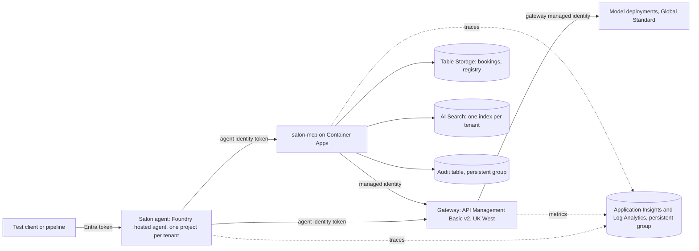

# Spec: Phases 0 and 1 (foundations and the governed single-tenant MVP)

Author: Rana Naveed Idrees. Status: draft for council review. Date: 2026-10-03.
Stage: 2 of 6 (Design). Reads: docs/intent.md revision 11 (decisions D1 to D36).
Next artifact: docs/implementation-plan-phase-0-1.md, after this spec is accepted.

## 1. Status and scope

This spec designs the remaining Phase 0 deliverables and the Phase 1 MVP. It designs nothing later.

In scope:
- Phase 0: the rest of the delivery harness, the infrastructure skeleton, CI with OIDC, and six
  time-boxed spikes that settle the open technical questions before any Phase 1 code.
- Phase 1: one governed agent for one tenant in the dev environment, built so that a second tenant
  is a second run of the same module.

Out of scope, by decision: a live (prod) environment (D19); a second tenant and cross-tenant
isolation tests (Phase 2, D1); the Agent Factory and the regulated document agent (Phase 3, D2);
the consoles and everything after the stop line (D30); real personal data (D29).

Citation rule: every design claim carries a key in square brackets that resolves to a URL in
section 13. Every URL was opened in this session on 2026-10-03. Prices are from the Azure Retail
Prices API through the Azure MCP pricing tool on the same day, in GBP, and are marked [prices].
Where something could not be verified, the text says so and section 2.3 lists it.

## 2. Clarifications

### 2.1 Questions answered in the design interview

| Question | Answer | Decision |
|---|---|---|
| Council Q4: gateway region and tier | API Management Basic v2 in UK West, on demand | D22 |
| Council Q4: tenancy unit in Foundry | One Foundry project per tenant | D24 |
| Council Q5: share one gateway between dev and prod | Does not arise: dev is the only environment | D19 |
| Council Q6: stop line | End of Phase 3 | D30 |
| Council Q7: Phase 1 length | Three weeks with cuts; Phase 0 is two weeks | D30, D31 |
| Council Q8: Phase 1 caller | Named Entra test identities only | D33 |
| Council Q9: additions | Negative demos and a prompt-injection guardrail; nothing else | D31 |
| Council Q10: Langfuse | Optional exporter, off by default | D32 |
| Council Q11: real data before Phase 5 | No, synthetic only | D29 |
| Council Q12: evidence and teardown | Full teardown; evidence lives in a persistent group | D28 |
| Council Q12: D9 not cumulative | £40 a month ceiling for dev | D21 |
| Council Q12: search tier unpriced | Free tier, by spike; Basic at £0.0762 an hour as fallback | D27 |
| Intent Q5: tenant provisioning | Admin script around the IaC module, with an audit record | D25 |
| Intent Q6: index per tenant or shared | Index per tenant | D27 |
| Intent Q7: model path | Spike both standalone gateway and Foundry AI Gateway | D23 |
| Intent Q8 and D11: data store | Table Storage; Foundry state store for conversation state | D26 |
| D6 against D13 | The owner's Desktop login is a second prod credential | D20 |
| Enforcement of D13 and D14 | Written rule only, by the owner's choice; accepted risk | D20 |

### 2.2 Council findings, checked against current documentation

| Finding in review 02 | Result | Source |
|---|---|---|
| A hosted agent can reach models without the gateway | Confirmed. "The agent has implicit access to core capabilities within its own project, such as model inferencing. No explicit role assignment is needed for the standard case." | [ha-perm] |
| No API Management v2 tier can be created in UK South | Confirmed. All three v2 tiers are marked unavailable for new instances. UK West has Basic v2 and Standard v2. | [apim-region] |
| Gateway token limit tiers | `llm-token-limit` applies to Developer, Basic, Basic v2, Standard, Standard v2, Premium and Premium v2. Consumption is not listed. | [apim-limit] |
| Gateway metrics take five dimensions | Confirmed. Five custom dimensions per policy. Each dimension is limited to 100 values and each namespace to 1,000 active series; beyond that data is "silently discarded". | [apim-metric] |
| AI Search tier limits | Free: 3 indexes. Basic: 15. S1: 50. | [search-limits] |
| Hosted agents in UK South and UK West | Both are listed for hosted agents. The wider Agent Service table lists UK South but not UK West. | [ha], [agent-regions] |

Two statements I made during the interview were wrong or too strong, and are corrected here:

- I said the Search Free tier needs key authentication. Microsoft's pages disagree. The roles page
  says role-based access works on "any tier, including free" [search-roles]; the keyless client
  page says the service "must be a billable tier (basic or higher)" [search-keyless]. Spike S4
  settles it.
- I repeated a Microsoft Q&A answer that gpt-4.1-mini retires in October 2026. The retirement
  schedule gives 2027-04-14 [retire]. D34 is unaffected: the regional models in UK South are all
  marked Deprecated or Legacy, and current models are Global Standard only [model-regions].

### 2.3 Not verified

| Item | Why | Handling |
|---|---|---|
| Hosted agent compute price | The pricing page showed no figures when fetched [ha-price] | Measured in Phase 0 week 1 from Cost Management |
| Model token prices | The pricing tool returned an error for this service family | Token spend is capped by the gateway quota; measured in week 1 |
| Log Analytics price per GB | Not returned by the pricing tool | Volume is small; measured in week 1 |
| "Free for up to 100,000 requests when created as an AI Gateway in Azure AI Foundry" | The pricing page gives no further terms [apim-price] | S1 reads the bill; not a planning assumption |
| Whether Foundry's AI Gateway binds hosted agent calls | The page does not say [ai-gw] | Spike S1 |
| How a hosted agent's code obtains a token for a custom audience | Docs describe the toolbox path, not the raw call [mcp-auth], [toolbox-ha] | Spike S2 |

### 2.4 Proposals not yet put to the owner

These are choices this spec makes that the interview did not cover. Each needs the owner's
confirmation at the spec gate; section 12 repeats them as questions.

1. Models: gpt-5.4-nano for classification and extraction, gpt-5.4-mini for answers,
   text-embedding-3-small for vectors (section 5.1).
2. The persistent group holds more than D28 lists: the audit table itself, the container registry,
   the workload identity for salon-mcp, the Workbook and the cost budget (section 3.2). Audit
   records are then written outside the environment, so no export step can fail.
3. The agent calls salon-mcp directly with its own Entra identity; a Foundry toolbox connection is
   the fallback (section 4).
4. Initial eval thresholds and token budget figures (sections 5.4 and 5.8).
5. If both gateway paths pass spike S1, the standalone gateway is chosen (section 6.2).
6. CLAUDE.md's Azure writes rule still cites only D9, D13 and D14. It should gain D20 and D21. It
   is harness configuration, so it is left for the owner to approve through /cleanup.

## 3. Architecture

### 3.1 Components and regions

Everything is in UK South except the gateway, which is in UK West (D22). The agent endpoint, the
gateway and salon-mcp all have public endpoints protected by Entra tokens; private networking is
out of scope and is recorded as a gap in section 11.

| Component | Service | Why this one | Source |
|---|---|---|---|
| Salon agent | LangGraph graph hosted with `langchain_azure_ai.agents.hosting`, Responses protocol | Official hosting path; the platform supplies endpoint, identity, sessions and scaling | [lg-hosted], [ha] |
| Conversation state | `FoundryCheckpointSaver` on Foundry's durable state store | Used to "persist LangGraph runtime state in Foundry's durable state store"; needs container protocol 2.0.0 | [lc-azure] |
| Tool server | FastMCP on Azure Container Apps, Streamable HTTP | Reuses Azure-Samples/python-mcp-demos, which deploys FastMCP to Container Apps with azd | [mcp-demos] |
| Gateway | API Management Basic v2 with `llm-token-limit` and `llm-emit-token-metric` | The only v2 tier creatable near UK South; v2 is required by Foundry's AI Gateway, so both spike paths can use it | [apim-region], [ai-gw] |
| Bookings and audit | Azure Table Storage | Unique partition and row key; atomic batches within a partition; separate add, update and delete permissions | [table-insert], [table-egt], [table-authz] |
| Knowledge | Azure AI Search, one index per tenant | Microsoft's shared-service multitenant pattern | [search-mt] |
| Telemetry | OpenTelemetry to Application Insights | The platform injects the connection string and the protocol libraries emit traces by default | [ha], [lc-traces] |

### 3.2 Resource groups

Two groups. Names are proposals for the implementation plan.

| Group | Lifetime | Contents |
|---|---|---|
| Persistent (`rg-maf-persist`) | Created once by the bootstrap; never torn down | Pipeline identity with federated credentials; workload identity for salon-mcp; Log Analytics workspace and Application Insights; storage account holding the audit table, eval results and release evidence; container registry; Azure Workbook; the cost budget |
| Environment (`rg-maf-dev`) | Created by `up`, deleted by `down` | Foundry resources, projects and model deployments; hosted agent; gateway; Container Apps environment and salon-mcp; storage account holding bookings, catalogue and the tenant registry; search service |

Deleting the environment group is safe for the evidence because nothing the evidence depends on
lives in it (D28). Putting the workload identity in the persistent group means its role
assignments on persistent resources do not have to propagate again after each rebuild; Table
Storage role assignments "may take up to 30 minutes to propagate" [table-entra].

### 3.3 The tenant module

One Bicep module takes `tenant_id` as a parameter and creates, for that tenant: a Foundry project
(D24); a search index; a partition in the bookings table; a registry entry mapping the tenant's
agent identity to the tenant; and a token budget in the gateway. Phase 2 is a second invocation
with a different parameter file.

The admin script (D25) is the only caller of the module. It runs the deployment, registers the
agent identity once the agent exists, and appends one record to the audit table: who ran it, when,
the tenant, a hash of the parameters and the deployment id. The Azure Activity Log is the second
witness. Provisioning is therefore traceable to an audit record, not to a pull request.

## 4. Identity flow

No hop uses a shared secret or an API key. The rule from the intent holds at every hop that makes
a tenant decision: tenant_id comes from the authenticated caller's identity, never from a value the
model can influence.

| Hop | Principal | Credential and audience | Check made by the receiver | Where tenant_id comes from | Negative test |
|---|---|---|---|---|---|
| 1. Test client to agent | The owner's Entra user | User token for the Foundry endpoint | Foundry requires the endpoint interact permission; Foundry Agent Consumer is "the least-privilege built-in role" and can be assigned at agent scope [ha-perm] | The agent itself: one agent belongs to one tenant | An identity without the role is refused |
| 2. Pipeline to agent | Pipeline managed identity, by GitHub OIDC | Federated token; no stored secret [gh-oidc] | Same role, same scope | As hop 1 | A workflow outside the two named environments gets no Azure token |
| 3. Agent to gateway | The agent's own Entra agent identity, "created automatically at deploy time" [ha] | Token for the gateway's app audience | `validate-azure-ad-token` checks tenant directory, audience and that the caller is a registered agent identity [apim-auth] | Looked up from the caller's object id in the registry | No token: 401. Unregistered identity: 403. Direct call to a model: fails (spike S1) |
| 4. Gateway to model | The gateway's managed identity | Token for Cognitive Services; role Cognitive Services OpenAI User on the model resource [apim-auth] | Azure RBAC on the model resource | Not applicable | The agent identity holds no role on the model resource |
| 5. Agent to salon-mcp | The agent identity | Token for salon-mcp's app audience | Signature, issuer, tenant directory, audience, expiry, and the agent marker claim `xms_par_app_azp` [mcp-entra], [agent-token] | Looked up from the caller's object id in the registry | Wrong audience: 401. Unregistered identity: 403. A tool call carrying a tenant_id is rejected by the tool schema |
| 6. salon-mcp to storage and search | salon-mcp's user-assigned managed identity [aca-mi] | Azure RBAC data roles | Table and index scoped roles; an add-and-read-only custom role on the audit table [table-authz] | Passed in code from hop 5's lookup | Updating or deleting an audit row is refused by Azure |
| 7. salon-mcp to gateway (embeddings) | salon-mcp's managed identity | Token for the gateway's app audience | As hop 3. The gateway accepts a tenant header only from this identity | From hop 5's lookup, asserted by salon-mcp | The same header from an agent identity is ignored |
| 8. Owner and scripts to Azure | The owner's own Azure login (D20) | Interactive login | Azure RBAC as subscription Owner | Parameter to the admin script | None. See the accepted risk in section 11 |

Notes on the design:

- **Agent identity is per agent.** "Every Hosted agent deployed to a Foundry project gets its own
  dedicated Microsoft Entra ID (agent identity)" and it is "the identity the agent container
  authenticates with at runtime" [ha]. The project managed identity is "not the agent's runtime
  identity" [ha]. With one project per tenant (D24), the project identity also identifies the
  tenant, which is the fallback if spike S2 cannot obtain agent identity tokens for a custom
  audience.
- **The identity changes on every rebuild.** Full teardown (D28) deletes the agent, so `up`
  re-registers the new object id in the registry and in the gateway. The registry is written only
  by the admin script.
- **No tool has a tenant_id parameter.** The model cannot supply what the schema does not accept.
  This is the Phase 1 unit test the intent asks for (section 6, item 5 of the intent).
- **One salon-mcp serves all tenants.** Its identity can read every tenant's index and partition,
  so the tenant boundary inside salon-mcp is enforced in code from hop 5's lookup, and proven by
  tests. This is the pooled model. A silo per tenant is in the optional backlog (Phase 6).
- **Customer authorisation (D33).** A cancellation needs the booking reference and the contact
  detail held on the booking. salon-mcp compares both server-side and refuses on a mismatch. The
  model passes values through; it does not decide.
- **No end-user identity in Phase 1.** Passing an end user to the agent needs the
  `x-ms-user-identity` header and a custom role, which "is not included in any built-in role"
  [ha-perm]. That belongs to the Phase 4 middle tier.

## 5. Phase 1 design

### 5.1 Salon agent

A LangGraph graph with four intents: book, cancel, FAQ, out of scope. Reschedule is dropped (D31).

| Node | Does | Model |
|---|---|---|
| classify | Picks the intent | Small |
| extract | Pulls service, stylist, date and time, or reference and contact | Small |
| validate | Checks opening hours, duration, that the stylist exists, and that the slot is in the future. Plain code, no model | None |
| availability | Calls `get_availability` | None |
| confirm | `interrupt()` showing the normalised booking or cancellation | None |
| write | Calls `create_booking` or `cancel_booking` after approval | None |
| retrieve and answer | Calls `search_faq`, answers only from returned passages, and cites their ids | Mid |
| refuse | Declines out-of-scope requests | Small |

- **Hosting.** The graph is a plain LangGraph package. A separate thin module passes it to
  `ResponsesHostServer` [lg-hosted]. That keeps the intent's rule that the graph can run elsewhere
  if Foundry hosting changes.
- **Confirmation.** With the Responses protocol, a pending interrupt surfaces as an
  `mcp_approval_request` item and the client resumes with an `mcp_approval_response` [lg-hosted].
  Microsoft's own sample does this with conversation-scoped checkpointing [sample-hitl].
- **State.** "For production Hosted agents, use a durable checkpointer instead of an in-memory
  checkpointer so graph state survives container restarts" [lg-hosted]. The checkpointer is
  `FoundryCheckpointSaver` [lc-azure], confirmed by spike S3.
- **Model calls.** The chat model's endpoint is set to the gateway, which the LangChain integration
  supports through its `endpoint` setting [lc-models]. Calls are non-streaming inside the graph,
  because the gateway estimates token counts for streamed responses [apim-limit].
- **Models (proposal 1).** Small: gpt-5.4-nano. Mid: gpt-5.4-mini. Embeddings:
  text-embedding-3-small. All three are listed for UK South as Global Standard [model-regions],
  are GA, and retire no earlier than 2027-09-21 [retire]. Microsoft's hosted LangGraph sample
  deploys gpt-5.4-mini as GlobalStandard [sample-hitl]. Prompts may be processed outside the UK;
  D29 makes that acceptable and section 11 records it.
- **Sandbox.** 0.5 vCPU and 1 GiB, the smallest size [ha]. Idle timeout five minutes (the range is
  2 to 60, default 15) [ha], to limit compute billed "during active sessions" [ha].

### 5.2 salon-mcp

FastMCP on Container Apps, starting from python-mcp-demos [mcp-demos]. The default scale rule is
HTTP with a minimum of zero replicas [aca-scale], so it costs nothing while idle.

| Tool | Reads or writes | Notes |
|---|---|---|
| `search_faq(query)` | Read | Returns passages with ids, titles and sources for citation |
| `get_availability(date, service, stylist?)` | Read | "Any available" when the stylist is omitted |
| `create_booking(slot, service, stylist, name, contact, idempotency_key)` | Write | The key is derived by the agent from the conversation and the confirmed proposal |
| `cancel_booking(reference, contact)` | Write | Both values must match the stored booking (D33) |

Every call is logged to the audit table with the tenant, the agent identity, the tool, a hash of
the arguments and the outcome. The token checks follow Microsoft's list for an Entra-protected MCP
server: signature, issuer, tenant, audience and expiry, then authorisation of the subject
[mcp-entra].

### 5.3 Data model

Table Storage, authorised only through Entra roles [table-entra].

| Table | Group | Partition key | Row keys | Purpose |
|---|---|---|---|---|
| `bookings` | Environment | tenant_id | `slot|stylist|start`, `ref|reference`, `idem|key` | One row per occupied half-hour slot, one lookup row per booking, one row per idempotency key |
| `catalogue` | Environment | tenant_id | service, stylist and opening-hours rows | Synthetic seed data |
| `registry` | Environment | `identity` | caller object id | Maps an agent identity to tenant_id and agent_id |
| `audit` | Persistent | tenant_id | reverse timestamp and a unique id | Append-only record of tool calls and provisioning |

- **Double booking.** The partition and row key "form the primary key, and must be unique within
  the table" [table-insert], so a second insert for the same stylist and slot fails at the store.
  The availability read can be stale; the insert is the check.
- **Atomicity.** The slot rows, the lookup row and the idempotency row are written in one entity
  group transaction. All share a partition key, as the feature requires, and a transaction holds
  up to 100 entities [table-egt]. A repeated request with the same idempotency key fails the batch
  and returns the original booking.
- **Append-only audit.** Insert needs either the write action or the `add/action`; update and
  delete are separate actions [table-authz]. salon-mcp's role on the audit table holds only read
  and `add/action`, so it cannot change or remove a record. The role is a custom one, which Azure
  supports for table data [table-entra].

### 5.4 Gateway

Policies live in the repository and are deployed with the environment.

- **Inbound.** Validate the Entra token [apim-auth]; look up the caller's object id in the
  registry values to get tenant_id and agent_id; reject unknown callers.
- **Budget.** `llm-token-limit` with the counter key set to tenant and agent together, a
  tokens-per-minute rate and a monthly quota. Exceeding the rate returns 429 and exceeding the
  quota returns 403 [apim-limit]. Initial figures (proposal 4): 20,000 tokens a minute and
  2,000,000 tokens a month for the tenant, retuned once token prices are measured.
- **Metrics.** `llm-emit-token-metric` with four custom dimensions: tenant_id, agent_id,
  environment and model_deployment. That is within the limit of five, and their product stays far
  below 1,000 series [apim-metric]. agent_version, conversation_id, turn_id, graph_node and
  tool_name are span-only, because their cardinality would exhaust the limits.
- **Backend.** The gateway authenticates to the model resource with its own managed identity
  [apim-auth].
- **No product or subscription key per tenant.** The intent's section 6 mentions a gateway product.
  This design does not create one: the caller's Entra identity already identifies the tenant, and a
  subscription key would be a shared secret to store and rotate.

Limits to state plainly: counters are kept per gateway; "concurrent or near-concurrent requests
can temporarily exceed the configured token limit"; and without prompt estimation the request that
crosses the limit is still served [apim-limit]. Anyone who can edit gateway policies can make the
gateway's identity call the model on their behalf [apim-mi], which is one more reason policy
changes go through pull requests.

Whether this gateway is a standalone instance or Foundry's AI Gateway integration is decided by
spike S1 (D23). The policies above describe the standalone path. On the Foundry path, limits are
set per project [ai-gw], which D24 makes equivalent to per tenant.

### 5.5 Knowledge and retrieval

One index per tenant, named from tenant_id, on the Free tier (D27). The seed script pushes the
synthetic FAQ documents with precomputed vectors; vector search is available "on all tiers at no
extra charge" [search-vector]. `search_faq` runs a hybrid query and returns ids for citation. No
indexer and no semantic ranking are used, because Microsoft says the Free tier "doesn't support
semantic ranking or managed identities" [search-free]. Free allows three indexes [search-limits],
which covers Phases 1 and 2.

### 5.6 Telemetry and the dashboard

- **Tracing.** `AzureAIOpenTelemetryTracer` emits spans that follow the OpenTelemetry GenAI
  conventions for agent steps, model calls and tool calls [lc-traces].
- **Attribution keys.** A span processor stamps all nine keys from the intent on every span at
  creation. OpenTelemetry notes that context values are not added to spans "without explicitly
  adding them" and that several languages provide span processors for this [otel-baggage]. The
  keys are held in process context, not sent as baggage, because baggage travels in request
  headers to whatever the code calls [otel-baggage].
- **One trace across hops.** W3C trace context is passed to salon-mcp and to the gateway.
- **Content.** Message content recording is off (`enable_content_recording=False`) [lc-traces].
  Data is synthetic, but the control is shown working.
- **Langfuse (D32).** A second OTLP exporter, off by default. When enabled it sends to
  `https://cloud.langfuse.com/api/public/otel` with Basic auth; Langfuse accepts OTLP over HTTP
  and does not support gRPC [langfuse]. Its keys never go in the image or in version environment
  variables, which Microsoft warns against [ha].
- **Workbook v0.** An Azure Workbook in the persistent group with four views by tenant and agent:
  tokens, estimated cost (tokens multiplied by a price parameter), latency percentiles, and eval
  results written by the pipeline.

### 5.7 Runtime guardrail

A guardrail policy with prompt-attack detection is attached to the agent definition through
`rai_config.rai_policy_name`. A prompt that violates it is rejected "before the agent runs" with
HTTP 400 and a `content_filter` error [guardrail].

Two cautions from the same source shape the design. Agent guardrails are in preview
[guardrail-overview], so this is a preview component (section 7). And "a nonexistent policy fails
open with no error" [guardrail], so `up` checks that the policy exists and the pipeline runs the
negative test on every candidate. Prompt Shields is listed for UK South [cs-regions].

Not covered in Phase 1: screening of tool responses, which is a preview intervention point
[guardrail-overview]. The FAQ content is seeded by the platform, so indirect injection through it
is a recorded gap, not a tested control.

### 5.8 Eval gate

One harness gates promotion (D35): microsoft/ai-agent-evals, pinned by commit SHA. It takes agents
as `agent-name:version`, compares them with a baseline, and reports "confidence intervals and test
for statistical significance" [eval-action], [eval-repo]. It is in preview [eval-action].

- **Dataset.** `evals/salon-seed.json`: at least 30 queries, six or more per intent, including
  out-of-scope requests and prompt-injection attempts.
- **Evaluators.** Task adherence, intent resolution, tool call accuracy, groundedness for FAQ
  answers, and one safety evaluator [agent-evals]. Task adherence and intent resolution are marked
  preview [agent-evals].
- **Gate (proposal 4).** Promotion is blocked if any pass rate falls below 0.80, if the candidate
  is significantly worse than the served version on any evaluator, if p95 latency exceeds 20
  seconds, or if mean tokens per conversation exceed the baseline by more than 25 per cent. The
  intent already says thresholds are proposed here and retuned after a baseline.
- **Deterministic rules.** Tenant override, booking validation, the double-booking race,
  idempotency and confirmation before writes are ordinary pytest tests that run on every pull
  request. They are not judged by a model.

The Action writes a report; it is not documented as failing the job itself. A following step
reads its output and applies the gate. Spike S6 confirms that this works against a version that is
not the served one.

### 5.9 Release pipeline

GitHub Actions with OIDC, following Microsoft's documented flow for releasing a hosted agent
version without changing what is served [release].

1. **Pull request.** Lint, pytest, Bicep build and secret scan. Main is protected: changes arrive
   by pull request with required checks.
2. **Candidate** (GitHub environment `dev`, no approval). Pin the served version with one
   `FixedRatio` rule at 100 per cent; build the image; create a new agent version without touching
   the selector. Microsoft warns that the default "follows the latest version", so pinning first
   is what stops a deploy from changing traffic [release], [cicd].
3. **Evaluate.** Create a session pinned to the candidate with a `version_ref` indicator and run a
   smoke test, then the eval gate and the guardrail negative test [release].
4. **Promote** (GitHub environment `dev-promote`, the owner as required reviewer, administrator
   bypass disallowed). The job waits; "a job cannot access environment secrets until one of the
   required reviewers approves it" and one approval is enough [gh-env]. After approval it confirms
   the candidate is still active and the served version unchanged, then moves the selector.
5. **Evidence.** A release record (commit, pull request, candidate version, image digest, eval run,
   approver, times) is written to the persistent storage account.
6. **Rollback.** Move the selector back to the recorded previous version, which is kept.

The owner is both author and approver. GitHub's prevent self-review setting exists so that
deployments "are always reviewed by more than one person" [gh-env], and with one account it cannot
be on. The gate proves that promotion needs a deliberate, recorded act, not that two people agreed.

The pipeline identity is a user-assigned managed identity with federated credentials [gh-oidc]
scoped to the two environments, so a workflow from a fork or outside those environments receives
no token. Subscription and tenant identifiers are GitHub variables, not files (D18).

Limitation: salon-mcp is deployed in the candidate step and is shared by the served agent, so a
tool change reaches the served version before promotion. Tool schemas are pinned in the eval
dataset to catch drift. Separate candidate and served revisions of salon-mcp are left to Phase 2.

### 5.10 Up, down and nightly teardown

- **`up`.** Deploys the environment group from Bicep, runs the admin script for the tenant, seeds
  the catalogue and the index, deploys the first agent version, and runs a smoke test. It waits
  for role assignments to take effect before reporting ready.
- **`down`.** Removes role assignments that point at persistent resources, deletes the environment
  group, then purges the soft-deleted gateway and Foundry resources. A deleted gateway keeps its
  name for 48 hours unless purged [apim-softdel], and the same holds for a Foundry resource, whose
  purge needs Contributor at subscription level [purge].
- **Nightly workflow.** Runs `down` each evening as a backstop, so a forgotten environment costs
  at most one day of gateway time.

Both scripts are run by the owner with the owner's login (D20). The nightly workflow uses the
pipeline identity.

## 6. Phase 0

### 6.1 Remaining deliverables

| Deliverable | Acceptance check |
|---|---|
| Bootstrap: persistent group, pipeline and workload identities, federated credentials, budget, GitHub environments and branch protection | One command creates them; a workflow in `dev` obtains a token and one outside does not |
| IaC skeleton: environment Bicep, tenant module, `up`, `down`, nightly teardown | Spike S5 passes |
| CI with OIDC: pull request checks and the release workflow skeleton | A no-op change travels from pull request to promotion, with approval |
| Secrets hook (D36) | A write containing a planted fake key is blocked; normal writes pass |
| Test-edit hook (D36) | Editing a test while a fix is in progress is blocked |
| Four skills (D36): tenant isolation, MCP security, telemetry attribution, IaC conventions | Each is a `SKILL.md` under `.claude/skills/` with a description that triggers it [cc-skills] |
| Verifier subagent (D36) | A definition under `.claude/agents/` [cc-agents] that checks work against the accepted plan |
| REVIEW.md | Used on the first Phase 0 pull request |
| Seed eval set | Loads in the eval Action in spike S6 |
| Cloud environment setup script | A cloud session can install dependencies and run the unit tests with no Azure credential |
| ADR folder | One short record per spike with the result and its evidence |
| CLAUDE.md architecture and commands sections | Filled from this spec once accepted |
| GitHub secret scanning and push protection (D18) | Enabled on the repository |

Hooks are not security boundaries. Claude Code's own documentation says to "use the permission
system rather than a hook to enforce a hard allow or deny" [cc-hooks] and that a Bash rule "isn't a
security boundary around the program" [cc-perms]. The two hooks reduce accidents; secret scanning
on the repository is the control that does not depend on the session.

### 6.2 Spikes

Six spikes, 4.25 days in total, inside the two weeks of Phase 0. A spike that reaches its time-box
without a go takes its fallback. Time-boxes are not extended.

**S1. Gateway binding (1.5 days).** Can the token budget be made impossible to bypass?

- Method: build both paths in dev and run the same four tests from inside the agent container.
  Path A is a standalone gateway, with the model deployments in a Foundry resource that only the
  gateway's identity can call. Path B is Foundry's AI Gateway with per-project limits [ai-gw].
- Go criteria: (1) a call on the intended path succeeds and a token metric with tenant and agent
  appears within five minutes; (2) exceeding the rate returns 429 and exceeding the quota returns
  403 [apim-limit], [ai-limits]; (3) every attempt by the agent identity to reach a model another
  way fails; (4) the path can be built from the repository with no portal step, since it is rebuilt
  daily.
- Decision: the path that passes all four. If both pass, the standalone gateway, because its
  policies live in the repository and its counter is per tenant and agent (proposal 5).
- No-go fallback: if test 3 fails on both, keep the gateway for metering and budget on the intended
  path, add a check that compares model usage with gateway usage, and downgrade the claim from
  "cannot be bypassed" to "bypass is detected". Network egress rules on the hosted agent, which are
  in preview [guardrail], are tried within the time-box as a third way to close the path.
- Can change: sections 3.1, 4 (hops 3 and 4) and 5.4.

**S2. Identity at each hop (1 day).** What token reaches salon-mcp and the gateway from a hosted
agent, and can it be mapped to a tenant?

- Method: deploy a minimal hosted agent that calls a token-echoing endpoint, first directly and
  then through a Foundry connection with `agentic-identity` authentication and a custom audience
  [mcp-auth].
- Go criteria: the receiver sees a token whose audience is its own, whose object id equals the
  agent identity Foundry reports, and which carries the agent marker claim [agent-token]; a token
  from another identity is refused.
- No-go fallback: the Foundry toolbox connection [toolbox-ha]; failing that, the project managed
  identity, which D24 makes tenant-specific.
- Can change: section 4, hops 3, 5 and 7.

**S3. Durable checkpointer (0.5 day).** Does a paused confirmation survive losing the container?

- Method: start a booking, stop at the confirmation interrupt, let the session go idle so the
  compute is deprovisioned, then approve.
- Go criteria: the graph resumes and writes exactly one booking.
- No-go fallback: `CosmosDBSaver` on Cosmos DB serverless [lc-cosmos], at £0.2242 per million
  request units and £0.19 per GB [prices].
- Can change: sections 5.1 and 8.

**S4. Search on the Free tier with roles only (0.25 day).**

- Method: create a Free service with keys disabled, grant salon-mcp's identity the reader role on
  one index [search-rbac], and run a hybrid query.
- Go criteria: the query succeeds with an Entra token, a key is refused, and the service can be
  deleted and recreated the same day.
- No-go fallback: Basic created on demand at £0.0762 an hour [prices].
- Can change: sections 5.5 and 8.

**S5. Full teardown and rebuild (0.5 day).**

- Method: run `down` then `up` twice in succession, unattended.
- Go criteria: both rebuilds reach a passing smoke test within 30 minutes; names are reusable after
  purge; the environment group is empty after `down`; traces and audit records from before the
  teardown are still queryable.
- No-go fallback: tear down only the gateway. That reopens D28, so it goes back to the owner.
- Can change: sections 3.2 and 5.10.

**S6. Eval Action against a candidate (0.5 day).**

- Method: deploy two versions, one with a deliberately damaged prompt, and run the Action with the
  candidate against the served version as baseline. Run it with the account layout S1 chose,
  because the Action needs a judge model deployment in the project [eval-action], and on path A
  that would put a deployment back within the agent's implicit reach.
- Go criteria: the damaged version is flagged and the job fails; the good version passes; a
  version that is not served can be evaluated.
- No-go fallback: a DeepEval-only gate in pytest (D35), with its judge model called through the
  gateway.
- Can change: sections 5.8 and 5.9.

## 7. Preview components and fallbacks

| Component | Status and source | Pin | Fallback |
|---|---|---|---|
| ai-agent-evals Action | `v3-beta`; the docs page is marked preview [eval-repo], [eval-action] | Commit SHA | DeepEval-only gate (D35) |
| Agent guardrails on hosted agents | "Agent guardrails are in preview" [guardrail-overview] | Policy id in IaC | Guardrail on the model deployment, which applies to all Foundry models sold by Azure [guardrail-overview] |
| Task adherence and intent resolution evaluators | Marked preview [agent-evals] | Evaluator names in the dataset | Tool call accuracy and custom graders |
| Foundry AI Gateway (only if S1 chooses it) | Preview: Microsoft's API Management page heads it "AI gateway in Microsoft Foundry (preview)" [apim-aigw]. Set up through the portal [ai-gw] | None available | Standalone gateway |
| Hosted agent network egress controls (only if S1 uses them) | Preview [guardrail] | Rule set in IaC | Path without them |
| azd `azure.ai.agents` extension | Beta: the official sample requires `>=1.0.0-beta.9` [sample-hitl] | Exact version | Deploy through the REST API [deploy] |
| Azure MCP server (harness only) | `3.0.0-beta.49` (D10) | Exact version | az and azd |

Generally available and not in doubt: hosted agents, API Management v2 policies, Table Storage,
Container Apps, AI Search, GitHub environments.

## 8. Cost estimate

Ceiling: £40 a month for the whole dev environment (D21).

| Item | Billing basis | Price | Source |
|---|---|---|---|
| Gateway, API Management Basic v2 | Per hour it exists | £0.1551 an hour | [prices] |
| Search, Free tier | None | £0 | [prices] |
| Container registry, Basic | Per day | £0.1257 a day, about £3.82 a month | [prices] |
| Container Apps | Per request and per second of use; scales to zero | £0.3019 per million requests; compute within the free tier at this volume | [prices], [aca-scale] |
| Table and blob storage | Per GB and per operation | Not priced; a few megabytes | Not verified |
| Logs | Per GB ingested | Not priced | Not verified |
| Hosted agent compute | CPU and memory during active sessions | Not published on the page fetched | Not verified |
| Model tokens | Per token | Not retrieved | Not verified |

| Hours the environment is up in a month | Gateway | Fixed | Known total |
|---|---|---|---|
| 60 | £9.31 | £3.82 | £13 |
| 135 | £20.94 | £3.82 | £25 |
| 200 | £31.02 | £3.82 | £35 |
| 730 (never torn down) | £113.22 | £3.82 | £117 |

- The known total leaves at least £5 at 200 hours for the four unpriced items. Week 1 of Phase 0
  reads the actual figures from Cost Management, and the owner is told if they exceed that margin.
- A forgotten environment costs at most £3.72, one day of gateway time, because of the nightly
  teardown.
- Spike S1 runs two gateways for up to a day and a half: about £5.60 extra, once.
- If S4 falls back to Basic search, add £0.0762 an hour and the 200 hours become about 135.
- If S3 falls back to Cosmos DB serverless, add pence.
- A Cost Management budget of £40 covers both resource groups, with alerts at 50, 80 and 100 per
  cent of actual cost and at 100 per cent of forecast [budget]. Budgets notify only: "none of your
  resources are affected and your consumption isn't stopped" [budget-bicep]. The teardown is what
  limits spend.
- D21 in practice: before a dev write that would otherwise auto-run, the session adds the month's
  cost so far, the remaining-month cost of what is running, and the cost of the write. If the sum
  is over £40, it asks.

## 9. Exit criteria

Each control has a demonstration that it works and a demonstration that it refuses. Evidence is
what remains afterwards.

### 9.1 Phase 0

| Control | Works | Refuses | Evidence |
|---|---|---|---|
| Pipeline identity | A job in `dev` obtains an Azure token | A job outside the named environments does not | Workflow runs |
| Protected main | A pull request with green checks merges | A direct push is rejected | Repository settings and a rejected push |
| Approval gate | An approved job proceeds | An unapproved job waits; a rejected one stops | Environment approval record |
| Secrets hook and scanning | Normal writes pass | A planted fake key is blocked by the hook and by push protection | Hook log |
| Test-edit hook | Tests can be edited in a test task | A test edit during a fix is blocked | Hook log |
| Rebuild from nothing | `up` reaches a passing smoke test | After `down`, no billable resource remains | Spike S5 record |
| Budget | The budget and its alerts exist | Not applicable: budgets do not block | Budget definition in IaC |
| Spikes | Each has a result | Each no-go has taken its fallback | Six ADRs |

Phase 0 is complete when all rows pass, this spec has been updated for the spike results, and the
council has reviewed the change.

### 9.2 Phase 1

| Control | Works | Refuses | Evidence |
|---|---|---|---|
| Caller authorisation | A named test identity gets a reply | An identity without the role is refused | Trace and a refused request |
| Tenant from identity | The agent books for its own tenant | A tool call carrying a tenant_id fails the schema; an unregistered identity gets 403 | Unit tests and audit rows |
| Confirmation before writes | Approval leads to one booking | Declining leaves no booking; the decline is audited | Audit rows |
| Durable confirmation | Approval after the container is lost still completes | Not applicable | Spike S3 repeated in Phase 1 |
| Booking rules in code | A valid slot is accepted | A slot outside hours or in the past is refused whatever the model says | Unit tests |
| Double booking | One of two simultaneous requests succeeds | The other fails at the store | Test with concurrent calls |
| Idempotency | A repeated request returns the same booking | No second booking is created | Unit test |
| Customer authorisation | Reference and contact together cancel the booking | A wrong contact detail is refused | Audit rows |
| Append-only audit | salon-mcp adds a record | Its update and delete attempts are refused by Azure | Refused requests |
| Gateway budget | A call is served and metered by tenant and agent | Over the rate: 429. Over the quota: 403. A direct model call fails | Metrics and refused requests |
| Attribution | A trace shows all nine keys on every span | A query for spans missing any key returns none | Saved query |
| Grounded answers | An FAQ answer cites ids that exist in the tenant's index | A question with no source is answered with "I do not know" | Eval results |
| Guardrail | A normal prompt gets HTTP 200 | An attack prompt gets HTTP 400 `content_filter` | Pipeline run |
| Eval gate | A sound candidate passes | A deliberately damaged candidate fails and cannot be promoted | Two pipeline runs |
| Approval and promotion | An approved candidate becomes the served version | A rejected one leaves the served version unchanged | Release records |
| Traceability | A release record names the pull request, commit, eval run and approver | Not applicable | Release record |
| Evidence survives teardown | After `down`, traces, audit rows and release records are still readable | The environment group is empty | Queries run after `down` |
| Dashboard | The Workbook shows tokens, cost, latency and eval results by tenant and agent | Not applicable | Screenshot in the pull request |
| Stranger test | From a clean clone, one setup command and one pipeline run produce a served agent | Not applicable | The owner's run from a fresh checkout |

Phase 1 is complete when all rows pass and the council gate is passed. The Langfuse export is
outside these criteria (D32).

## 10. Schedule and cut order

| Phase | Week | Work |
|---|---|---|
| 0 | 1 | Bootstrap, IaC skeleton, CI with OIDC, repository protections, spikes S1 and S2, cost measurement |
| 0 | 2 | Spikes S3 to S6, hooks, skills, verifier, REVIEW.md, seed eval set, ADRs, spec update, council gate |
| 1 | 1 | salon-mcp, data model, tenant module, agent graph running locally with tests |
| 1 | 2 | Hosted agent, gateway policies, telemetry and attribution, guardrail |
| 1 | 3 | Eval gate, release pipeline, Workbook, exit demonstrations, council gate |

If a time-box is at risk, scope is cut in this order and the date holds (D30):

1. Workbook reduced to tokens and latency only.
2. Vector half of retrieval; keyword search only.
3. The second model role; one model for every node.
4. The cost-per-conversation and latency conditions in the eval gate.
5. Stylist choice; "any available" only.

Never cut, because they are the story: tenant from identity, confirmation before writes, the
gateway negative test, the eval gate, the approval gate, the audit log.

## 11. Risks and accepted risks

Accepted by the owner:

- **No enforced control on session writes to Azure (D20).** A session uses the owner's login, so
  nothing mechanical stops it writing anywhere the owner can. With dev as the only environment the
  exposure is the dev environment and the persistent group, including the evidence. The council's
  first debate in review 02 stays open.
- **One approver (D19).** Author and approver are the same person.
- **Global Standard processing (D34).** Prompts may be processed outside the UK. Acceptable only
  because data is synthetic (D29). The path for real data is regional or provisioned deployment.
- **Provisioning outside the pull request trail (D25).**

Design risks:

| Risk | Mitigation |
|---|---|
| The gateway budget can be bypassed | Spike S1, with a stated downgrade of the claim if it cannot be closed |
| Preview components change or disappear | Section 7 names a pin and a fallback for each |
| Public endpoints for the agent, the gateway and salon-mcp | Entra tokens on every hop; private networking recorded as out of scope |
| Daily rebuild is slow or flaky, and role assignments lag | Spike S5 sets a 30 minute limit; workload identity kept in the persistent group |
| One salon-mcp identity can read every tenant's data | Boundary enforced in code and tested; cross-tenant tests arrive in Phase 2 |
| The eval judge deployment reopens the bypass | S6 runs after S1 with the same account layout |
| Unpriced items exceed the margin | Measured in week 1; the owner is told |
| Indirect prompt injection through retrieved content | Recorded gap; content is platform-seeded in Phase 1 |
| Tool changes reach the served agent before promotion | Tool schemas pinned in the eval set; separate revisions in Phase 2 |
| Six spikes overrun | Fixed time-boxes with fallbacks; two weeks for Phase 0 |

## 12. Open questions

For the owner, at the spec gate:

1. Are gpt-5.4-nano, gpt-5.4-mini and text-embedding-3-small the models?
2. May the persistent group also hold the audit table, the container registry, the salon-mcp
   workload identity, the Workbook and the budget, extending D28?
3. Is a direct call from the agent to salon-mcp the default, with a toolbox connection as fallback?
4. Are the initial figures acceptable: 20,000 tokens a minute, 2,000,000 tokens a month, pass
   rates of 0.80, p95 latency of 20 seconds?
5. If both gateway paths pass S1, is the standalone gateway the choice?
6. Should CLAUDE.md's Azure writes rule be updated for D20 and D21?
7. Is it accepted that salon-mcp has a public endpoint in Phase 1?

For the implementation plan:

- The MCP client library used inside the graph.
- The Bicep module layout and the exact custom role definitions.
- How the pipeline reads the eval Action's output to apply the gate.
- The catalogue and FAQ seed content.

## 13. References

All opened on 2026-10-03.

| Key | Source |
|---|---|
| [ha] | https://learn.microsoft.com/azure/foundry/agents/concepts/hosted-agents |
| [ha-perm] | https://learn.microsoft.com/en-us/azure/foundry/agents/concepts/hosted-agent-permissions |
| [ha-price] | https://azure.microsoft.com/en-gb/pricing/details/foundry-agent-service/ |
| [agent-regions] | https://learn.microsoft.com/azure/foundry/agents/concepts/limits-quotas-regions |
| [lg-hosted] | https://learn.microsoft.com/azure/foundry/how-to/develop/langchain-hosted-agents |
| [lc-azure] | https://github.com/langchain-ai/langchain-azure/blob/main/libs/azure-ai/README.md |
| [lc-cosmos] | https://github.com/langchain-ai/langchain-azure/blob/main/libs/azure-cosmosdb/README.md |
| [lc-models] | https://learn.microsoft.com/azure/foundry/how-to/develop/langchain-models#environment-variables-reference |
| [lc-traces] | https://learn.microsoft.com/azure/foundry/how-to/develop/langchain-traces |
| [sample-hitl] | https://github.com/microsoft-foundry/foundry-samples/blob/main/samples/python/hosted-agents/langgraph/responses/07-human-in-the-loop/azure.yaml |
| [release] | https://learn.microsoft.com/azure/foundry/agents/how-to/manage-hosted-agent#release-a-version-without-changing-production |
| [cicd] | https://learn.microsoft.com/azure/foundry/agents/how-to/set-up-ci-cd-cli |
| [deploy] | https://learn.microsoft.com/azure/foundry/agents/how-to/deploy-hosted-agent |
| [guardrail] | https://learn.microsoft.com/azure/foundry/agents/how-to/add-hosted-agent-guardrails |
| [guardrail-overview] | https://learn.microsoft.com/azure/foundry/guardrails/guardrails-overview |
| [cs-regions] | https://learn.microsoft.com/azure/ai-services/content-safety/region-availability |
| [mcp-auth] | https://learn.microsoft.com/azure/foundry/agents/how-to/mcp-authentication |
| [toolbox-ha] | https://learn.microsoft.com/azure/foundry/agents/how-to/tools/use-toolbox-hosted-agent |
| [mcp-entra] | https://learn.microsoft.com/entra/agent-id/secure-mcp-server-with-entra-id |
| [agent-token] | https://learn.microsoft.com/entra/agent-id/how-to-validate-agent-tokens-downstream-api |
| [mcp-demos] | https://github.com/Azure-Samples/python-mcp-demos |
| [apim-region] | https://learn.microsoft.com/en-us/azure/api-management/api-management-region-availability |
| [apim-limit] | https://learn.microsoft.com/en-us/azure/api-management/llm-token-limit-policy |
| [apim-metric] | https://learn.microsoft.com/en-us/azure/api-management/llm-emit-token-metric-policy |
| [apim-auth] | https://learn.microsoft.com/azure/api-management/api-management-authenticate-authorize-ai-apis |
| [apim-mi] | https://learn.microsoft.com/azure/api-management/api-management-howto-use-managed-service-identity |
| [apim-softdel] | https://learn.microsoft.com/azure/api-management/soft-delete |
| [apim-price] | https://azure.microsoft.com/en-gb/pricing/details/api-management/ |
| [apim-aigw] | https://learn.microsoft.com/azure/api-management/genai-gateway-capabilities#ai-gateway-in-microsoft-foundry-preview |
| [ai-gw] | https://learn.microsoft.com/en-us/azure/foundry/configuration/enable-ai-api-management-gateway-portal |
| [ai-limits] | https://learn.microsoft.com/azure/foundry/control-plane/how-to-enforce-limits-models |
| [model-regions] | https://learn.microsoft.com/azure/foundry/foundry-models/concepts/models-sold-directly-by-azure-region-availability |
| [retire] | https://learn.microsoft.com/azure/foundry/openai/concepts/model-retirement-schedule |
| [search-limits] | https://learn.microsoft.com/azure/search/search-limits-quotas-capacity |
| [search-roles] | https://learn.microsoft.com/azure/search/search-security-enable-roles |
| [search-keyless] | https://learn.microsoft.com/azure/search/search-security-rbac-client-code |
| [search-rbac] | https://learn.microsoft.com/azure/search/search-security-rbac |
| [search-mt] | https://learn.microsoft.com/azure/search/search-modeling-multitenant-saas-applications |
| [search-vector] | https://learn.microsoft.com/azure/search/vector-search-overview |
| [search-free] | https://learn.microsoft.com/azure/search/search-try-for-free |
| [table-authz] | https://learn.microsoft.com/rest/api/storageservices/authorize-with-azure-active-directory |
| [table-entra] | https://learn.microsoft.com/azure/storage/tables/authorize-access-azure-active-directory |
| [table-insert] | https://learn.microsoft.com/rest/api/storageservices/insert-entity |
| [table-egt] | https://learn.microsoft.com/rest/api/storageservices/performing-entity-group-transactions |
| [aca-scale] | https://learn.microsoft.com/azure/container-apps/scale-app |
| [aca-mi] | https://learn.microsoft.com/azure/container-apps/managed-identity |
| [purge] | https://learn.microsoft.com/azure/ai-services/recover-purge-resources |
| [gh-env] | https://docs.github.com/en/actions/reference/workflows-and-actions/deployments-and-environments |
| [gh-oidc] | https://learn.microsoft.com/azure/developer/github/connect-from-azure-openid-connect |
| [eval-action] | https://learn.microsoft.com/azure/foundry/how-to/evaluation-github-action |
| [eval-repo] | https://github.com/microsoft/ai-agent-evals |
| [agent-evals] | https://learn.microsoft.com/azure/foundry/concepts/evaluation-evaluators/agent-evaluators |
| [otel-baggage] | https://opentelemetry.io/docs/concepts/signals/baggage/ |
| [langfuse] | https://langfuse.com/integrations/native/opentelemetry |
| [budget] | https://learn.microsoft.com/azure/cost-management-billing/costs/tutorial-acm-create-budgets |
| [budget-bicep] | https://learn.microsoft.com/azure/cost-management-billing/costs/quick-create-budget-bicep |
| [cc-hooks] | https://code.claude.com/docs/en/hooks |
| [cc-perms] | https://code.claude.com/docs/en/permissions |
| [cc-skills] | https://code.claude.com/docs/en/skills |
| [cc-agents] | https://code.claude.com/docs/en/sub-agents |
| [prices] | Azure Retail Prices API, queried through the Azure MCP pricing tool, GBP, UK South and UK West |
