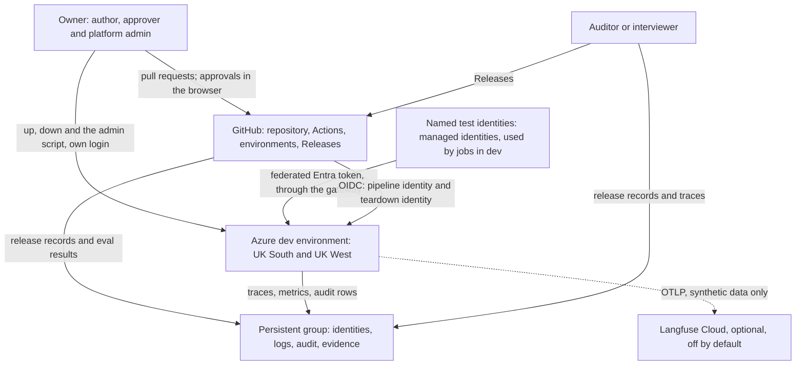
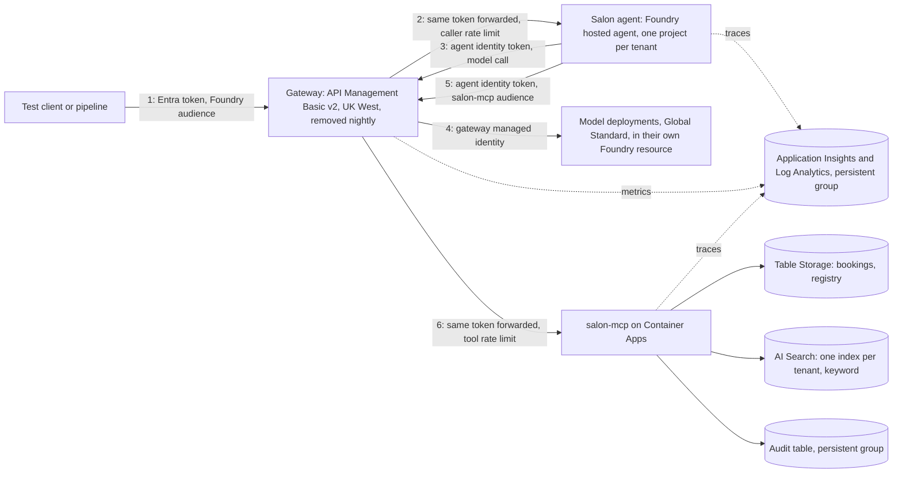
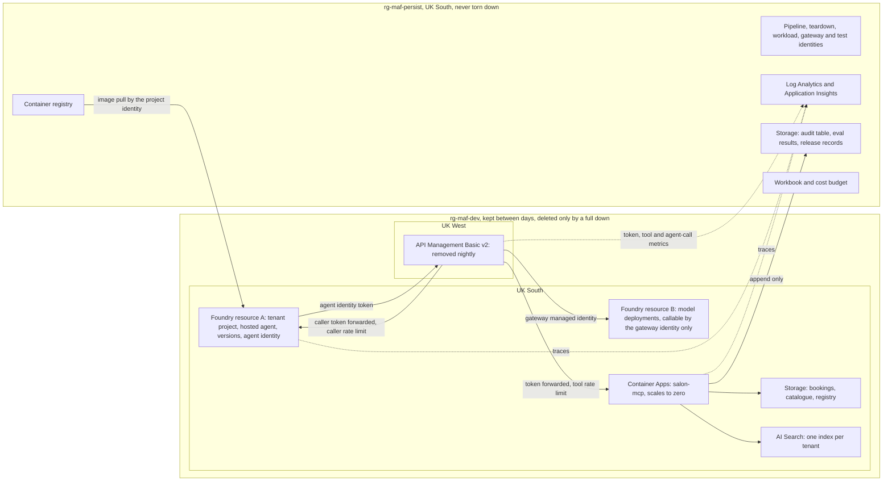
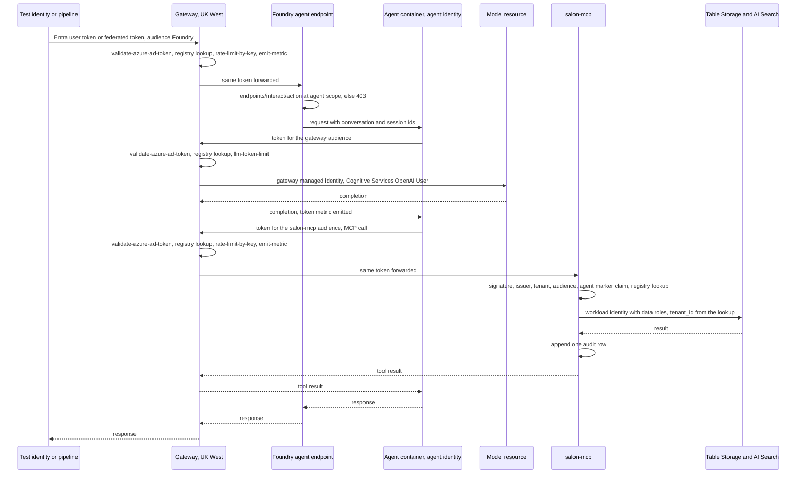
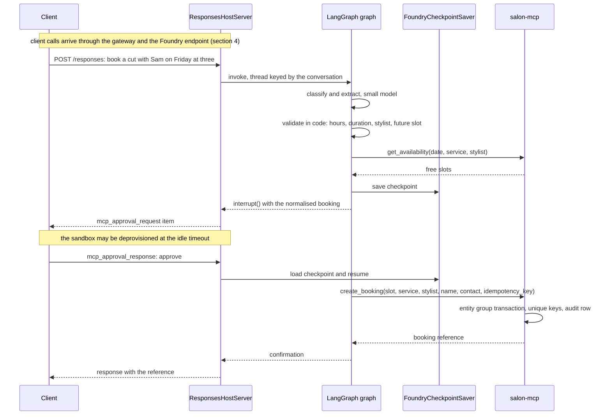
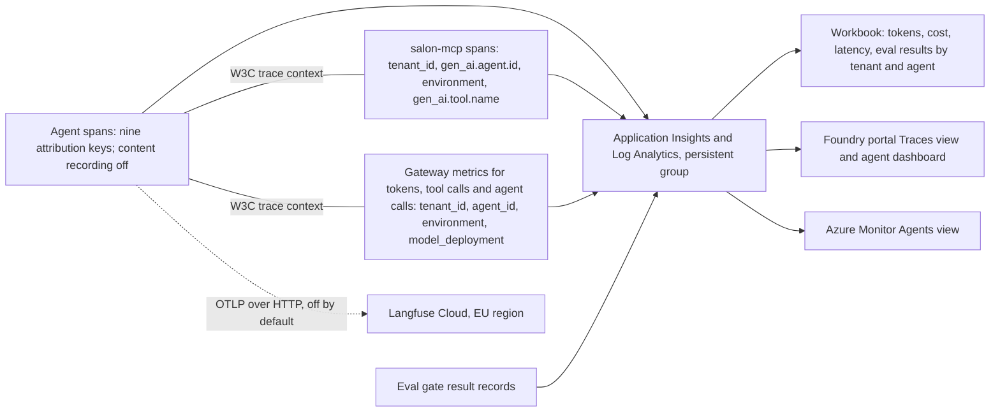
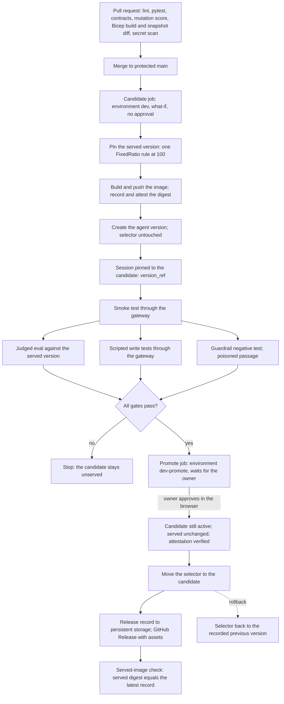

# Spec: Phases 0 and 1 (foundations and the governed single-tenant MVP)

Author: Rana Naveed Idrees. Status: accepted by the owner on 2026-10-04, after council review 03 and principal review 04; revised the same day for D71 (the gateway fronts salon-mcp), for D72 to D79 (the owner's decisions after council review 05 of the plan), for D80 (the gateway also fronts the agent endpoint, gated by spike S1) and for D81 and D82 (the time the agent route is given, and the test identities); corrected the same day for principal review 06 of the plan (the hosting library pins, the owner's role, and two rows that D73 and D74 had missed), and revised for D83 to D88 (the owner's decisions after that review). Date: 2026-10-04.
Stage: 2 of 6 (Design). Reads: docs/intent.md revision 18 (decisions D1 to D88).
Council record: docs/council/03-spec-phase-0-1-review.md, which reviewed the draft at commit e13557b; docs/council/04-spec-phase-0-1-principal-review.md, a single-reviewer pass with a currency audit, which reviewed the revision at commit dea7217.
Next artifact: docs/implementation-plan-phase-0-1.md, after this spec is accepted.

## 1. Status and scope

This spec designs the remaining Phase 0 deliverables and the Phase 1 MVP. It designs nothing later.

In scope:
- Phase 0: the rest of the delivery harness, the infrastructure skeleton, CI with OIDC, and six
  time-boxed spikes that settle the open technical questions before any Phase 1 code.
- Phase 1: one governed agent for one tenant in the dev environment, built so that a second tenant
  is a second run of the same module.

Out of scope, by decision: a live (prod) environment (D19); a second tenant in Azure and isolation
tests against real infrastructure (Phase 2, D1, D49); the Agent Factory and the regulated document
agent (Phase 3, D2); vector retrieval (Phase 3, D45); the consoles and everything after the stop
line (D30); real personal data (D29).

Citation rule: every design claim carries a key in square brackets that resolves to a URL in
section 13. Every URL was opened on 2026-10-03, in the design session, the gate session or the
review session.
Prices are from the Azure Retail Prices API on the same day, in GBP, and are marked [prices].
Microsoft prices in USD: "Other non-USD prices returned by the API are for your reference to help
you estimate budget expenses" [prices-api]. Where something could not be verified, the text says so
and section 2.5 lists it.

## 2. Clarifications

### 2.1 Questions answered in the design interview

| Question | Answer | Decision |
|---|---|---|
| Council Q4: gateway region and tier | API Management Basic v2 in UK West, on demand | D22 |
| Council Q4: tenancy unit in Foundry | One Foundry project per tenant | D24 |
| Council Q5: share one gateway between dev and prod | Does not arise: dev is the only environment | D19 |
| Council Q6: stop line | End of Phase 3 | D30 |
| Council Q7: Phase 1 length | Three weeks with cuts; Phase 0 is two weeks. Now 18 and 12 working days (D81, D87) | D30, D31, D81, D87 |
| Council Q8: Phase 1 caller | Named Entra test identities only, which are managed identities (D82) | D33, D82 |
| Council Q9: additions | Negative demos and a prompt-injection guardrail; later extended at the spec gate | D31, D46 |
| Council Q10: Langfuse | Optional exporter, off by default | D32 |
| Council Q11: real data before Phase 5 | No, synthetic only | D29 |
| Council Q12: evidence and teardown | Evidence lives in a persistent group; teardown later narrowed to the gateway | D28, D37 |
| Council Q12: D9 not cumulative | £40 a month ceiling for dev | D21 |
| Council Q12: search tier unpriced | Free tier, by spike; Basic at £0.0762 an hour as fallback | D27 |
| Intent Q5: tenant provisioning | Admin script around the IaC module, with an audit record | D25 |
| Intent Q6: index per tenant or shared | Index per tenant | D27 |
| Intent Q7: model path | Standalone gateway; Foundry's AI Gateway as a desk check | D23, D47 |
| Intent Q8 and D11: data store | Table Storage; Foundry state store for conversation state | D26 |
| D6 against D13 | The owner's Desktop login is a second prod credential | D20 |
| Enforcement of D13 and D14 | Written rule only, by the owner's choice; accepted risk | D20 |

### 2.2 Council review 02 findings, checked against current documentation

| Finding in review 02 | Result | Source |
|---|---|---|
| A hosted agent can reach models without the gateway | Confirmed. "The agent has implicit access to core capabilities within its own project, such as model inferencing. No explicit role assignment is needed for the standard case." | [ha-perm] |
| No API Management v2 tier can be created in UK South | Confirmed. All three v2 tiers are marked unavailable for new instances. UK West has Basic v2 and Standard v2. | [apim-region] |
| Gateway token limit tiers | `llm-token-limit` applies to Developer, Basic, Basic v2, Standard, Standard v2, Premium and Premium v2. Consumption is not listed. | [apim-limit] |
| Gateway metrics take five dimensions | Confirmed. Five custom dimensions per policy. Each dimension is limited to 100 values and each namespace to 1,000 active series; beyond that data is "silently discarded". | [apim-metric] |
| AI Search tier limits | Free: 3 indexes. Basic: 15. S1: 50. | [search-limits] |
| Hosted agents in UK South and UK West | Both are listed for hosted agents. The wider Agent Service table lists UK South but not UK West. | [ha], [agent-regions] |

Two statements I made during the design interview were wrong or too strong, and are corrected here:

- I said the Search Free tier needs key authentication. Microsoft's pages disagree. The roles page
  says role-based access works on "any tier, including free" [search-roles]; the keyless client
  page says the service "must be a billable tier (basic or higher)" [search-keyless]. A third page,
  opened at the gate, sides with the stricter reading: the service "must be a billable tier (Basic
  or higher) for role-based access" [search-index]. Spike S4 settles it, and the Basic fallback is
  now the likelier outcome.
- I repeated a Microsoft Q&A answer that gpt-4.1-mini retires in October 2026. The retirement
  schedule gives 2027-04-14 [retire]. D34 is unaffected: the regional models in UK South are all
  marked Deprecated or Legacy, and current models are Global Standard only [model-regions].

### 2.3 Decisions at the spec gate

"Q" numbers are the owner questions in docs/council/03-spec-phase-0-1-review.md. "Draft Q" numbers
are the questions in section 12 of the draft at commit e13557b.

| Question | Answer | Decision |
|---|---|---|
| Q1: nightly teardown | The gateway only | D37 |
| Q2: full rebuild | `up` restores the approved image only | D38 |
| Q3: a session's credential can approve | Written rule; accepted risk | D41 |
| Q4: gate additions | Branch rule, served-image check, teardown identity, full-SHA pins | D42 |
| Q5: gating the write intents | Scripted tests beside the eval Action | D44 |
| Q6: thresholds | Measured in spike S6 before they are fixed; cost and latency stay | D44 |
| Q7 and draft Q4: token quota | 150,000 tokens a day; a monthly figure is reported | D39 |
| Q8: evidence | A GitHub Release for each promotion | D43 |
| Q9: retrieval | Keyword only | D45 |
| Q10: agent additions | Validator node, pinned model versions, unanswerable questions, poisoned-passage test | D46 |
| Q11 and draft Q5: gateway path B | Desk check only; S2 runs before S1 | D47 |
| Q11: Phase 0 cut order | Added | D48 |
| Q12: two-tenant test | Added, local | D49 |
| Q13: points raised only in rebuttal | All six addressed | D53 |
| Debate 7: unopposed corrections | Applied | D54 |
| Draft Q1: models | gpt-5.4-nano and gpt-5.4-mini | D50 |
| Draft Q2: persistent group | Extended | D51 |
| Draft Q3 and Q7: salon-mcp | Direct call; public endpoint in Phase 1 | D52 |
| Draft Q6: CLAUDE.md's Azure writes rule | Already updated in commit e13557b | None |
| Session teardown | A session may run the gateway teardown without asking | D40 |

### 2.4 Council review 03 findings, checked against current documentation

| Finding in review 03 | Result | Source |
|---|---|---|
| Deleting an agent or a version is not rollback | Confirmed. "Retain previous versions and images while sessions or rollback requirements still depend on them. Deleting the agent or a version isn't a rollback operation." | [release] |
| One permission creates a version and moves the selector | Confirmed. Each needs `Microsoft.CognitiveServices/accounts/AIServices/agents/write` "at the scope of the Foundry project" | [ha-perm] |
| A token with the `repo` scope can approve a deployment | Confirmed. "OAuth app tokens and personal access tokens (classic) need the repo scope to use this endpoint." | [gh-review] |
| Environments accept any branch by default | Confirmed. "No restriction: No restriction on which branch or tag can deploy to the environment." | [gh-env] |
| The eval Action sends single queries and reports only a summary | Confirmed. Data is an "Array of input objects with `query` and optional evaluator fields", and results "are output to the summary section" | [eval-action] |
| Foundry's AI Gateway is set up through the portal | Confirmed. The only documented setup is a sequence of portal steps | [ai-gw] |
| Purging a gateway needs rights at subscription scope | Confirmed. Two named actions "at the subscription scope in addition to Contributor access to the API Management instance" | [apim-softdel] |
| Bicep cannot create a search index | Confirmed. "There's no Bicep template support for Azure AI Search data plane operations like creating an index" | [search-bicep] |
| Risk and safety evaluators are not offered in UK South | Confirmed. UK South is absent from the list of supported regions | [eval-regions] |
| Workflow logs and log tables expire | Confirmed. Workflow logs "are retained for 90 days before they are automatically deleted" [gh-retention]. "By default, all tables in a Log Analytics workspace retain data for 30 days, except for log tables with 90-day default retention" [la-retention] | [gh-retention], [la-retention] |
| Model quota is unverified | Resolved. The subscription holds Global Standard quota in UK South for both models, read on 2026-10-03 with `az cognitiveservices usage list` | None |
| The token counter is lost when the gateway is purged | Not verified. The policy "tracks token usage independently at each gateway where it is applied" [apim-limit]; the page does not say what a delete does | Spike S1 |

### 2.5 Not verified

The draft listed hosted agent compute, model tokens and logs as unpriced. All three were found in
the Azure Retail Prices API at the gate and are in section 8. What remains:

| Item | Why | Handling |
|---|---|---|
| The unit of the hosted agent memory meter | The API gives the unit as one hour. The pricing page heads the column as memory per GiB hour but shows no figures [ha-price] | Read from Cost Management in Phase 0 week 1 |
| Tokens in one conversation and in one gate run | Estimates only | Measured in spike S6 (D39) |
| Whether a gateway's token counter survives delete and purge | The page does not say [apim-limit] | Spike S1 |
| Whether the agent's own Foundry resource can run with no chat model deployment | The permissions reference lists "A model deployment (in the account)" among the resources a hosted agent deployment requires [ha-perm] | Spike S1; the "bypass is detected" fallback is the likelier outcome |
| Whether Foundry's AI Gateway has an API or Bicep route, and binds hosted agent calls | The page describes the portal only [ai-gw]; review 04 found no CLI, REST or Bicep route | Desk check in spike S1 (D47), one hour |
| "Free for up to 100,000 requests when created as an AI Gateway in Azure AI Foundry" | The pricing page gives no further terms [apim-price] | Not a planning assumption |
| How a hosted agent's code obtains a token for a custom audience | The in-container credential is documented only for the Foundry scope [migrate-preview]; the documented path is a project connection with an audience [mcp-auth] | Spike S2, connection route first (D60) |
| Whether role-based access works on the Search Free tier | Three pages disagree [search-roles], [search-keyless], [search-index] | Spike S4 |
| Whether the gate step can read the Action's result | The Action's code writes only to the job summary, but it targets the version through the project evaluation API, which returns results a script can read [eval-action-code], [eval-targets] | Spike S6 runs both routes (D56) |
| Whether a trace evaluation of the scripted conversations runs from a UK South project | Batch evaluations are listed for UK South; trace evaluation is not named by region [eval-regions], [foundry-mcp-tools] | Withdrawn for Phase 1 (D77); the Phase 2 eval twin spike |
| Whether API Management can front a hosted agent's own endpoint as a pass-through: a token for the Foundry audience validated at the gateway and forwarded unchanged, the approval round trip, and a session pinned by `version_ref` | Microsoft documents its gateway as a proxy for agents that run outside Foundry [custom-agent]; no page describes it in front of a hosted agent's endpoint | Spike S1, test 6; then the approval round trip in spike S3 and the pinned session in spike S6 (D80); a no-go drops the agent path to Phase 2 |
| Which key joins an agent turn to the gateway request that carried it, and how an evaluation run's calls appear to the agent | The pages do not say whether the platform carries the gateway's trace context or a stamped header into the container | Recorded in spikes S1 and S6 (D80); without a key the agent path is governed at the gateway and no detection is claimed |
| Whether a consumer-only identity can open a session pinned by `version_ref` | The permissions page describes the permission as covering runtime interactions with the agent and does not name pinning [ha-perm] | Spike S6; if it cannot, the pipeline calls as itself with a caller row (D86) |
| Whether custom metrics with dimensions can be switched on in Application Insights without the portal | The page describes a portal step [apim-appinsights] | Spike S1, test 4; otherwise one recorded portal step, on the persistent group, which is created once |
| Whether a hosted agent's endpoint can be made private | Microsoft's pages disagree. One section says "The agent endpoint stays public in this preview" [ha-vnet]. The same page says the account "is reachable only through a private endpoint, for both data-plane and ARM calls" [ha-vnet], and the configuration page says that with public network access disabled "Other agent protocols and project APIs remain private" [ha-config] | Not needed in Phase 1, which has no private networking (D52); settled in Phase 2 with the tool-path lock (D80) |
| Whether two `FixedRatio` rules split traffic | Two pages say "Traffic splitting between versions isn't supported" [ha], [manage]; a preview page documents a 90/10 canary [azd-prod] | Five minutes in spike S5 |
| The price of the evaluations meter and of Defender for AI Services after its trial | The pricing pages render no figure | Not a planning assumption; Defender is disabled before its trial ends (D66) |

### 2.6 Decisions after principal review 04

Finding numbers refer to docs/council/04-spec-phase-0-1-principal-review.md.

| Finding | Answer | Decision |
|---|---|---|
| F1: the eval gate's statistics and harness route | 50 rows per judged intent; five baseline runs; the project API alongside the Action; the write intents judged on their traces (D58, withdrawn for Phase 1 by D77) | D56, D57, D58 |
| F2: preview and beta parts missing from section 7 | Added with pins; the `mcp` client answers the open question | D61 |
| F3: the identity path | Connection route tested first; v2 tokens and the metadata document on salon-mcp | D60 |
| F4: diagrams and mapping | Six views and a mapping to the platform added | None |
| F5: attribution key names | GenAI names for five keys | D59 |
| F6: release evidence | Attestation and the repository SHA policy | D62 |
| F7: traffic splitting | Discrepancy recorded; S5 check | None |
| F8: guardrail facts | Added to 5.7 and 7 | None |
| F9: safety region | S6 safety test dropped; EU-region project decided in Phase 2 | D63 |
| F10: platform observability | Built-in views cited beside the Workbook | None |
| F11: harness | Foundry Skill; Azure MCP at its GA line | D64, D65 |
| Challenge C10: Defender for AI Services | Trial period only | D66 |
| Section 14: engineering practice | Owner-signed behaviour; mutation testing; architecture contracts; review process | D67 to D70 |

### 2.7 Decision after acceptance

| Question | Answer | Decision |
|---|---|---|
| The owner's question of 2026-10-04, raised with an external note on regulated-industry requirements: should the gateway be a central AI gateway for tools as well as models? | Yes, from Phase 1, as an MCP pass-through with defence in depth; bypass of the tool path is detected, not closed, until Phase 2 | D71 |
| Council review 05 of the plan, question 2: pull request checks | No Azure login on pull requests: build, lint and a snapshot diff; the what-if runs in the candidate job | D72 |
| Questions 3 and 11: gateway identity, telemetry sink, reconciliation, MCP entity API version | User-assigned identity in the persistent group; logger and diagnostic at 100 per cent; join by request id; the `apis` resource at 2025-09-01-preview | D73 |
| Questions 8 and 11: teardown | Nightly deletes only, after its checks; `up` purges; a second schedule at 18:30 on weekdays | D74 |
| Questions 1 and 11: the eval judge | Admin-connected model through the gateway first; a deployment on resource A only as the recorded fallback | D75 |
| Question 4 and the gate's calibration | Thresholds from five runs of the bootstrap release; deterministic checks of the signed outcomes; jailbreak rows out of the judged set; a 3,000,000-token quota on the spike day | D76 |
| Question 5: trace evaluation | Withdrawn for Phase 1; an eval twin version in Phase 2 | D77 |
| Questions 6 and 7: identities and the injection control | Foundry User at project scope for the pipeline; no search delete for teardown; structural control plus the poisoned-passage test | D78 |
| Questions 9 and 10: supply chain and the harness | Base image by digest; scanner deferred; plugin auto-update off; mutation checks wired in Phase 0 and measured in Phase 1 | D79 |
| The owner's question of 2026-10-04, raised with a colleague's proposed architecture: should a caller reach the central gateway first, so that all AI traffic crosses it? | Yes: the gateway also fronts the agent endpoint as a pass-through, gated by spike S1; if its test fails or the time-box is at risk, the agent path becomes a recorded Phase 2 item | D80 |
| The question journal entry 05 left with the owner: does test 6 of spike S1 get its own half-day, and what pays for the agent route? | Yes, a half-day that is not extended. Time gives: Phase 0 is 10.5 working days and Phase 1 is 16, and the cloud setup script and the verifier move to after Phase 1. The session's additions to D80 are confirmed unchanged | D81 |
| How are the named test identities created? Section 12 left it to the plan | Three user-assigned managed identities with federated credentials for the `dev` environment, created by the bootstrap. Entra test users were not adopted | D82 |
| Principal review 06 of the plan, finding F2: a clean clone cannot reach a served agent in one pipeline run | On a clean clone the candidate job registers the new agent's identity; the test identities' role is assigned at project scope | D83 |
| Finding F4: the low-quota test identity is created nowhere | A fourth managed identity with an agent row of its own; the agent row gains a quota field | D84 |
| Finding F7: the five baseline runs do not fit the daily quota | The raised quota applies on the baseline day too | D85 |
| Finding F5 and the three options carried from session 05 | The pipeline's calls to the agent are made as the consumer-only test identity, if spike S6 allows; the other two options are recorded and not built | D86 |
| Finding F9: the estimates | Phase 0 is 12 working days and Phase 1 is 18 | D87 |
| Finding F15: which tests are feature files | The golden conversations, the scripted write tests and the agent route's exit row; the other exit rows are end-to-end tests | D88 |

## 3. Architecture

### 3.1 Components and regions

**Context.** The owner holds two roles, author and approver, and two logins, GitHub and Azure. The
only other callers are named test identities, the pipeline and the auditor who reads the evidence.
The test identities are managed identities that a job in the `dev` environment signs in as (D82).

**Components.** Everything is in UK South except the gateway, which is in UK West because no v2
tier can be created in UK South at present, a limit Microsoft marks as temporary [apim-region]
(D22). The agent endpoint, the gateway and salon-mcp all have public endpoints protected by Entra
tokens (D52); private networking is out of scope and is recorded as a gap in section 11. AI calls
cross the gateway: a caller's call to the agent (D80), and the agent's calls to a model or to a
tool (D71). It is the one governed boundary, and Foundry and salon-mcp keep their own checks
behind it. There is one stated exception: an evaluation run calls the agent through the project
evaluation API and does not cross the gateway (section 5.4). Microsoft's guidance for agents
points the same way: "Route all AI traffic through a managed gateway to create a unified control
point for policy enforcement" [caf-agents]. The agent path is gated by spike S1. Sections 3 to 5
and their diagrams show the route kept; section 6.2 gives the three outcomes of the spike and
what reverts if the route is dropped. The numbers on the arrows give the order of one turn.

| Component | Service | Why this one | Source |
|---|---|---|---|
| Salon agent | LangGraph graph hosted with `langchain_azure_ai.agents.hosting`, Responses protocol | Official hosting path; the platform supplies endpoint, identity, sessions and scaling | [lg-hosted], [ha] |
| Conversation state | `FoundryCheckpointSaver` on Foundry's durable state store | Used to "persist LangGraph runtime state in Foundry's durable state store"; needs container protocol 2.0.0 | [lc-azure] |
| Tool server | FastMCP on Azure Container Apps, Streamable HTTP, reached through the gateway's MCP pass-through (D71) | Reuses Azure-Samples/python-mcp-demos, which deploys FastMCP to Container Apps with azd; API Management exposes an existing MCP server on Basic v2 | [mcp-demos], [apim-mcp] |
| Gateway | API Management Basic v2 with `llm-token-limit` and `llm-emit-token-metric` on the model path, and `validate-azure-ad-token`, `rate-limit-by-key` and `emit-metric` on the tool path (D71) and on the agent path (D80) | The only v2 tier creatable near UK South; the MCP pass-through is generally available on it; Microsoft describes the AI gateway as governing models, tools and agents, where agents means A2A agent APIs and registered custom agents | [apim-region], [apim-mcp], [apim-rate], [apim-aigw] |
| Models | gpt-5.4-nano and gpt-5.4-mini in a Foundry resource that only the gateway's identity can call (D50) | Closes the implicit path from the agent's own project | [ha-perm], [model-regions] |
| Bookings and audit | Azure Table Storage | Unique partition and row key; atomic batches within a partition; separate add, update and delete permissions | [table-insert], [table-egt], [table-authz] |
| Knowledge | Azure AI Search, one index per tenant, keyword search (D45) | Microsoft's shared-service multitenant pattern | [search-mt] |
| Telemetry | OpenTelemetry to Application Insights | The platform injects the connection string and the protocol libraries emit traces by default | [ha], [lc-traces] |

### 3.2 Resource groups

Two groups. Names are proposals for the implementation plan.

| Group | Lifetime | Contents |
|---|---|---|
| Persistent (`rg-maf-persist`) | Created once by the bootstrap; never torn down | Pipeline identity and teardown identity, each with federated credentials; workload identity for salon-mcp; the gateway's user-assigned identity (D73); the four test identities, each with a federated credential (D82, D84); Log Analytics workspace and Application Insights; storage account holding the audit table, eval results and release records; container registry; Azure Workbook; the cost budget (D51) |
| Environment (`rg-maf-dev`) | Created by `up`; kept between working days; deleted only by a full `down` | Two Foundry resources, one for the tenant projects and the hosted agent and one for the model deployments; the gateway, which alone is deleted nightly and purged by `up` the next morning (D37, D74); Container Apps environment and salon-mcp; storage account holding bookings, catalogue and the tenant registry; search service |

Only the gateway bills for existing, at £0.155085 an hour [prices]. Hosted agent compute is billed
"during active sessions" [ha], Container Apps scale to zero [aca-scale] and the Free search tier
costs nothing. So the nightly teardown removes the gateway alone, and agent versions, identities
and rollback targets stay (D37). A full `down` deletes the whole environment group. That is safe
for the evidence because nothing the evidence depends on lives in it (D28). The workload identity
is in the persistent group so that its role assignments on persistent resources do not have to
propagate again after a full rebuild; Table Storage role assignments "may take up to 30 minutes to
propagate" [table-entra].

The model deployments have their own Foundry resource because a hosted agent has implicit access to
model inferencing within its own project [ha-perm]. Models left beside the agent would be reachable
without the gateway. Only the gateway's managed identity holds a role on the model resource.
Whether the agent's own resource can run with no chat deployment is tested in spike S1. The eval
judge is reached through the gateway as an admin-connected model (D75), so no judge deployment
sits within the agent's reach; S6 tests that route first.

### 3.3 The tenant module

One module takes `tenant_id` as a parameter. Phase 2 is a second invocation with a different
parameter file. It has two parts (D54):

- **Bicep**, for the control plane: the tenant's Foundry project (D24), role assignments, and the
  tenant's token budget in the gateway.
- **Script steps**, for the data plane: the search index, the registry's agent row mapping the
  tenant's agent identity to the tenant, a caller row for each identity allowed to call that agent
  (D80), and the seed of the bookings partition. "There's no Bicep template
  support for Azure AI Search data plane operations like creating an index" [search-bicep].

The admin script (D25) is the only caller of both parts. It runs the deployment, registers the
agent identity once the agent exists, and appends one record to the audit table: who ran it, when,
the tenant, a hash of the parameters and the deployment id. The Azure Activity Log is the second
witness. Provisioning is therefore traceable to an audit record, not to a pull request.

The identity registry has one source of truth, the `registry` table, written only by the admin
script (D53). The owner runs it, and on a clean clone the candidate job runs its register step
for the new agent's identity (D83). The gateway's copy, the values its policy reads, is generated from the table in the
same step. `up` and the nightly check compare the two and fail on a difference, so the gateway
cannot meter one tenant while salon-mcp serves another.

### 3.4 How the design maps to the platform

Foundry's hosted agent lifecycle, as documented today, is: a Foundry resource holds model
deployments and projects; a project holds hosted agents; an agent carries an endpoint, a version
selector and its own Entra agent identity under the new agent object model [migrate]; each
version is an immutable snapshot of image, resources and protocols [ha]; the endpoint serves one
version through a `FixedRatio` rule [manage]; sessions run in per-session sandboxes bound to a
version, conversations persist in Foundry, and a preview state store holds framework checkpoints
[ha], [state-store]; callers are authorised by Azure RBAC at project or agent scope and isolated
by their Entra identity [ha-perm], [isolate]; traces land in Application Insights and are read by
the portal, by Foundry's agent dashboard and by Azure Monitor's agent view [ha], [agent-dashboard],
[agents-view]; evaluations target an agent by name and version through the project API
[eval-targets]; a guardrail policy is applied before the agent runs [guardrail]. The full account
with quotations is section 5 of docs/council/04-spec-phase-0-1-principal-review.md.

| This design | Foundry object | Entra object | GitHub object | Azure Monitor object | Section |
|---|---|---|---|---|---|
| Tenant | One project per tenant (D24); one index; one storage partition | The project's managed identity; the tenant agent's identity | None | `tenant_id` on spans and metrics | 3.3, 4 |
| Agent | Hosted agent object with `agent_endpoint`, `version_selector`, `instance_identity` | Agent identity blueprint and agent identity, listed in the Entra admin centre | Repository | `gen_ai.agent.id` | 3.1, 5.1 |
| agent_version | Immutable agent version (integer) | None | Image digest in the release record; GitHub Release; build attestation | `gen_ai.agent.version` stamped as the digest; the release record joins the two | 5.6, 5.9 |
| Candidate | A normal version with the selector pinned; a session pinned by `version_ref` | None | Environment `dev` job | Spans with the candidate digest | 5.9 |
| Served version | The version named in the `FixedRatio` rule | None | Environment `dev-promote` approval; release record | None | 5.9 |
| Rollback | Selector moved to the recorded previous version | None | Release record names the previous version; restore record | None | 5.9, 9.2 |
| Conversation and session | Responses conversation id; per-session sandbox bound to a version | Caller identity scopes the session | None | `gen_ai.conversation.id`, `turn_id` | 5.1 |
| Conversation state | `FoundryCheckpointSaver` on the durable state store (preview, section 7) | The store resolves the user from the platform call id | None | None | 3.1, 5.1 |
| salon-mcp | A downstream service reached through a project connection with `agentic-identity` whose target is the gateway's MCP endpoint (D71), or by a direct call (S2) | App registration for its audience; the container app's workload identity | Deployed by the candidate job | `gen_ai.tool.name`; salon-mcp spans; gateway tool metrics | 5.2, 5.4, 6.2 |
| Gateway | None in Foundry; one API Management instance with an LLM API, an MCP server entity (D71) and an HTTP API in front of the agent endpoint (D80) | The gateway's managed identity; the two app registrations | Policies in the repository, deployed by `up` | Token metrics, tool metrics and agent-call metrics | 5.4 |
| Knowledge base | None; an AI Search index the MCP server queries, so the tenant boundary stays in one place | Workload identity with query rights | None | None | 5.5 |
| Attribution keys | None; span attributes, five on the GenAI names (D59) | None | None | Read by the agent views | 5.6 |
| Release | A version plus a selector move | None | Immutable GitHub Release with the record as an asset; release attestation | Eval result record | 5.9 |
| Eval gate | A batch evaluation that calls the agent by name and version, compared with the served version | None | ai-agent-evals Action, pinned by SHA; the project API as the readable route (D56) | Eval result records | 5.8 |
| Guardrail | Policy on the agent definition, by full resource id | None | Negative test in the pipeline | None | 5.7 |
| Audit | None; the project's own append-only table | Agent identity in every row | Release records | None | 5.3 |
| Teardown | None; the gateway is a separate service | Teardown identity with a delete-and-read role and no purge action (D74) | Nightly workflow | None | 5.10 |
| Dashboard | Portal Traces view; the agent dashboard (preview) | None | None | Workbook v0 for cost and the tenant join; the Agents view (preview) | 5.6 |
| Maintain loop | Continuous evaluation and Insights in Foundry, both preview, Phase 6 | None | None | Budget and token alerts | Intent section 10 |

## 4. Identity flow

No hop uses a shared secret or an API key. The rule from the intent holds at every hop that makes
a tenant decision: tenant_id comes from the authenticated caller's identity, never from a value the
model can influence.

| Hop | Principal | Credential and audience | Check made by the receiver | Where tenant_id comes from | Negative test |
|---|---|---|---|---|---|
| 1a. Caller to the gateway's agent route (D80) | The owner's Entra user or a named test identity, which is a managed identity (D82) | The owner's user token, or the test identity's federated token [gh-oidc], for the Foundry audience, sent to the gateway | `validate-azure-ad-token` for that audience [apim-validate]; the registry must hold a caller row for this object id and the agent named on the route; `rate-limit-by-key` for each caller [apim-rate]; `emit-metric` [apim-emit]; the token is forwarded unchanged, which spike S1 checks | From the agent named on the route, through its agent row in the registry; the caller row only says who may call it | No token: 401. No caller row for this agent: 403, shown with the test identity that holds the role and no row (D82). Over the caller rate: 429 |
| 1b. Gateway to agent | The caller, in the forwarded token | The same token | Foundry requires the endpoint interact permission; Foundry Agent Consumer is "the least-privilege built-in role" and can be assigned at agent scope [ha-perm]. Foundry "identifies each caller from their Microsoft Entra token" [isolate], so sessions stay scoped to the caller | The agent itself: one agent belongs to one tenant | An identity without the role is refused by Foundry, shown through the route with the test identity that holds a caller row and no role (D82). A call at the agent's own address with a valid token and the role succeeds: the path is not closed, and the reconciliation check reports the call where spike S1 found a join key (section 5.4) |
| 2. Pipeline to agent | The consumer-only test identity, signed in from the pipeline's job by GitHub OIDC (D86); the pipeline identity itself only if spike S6 shows that a consumer cannot open a pinned session | Federated token; no stored secret [gh-oidc] | The same route and checks as hops 1a and 1b | As hops 1a and 1b | A workflow outside the named environments, or from a branch other than `main`, gets no Azure token |
| 3. Agent to gateway | The agent's own Entra agent identity, "created automatically at deploy time" [ha] | Token for the gateway's app audience | `validate-azure-ad-token` checks tenant directory, audience and that the caller is a registered agent identity [apim-auth] | Looked up from the caller's object id in the registry | No token: 401. Unregistered identity: 403. Direct call to a model: fails (spike S1) |
| 4. Gateway to model | The gateway's managed identity | Token for Cognitive Services; role Cognitive Services OpenAI User on the model resource [apim-auth] | Azure RBAC on the model resource | Not applicable | The agent identity holds no role on the model resource |
| 5a. Agent to the gateway's MCP endpoint (D71) | The agent identity | Token for salon-mcp's app audience, obtained through a project connection with `agentic-identity` authentication and that audience, whose target is the gateway's MCP endpoint [mcp-auth]; a direct call from the graph's own code is what spike S2 proves (D60) | `validate-azure-ad-token` for the salon-mcp audience and the registered caller [apim-mcp-sec]; registry lookup; `rate-limit-by-key` per tenant and agent [apim-rate]; `emit-metric` [apim-emit]; the token is forwarded unchanged [apim-mcp-sec] | Looked up from the caller's object id in the registry | No token: 401. Unregistered identity: 403. Over the tool rate: 429 |
| 5b. Gateway to salon-mcp | The agent identity, in the forwarded token | The same token | Signature, issuer, tenant directory, audience, expiry, and the agent marker claim `xms_par_app_azp` [mcp-entra], [agent-token]; v2 tokens only; the protected resource metadata document is served and referenced from 401 responses [mcp-entra] | Looked up again from the caller's object id in the registry | Wrong audience: 401. Unregistered identity: 403. A tool call carrying a tenant_id is rejected by the tool schema. A call at salon-mcp's own address with a valid token succeeds: bypass is detected by the reconciliation check (section 5.4), not closed |
| 6. salon-mcp to storage and search | salon-mcp's user-assigned managed identity [aca-mi] | Azure RBAC data roles | Table and index scoped roles; an add-and-read-only custom role on the audit table [table-authz]; read only on the registry | Passed in code from hop 5's lookup | Updating or deleting an audit row is refused by Azure |
| 7. Owner and scripts to Azure | The owner's own Azure login (D20) | Interactive login | Azure RBAC as subscription Owner | Parameter to the admin script | None. See the accepted risk in section 11 |
| 8. Nightly teardown to Azure | Teardown managed identity, by GitHub OIDC, in its own environment restricted to `main` | Federated token [gh-oidc] | A custom role: delete and read on the gateway, and read on what the checks need; no purge action, because purging needs Contributor on the instance [apim-softdel] (D74) | Not applicable | Its attempt to delete anything else is refused |

What each identity holds (D42). Exact role definitions are for the implementation plan.

| Identity | Holds | Does not hold |
|---|---|---|
| The owner's login, used by sessions and scripts | Subscription Owner (D20); Foundry Project Manager on the tenant project, which deploying a hosted agent requires [deploy] and which carries the data-plane right to call the agent that Owner lacks [ha-perm] | Nothing is withheld; see section 11 |
| Pipeline identity | Push to the registry; Foundry User at project scope, the least built-in role carrying `agents/write`, which creates a version and moves the selector [ha-perm] (D78); deploy salon-mcp and gateway policies in the environment group; write release records; write the registry's rows when it registers a new agent's identity on a clean clone (D83) | Foundry Project Manager; purge rights; any role outside the two groups; a caller row, because its calls to the agent are made as the consumer-only test identity (D86) |
| Teardown identity | Delete and read on the gateway; read access for the nightly checks (D74) | Purge actions; any right to create or change a resource |
| Agent identity | Calls to the gateway and salon-mcp; implicit access within its own project [ha-perm] | Any role on the model resource |
| Gateway identity, user-assigned in the persistent group (D73) | Cognitive Services OpenAI User on the model resource [apim-auth]; Monitoring Metrics Publisher on Application Insights for its logger; nothing on salon-mcp or on the agent, because it forwards the caller's token (D71, D80) | Anything else, including any right to call the agent or to act as an end user |
| salon-mcp workload identity | Read and write on bookings and catalogue; read on the registry; query on the tenant indexes; add and read on the audit table [table-authz] | Update or delete on the audit table; write on the registry |
| Test identity that is served (D82), which is also the identity the pipeline's calls to the agent are made as (D86) | Foundry Agent Consumer at project scope [ha-perm] (D83); a caller row | Anything else |
| Test identity that Foundry refuses (D82) | A caller row | The role; anything else |
| Test identity that the gateway refuses (D82) | Foundry Agent Consumer at project scope [ha-perm] (D83) | A caller row; anything else |
| Low-quota test identity (D84) | An agent row with a quota of 2,000 tokens | Any role; a caller row |

Every identity that may call the agent through the gateway, which is the owner and two of the
test identities, has a caller row in the registry for each agent it may call (D80). The pipeline
identity has none, because its calls are made as one of those two (D86). A third test identity
holds the role and no row, so that the gateway's own refusal can be shown (D82). The admin script writes the rows (section 3.3). The gateway checks the row and Foundry checks the role, and nothing
in Phase 1 keeps the two in step: Foundry User at project scope also carries the right to call the
agent [ha-perm], so the pipeline identity holds it, and so does whoever created the project if the
platform granted that role on creation. Such a principal with no caller row is refused at the
gateway and answered at the agent's own address.

The test identities are four user-assigned managed identities in the persistent group, each with
a federated credential for the `dev` environment, so a job there signs in as one with no stored
secret [gh-oidc] (D82, D84). Three show the agent path; the fourth carries the low quota of
section 5.4. The role is assigned at project scope by the tenant module, because an agent-scope
assignment needs the agent to exist and the first pipeline run needs the role in place (D83). Foundry's permission to call an agent can be held by "the calling user or
service principal" [ha-perm]. Entra test users were not adopted: creating one needs a password
[az-ad-user], security defaults require multifactor authentication for the Azure CLI
[sec-defaults], and a stranger could not then reproduce the demonstrations with one command. The
owner's user is the only human caller.

**GitHub, not Azure, enforces the promotion gate.** Creating a version and moving the served
selector need the same permission [ha-perm], so Azure cannot tell a candidate deploy from a
promotion. Three things separate them: both environments accept only `main`; `dev-promote` has a
required reviewer; and a check compares the served image with the latest approved release record
(section 5.9).

Notes on the design:

- **Agent identity is per agent.** "Every Hosted agent deployed to a Foundry project gets its own
  dedicated Microsoft Entra ID (agent identity)" and it is "the identity the agent container
  authenticates with at runtime" [ha]. The project managed identity is "not the agent's runtime
  identity" [ha]. With one project per tenant (D24), the project identity also identifies the
  tenant, which is the fallback if spike S2 cannot obtain agent identity tokens for a custom
  audience.
- **The identity survives the nightly teardown.** Only a full rebuild deletes the agent. `up` then
  registers the new object id through the admin script (D37).
- **App registrations.** Hops 3 and 5 each need an Entra app registration, one for the gateway's
  audience and one for salon-mcp's [apim-auth], [mcp-entra]. The bootstrap creates both (D54).
  Entra Agent ID, which issues the agent's tokens, is generally available [agent-id-ga].
- **No tool has a tenant_id parameter.** The model cannot supply what the schema does not accept.
  This is the Phase 1 unit test the intent asks for (section 6, item 5 of the intent).
- **One salon-mcp serves all tenants.** Its identity can read every tenant's index and partition,
  so the tenant boundary inside salon-mcp is enforced in code from hop 5's lookup. A local test
  with two registered identities and two tenants' data shows that one tenant's identity cannot read
  or write the other's bookings or index (D49). Tests against real infrastructure arrive in
  Phase 2. This is the pooled model. A silo per tenant is in the optional backlog (Phase 6).
- **salon-mcp sits behind the gateway and keeps its own checks (D71).** The gateway is the one
  governed boundary for models and tools, which is Microsoft's AI gateway pattern for MCP servers
  [apim-mcp]. It adds policy, not a closed path: the v2 tiers run "on a shared infrastructure and
  without a deterministic IP address" [apim-ip], so Container Apps IP restrictions [aca-ip] cannot
  lock salon-mcp to it, and the Well-Architected guidance that back ends "should only accept
  traffic from the API gateways and should block all other traffic" [waf-apim] is met in Phase 2
  by Standard v2 with virtual network integration [apim-v2], at £0.7237 an hour against £0.1551
  [prices]. Until then a nightly reconciliation check compares salon-mcp's audit rows with the
  gateway's request logs and fails on a call the gateway did not see.
- **The gateway is in front of the agent as well (D80).** A caller reaches the gateway first, so
  one boundary holds the rate limit, the metric and the request log for calls to the agent, as it
  does for models and tools. It follows the shape of Microsoft's own proxy for an agent that runs
  outside Foundry: a proxy address, with "the original authorization and authentication schema in
  the original endpoint" still applying [custom-agent]. This design adds the token check and the
  rate limit at the gateway, which that proxy does not describe. No page was found that describes
  API Management in front of a hosted agent's own endpoint, so spike S1 decides whether the route
  stays in Phase 1 (section 6.2). It adds policy, not a closed path. Phase 1 has no private
  networking (D52), and only Standard v2 and Premium v2 can reach a private back end [apim-v2], so
  the agent's own address still answers a caller that holds the role. Whether a hosted agent's
  endpoint can be made private at all is something Microsoft's pages disagree on (section 2.5);
  Phase 2 settles it with the tool-path lock. The token the gateway forwards is valid for Foundry
  as a whole, not for this agent alone, which is a wider thing to handle than the salon-mcp token
  of D71; section 5.4 states the limit. Making the gateway the only identity allowed to call the
  agent would close the path and was not adopted: Foundry would then see one caller, where it now
  keeps each caller's sessions apart [isolate], and the gateway would need the permission to act
  as any end user, the one named in the last note of this list [ha-perm].
- **salon-mcp makes no model call in Phase 1.** Keyword retrieval needs no embedding, so the
  draft's hop from salon-mcp to the gateway, which asserted the tenant in a header, is gone (D45).
- **Customer authorisation (D33).** A cancellation needs the booking reference and the contact
  detail held on the booking. salon-mcp compares both server-side and refuses on a mismatch. The
  model passes values through; it does not decide.
- **No end-user identity in Phase 1.** Passing an end user to the agent needs the
  `x-ms-user-identity` header and a custom role, which "is not included in any built-in role"
  [ha-perm]. That belongs to the Phase 4 middle tier.

## 5. Phase 1 design

### 5.1 Salon agent

A LangGraph graph with four intents: book, cancel, FAQ, out of scope. Reschedule is dropped (D31).

| Node | Does | Model |
|---|---|---|
| classify | Picks the intent | Small |
| extract | Pulls service, stylist, date and time, or reference and contact | Small |
| validate | Checks opening hours, duration, that the stylist exists, and that the slot is in the future. Plain code, no model | None |
| availability | Calls `get_availability` | None |
| confirm | `interrupt()` showing the normalised booking or cancellation | None |
| write | Calls `create_booking` or `cancel_booking` after approval | None |
| retrieve and answer | Calls `search_faq`, answers only from returned passages, and cites their ids | Mid |
| check citations | Refuses the answer unless every cited id is among the passages returned. No passages, or a failed check, gives "I do not know". Plain code (D46) | None |
| refuse | Declines out-of-scope requests | Small |

The booking path, with the confirmation interrupt and the checkpoint that survives an idle sandbox:

- **Hosting.** The graph is a plain LangGraph package. A separate thin module passes it to
  `ResponsesHostServer` [lg-hosted]. That keeps the intent's rule that the graph can run elsewhere
  if Foundry hosting changes.
- **The graph is its own diagram.** The compiled graph's Mermaid rendering is committed beside the
  code and diffed on every pull request, so a changed graph needs a changed spec (D69).
- **Tools are called by code.** The graph's nodes call the tools; the model never chooses a tool.
  The answering node has no tools at all, which is what the poisoned-passage test in section 5.7
  demonstrates.
- **Confirmation.** With the Responses protocol, a pending interrupt surfaces as an
  `mcp_approval_request` item and the client resumes with an `mcp_approval_response` [lg-hosted].
  Microsoft's own sample does this with conversation-scoped checkpointing [sample-hitl]. Both
  turns travel through the gateway's agent route, and callers ask for non-streaming responses in
  Phase 1, so the route is tested on plain request and response (D80).
- **State.** "For production Hosted agents, use a durable checkpointer instead of an in-memory
  checkpointer so graph state survives container restarts" [lg-hosted]. The checkpointer is
  `FoundryCheckpointSaver` [lc-azure], confirmed by spike S3. It runs only in the hosted container:
  "Use an in-memory or database-backed LangGraph saver for local development" [lc-azure], so local
  tests use `MemorySaver`. The state store behind it is in preview, with items capped at 1 MB
  [state-store]; section 7 pins it.
- **Model calls.** The chat model's endpoint is set to the gateway, which the LangChain integration
  supports through its `endpoint` setting [lc-models]. Calls are non-streaming inside the graph,
  because the gateway estimates token counts for streamed responses [apim-limit].
- **Models (D50).** Small: gpt-5.4-nano. Mid: gpt-5.4-mini. Both are version 2026-03-17, listed
  for UK South as Global Standard [model-regions], GA, and retire on 2027-09-21 [retire].
  Microsoft's hosted LangGraph sample deploys gpt-5.4-mini as GlobalStandard [sample-hitl]. The
  versions are pinned and the deployments use `NoAutoUpgrade`: "The model deployment never
  automatically upgrades. Once the retirement date is reached the model deployment stops working"
  [model-upgrade]. A change of model is then a deliberate release, not a silent one (D46). There
  is no embedding model in Phase 1 (D45). Prompts may be processed outside the UK; D29 makes that
  acceptable and section 11 records it.
- **Sandbox.** 0.5 vCPU and 1 GiB, the smallest size [ha]. Idle timeout five minutes (the range is
  2 to 60, default 15) [ha], to limit compute billed "during active sessions" [ha].

### 5.2 salon-mcp

FastMCP 4 on Container Apps, reached through the gateway's MCP pass-through (D71, section 5.4),
reusing the azd and Container Apps layout of python-mcp-demos [mcp-demos]. The sample's own Entra setup is "FastMCP's built-in Azure OAuth proxy", a user sign-in
flow [mcp-demos-readme], and it pins FastMCP 3 [mcp-demos-lock], so neither its authentication nor
its versions are reused (D61). The default scale rule is HTTP with a minimum of zero replicas
[aca-scale], so it costs nothing while idle. The graph's nodes call the server with the `mcp`
Python client directly; no LangChain adapter is used (D61). Versions are pinned in section 7.

| Tool | Reads or writes | Notes |
|---|---|---|
| `search_faq(query)` | Read | Keyword search (D45). Returns passages with ids, titles and sources for citation |
| `get_availability(date, service, stylist?)` | Read | "Any available" when the stylist is omitted |
| `create_booking(slot, service, stylist, name, contact, idempotency_key)` | Write | The key is derived by the agent from the conversation and the confirmed proposal |
| `cancel_booking(reference, contact)` | Write | Both values must match the stored booking (D33) |

Every call is logged to the audit table with the tenant, the agent identity, the tool, a hash of
the arguments and the outcome. The token checks follow Microsoft's list for an Entra-protected MCP
server: signature, issuer, tenant, audience and expiry, then authorisation of the subject
[mcp-entra]. The server accepts v2 access tokens only and serves the protected resource metadata
document, referenced from the `WWW-Authenticate` header of its 401 responses, as the MCP
authorisation specification requires [mcp-entra] (D60).

### 5.3 Data model

Table Storage, authorised only through Entra roles [table-entra].

| Table | Group | Partition key | Row keys | Purpose |
|---|---|---|---|---|
| `bookings` | Environment | tenant_id | `slot|stylist|start`, `ref|reference`, `idem|key` | One row per occupied half-hour slot, one lookup row per booking, one row per idempotency key |
| `catalogue` | Environment | tenant_id | service, stylist and opening-hours rows | Synthetic seed data |
| `registry` | Environment | `identity` for agent rows; `caller` for caller rows | An agent row: the agent identity's object id. A caller row: the caller's object id and the agent id together | An agent row maps an agent identity to tenant_id, agent_id and its daily token quota (D84), and is the only kind the model and tool routes accept. A caller row says that an identity may call one agent, and is what the agent route looks up (D80); it grants nothing on the model and tool routes, and an identity that may call two agents has two rows. The one source of truth (section 3.3) |
| `audit` | Persistent | tenant_id | reverse timestamp and a unique id | Append-only record of tool calls and provisioning |

- **Double booking.** The partition and row key "form the primary key, and must be unique within
  the table" [table-insert], so a second insert for the same stylist and slot fails at the store.
  The availability read can be stale; the insert is the check.
- **Atomicity.** The slot rows, the lookup row and the idempotency row are written in one entity
  group transaction. All share a partition key, as the feature requires, and a transaction holds
  up to 100 entities [table-egt]. A repeated request with the same idempotency key fails the batch
  and returns the original booking.
- **Append-only audit.** Insert needs either the write action or the `add/action`; update and
  delete are separate actions [table-authz]. salon-mcp's role on the audit table holds only read
  and `add/action`, so it cannot change or remove a record. The role is a custom one, which Azure
  supports for table data [table-entra].
- **Slots reserved for evaluation.** The scripted write tests in section 5.8 book only slots set
  aside for them and clear those slots before each run, so one run cannot change the result of the
  next (D53).

### 5.4 Gateway

Policies live in the repository and are deployed with the gateway each time `up` recreates it.

- **Inbound.** Validate the Entra token [apim-auth]; look up the caller's object id in the
  registry values to get tenant_id and agent_id; reject unknown callers. Only agent rows count on
  the model and tool routes: a caller row (D80) is not a registration there, so an identity that
  may call the agent cannot spend the agent's token budget by calling the model route itself.
- **Budget (D39).** `llm-token-limit` with the counter key set to tenant and agent together:
  20,000 tokens a minute and a quota of 150,000 tokens with `token-quota-period` set to `Daily`.
  Exceeding the rate returns 429 and exceeding the quota returns 403 [apim-limit]. The quota is
  held on the caller's agent row and read by a policy expression, which `token-quota` allows
  [apim-limit]; its default, 150,000, is a deploy parameter (D84). The low-quota test identity,
  a managed identity with an agent row of its own, has a quota of 2,000 tokens, so the 403
  demonstration costs pence. Section 8 gives the cost of these figures.
- **Why daily.** The policy "tracks token usage independently at each gateway where it is applied"
  [apim-limit], and the gateway is purged every night, so a monthly counter is expected to restart
  with each rebuild. Spike S1 tests that. The monthly figure, 2,000,000 tokens, is therefore
  reported from the persisted token metrics, with an alert, not enforced. A quota period starts at
  "the UTC timestamp truncated to the unit" [apim-limit], so the daily quota resets at midnight
  UTC, and a gate run that straddles midnight sees two quotas.
- **Metrics.** The gateway has an Application Insights logger and a diagnostic at 100 per cent
  sampling, which its metric policies need to emit anything [apim-appinsights] (D73). Two more
  settings are needed: custom metrics with dimensions switched on in Application Insights, and
  the `metrics` property set on the diagnostic [apim-emit], [apim-appinsights]. The diagnostic's
  frontend response payload is set to 0 bytes, which the MCP pass-through needs [apim-mcp].
  `llm-emit-token-metric` with four custom dimensions: tenant_id, agent_id,
  environment and model_deployment. That is within the limit of five, and their product stays far
  below 1,000 series [apim-metric]. agent_version, conversation_id, turn_id, graph_node and
  tool_name are span-only, because their cardinality would exhaust the limits.
- **Backend.** The gateway authenticates to the model resource with its own managed identity
  [apim-auth].
- **No product or subscription key per tenant.** The intent's section 6 mentions a gateway product.
  This design does not create one: the caller's Entra identity already identifies the tenant, and a
  subscription key would be a shared secret to store and rotate.
- **Tool path (D71).** The same instance exposes salon-mcp as an existing MCP server over
  Streamable HTTP [apim-mcp]; the entity is an `apis` resource at API version 2025-09-01-preview,
  which the management API requires for MCP servers [apim-mcp-rest] (D73). Inbound: `validate-azure-ad-token` for salon-mcp's audience and the
  registered caller [apim-mcp-sec]; the registry lookup; `rate-limit-by-key` with the counter key
  set to tenant and agent together, 60 calls in 60 seconds as the starting figure and a deploy
  parameter, returning 429 when exceeded [apim-rate]; `emit-metric` with the dimensions
  tenant_id, agent_id and environment [apim-emit]. The token is forwarded unchanged: "Request
  headers are automatically forwarded (with certain exclusions) to MCP tool invocations"
  [apim-mcp-sec], and spike S1 checks that the `Authorization` header is among them. Policies
  "apply to all API operations exposed as tools in the MCP server" [apim-mcp-overview], so the
  tool name is not a policy dimension; salon-mcp's audit row carries it. The pass-through supports
  tools and resources, not prompts, and needs MCP 2025-06-18 or later [apim-mcp], which FastMCP 4
  on the 2026-07-28 specification meets (section 7).
- **The reconciliation check (D71).** salon-mcp's own address stays reachable with a valid token,
  because the gateway has no fixed outbound address on the v2 tiers [apim-ip]. The gateway stamps
  a request id on every tool call it forwards and salon-mcp writes it into the audit row; the
  nightly workflow joins the day's audit rows to the gateway's tool-call requests in Application
  Insights and fails on a row with no request (D73), which turns a bypass into a detected event.
  Closing the path is the Phase 2 lock described in section 4.
- **Agent path (D80).** The same instance exposes the agent endpoint as an ordinary HTTP API.
  API Management's own agent type is the A2A agent API, where "Only JSON-RPC-based A2A agent APIs
  are supported" [apim-a2a], and the salon agent speaks the Responses protocol. Spike S1 tests
  the route last and decides whether it stays in Phase 1 (section 6.2).
  - *One API for every agent.* The agent's name is a path parameter and the back end is the
    agent endpoint of the project that owns it, so a second tenant adds registry rows, not a
    route. `up` creates the API with the gateway. It carries the two groups of operations a
    caller uses, the Responses calls, which include creating a conversation, and the session
    operations under `endpoint/sessions` [sessions], and nothing else on the project.
  - *Inbound.* `validate-azure-ad-token` for the Foundry audience, `https://ai.azure.com`
    [apim-validate], [isolate]; a caller row in the registry for this object id and the agent on
    the route, or 403; the tenant taken from that agent's row; `rate-limit-by-key` with the
    counter key set to caller and agent together, 30 calls in 60 seconds as the starting figure
    and a deploy parameter, returning 429 when exceeded [apim-rate]; `emit-metric` with the
    dimensions tenant_id, agent_id and environment [apim-emit]. The limit is approximate: the v2
    tiers use a token bucket and Microsoft says rate limiting "is never completely accurate"
    [apim-rate].
  - *Outbound.* The token is forwarded unchanged and Foundry authorises the caller again
    (section 4, hops 1a and 1b). The gateway's identity holds no role on the agent.
  - *Callers.* The owner and the test identities are given the gateway's address as their base
    address, and the pipeline's calls are made as the consumer-only test identity (D86). A 429 or 403 from the route is an error, not a regression, as on the
    model path (section 5.8).
  - *The exception.* An evaluation run targets the agent by name and version through the project
    API [eval-targets]. The page does not say by what route or under what identity the service
    then calls the agent; it is not expected to cross this route, and spike S6 records what the
    agent sees.
  - *Limit to state plainly.* The tokens this route handles are valid for Foundry as a whole,
    not for one agent, and the pipeline's can create a version and move the selector [ha-perm].
    The gateway's diagnostic never records the `Authorization` header, policy changes go through
    pull requests, and the served-image check (section 5.9) catches a promotion made outside the
    gate. Calling the route with an identity that holds only Foundry Agent Consumer would narrow
    this, and it is done: the pipeline's calls are made as the consumer-only test identity
    (D86), if spike S6 shows that such an identity can open a session pinned to a version. The
    owner's own token, which is wider, still crosses the route when the owner calls.
- **The reconciliation check on the agent path (D80).** The agent's own address stays reachable
  by a caller that holds the role (section 4). If spike S1 finds a join key, the nightly workflow
  joins each agent turn since its last run to one gateway agent-route request, each request
  accounting for one turn at most, and reports a turn with no request. The key is the W3C trace
  id, if the platform carries the gateway's trace context into the container, or else a request
  id the gateway stamps. Evaluation turns are listed with their run ids and are not failures; if
  spike S6 cannot tell them apart, the check reports and does not fail. Anything else that
  reaches the agent without the gateway is reported, the Foundry portal's playground and a
  command-line invoke by the owner included: those are bypasses. A direct call that a test makes
  on purpose is marked and listed apart. This check is weaker than the
  tool path's. It reads the agent's spans, which are telemetry and can be lost, not an
  append-only audit row, and a caller who sets out to hide may be able to choose the trace id.
  The claim is therefore that an accidental direct call by a role holder is reported, not that a
  determined one is. If S1 finds no key that survives, the agent path is governed at the gateway
  and no detection is claimed.

Limits to state plainly: counters are kept per gateway; "concurrent or near-concurrent requests
can temporarily exceed the configured token limit"; and without prompt estimation the request that
crosses the limit is still served [apim-limit]. Anyone who can edit gateway policies can make the
gateway's identity call the model on their behalf [apim-mi], which is one more reason policy
changes go through pull requests.

The gateway is a standalone instance (D47). Foundry's AI Gateway integration gets a desk check in
spike S1, not a build: it is set up in the portal, and its limits are set per project on the same
pane [ai-gw], [ai-limits], while this gateway is recreated from the repository every working day.
Review 04 found no CLI, REST or Bicep route to it, so the desk check is one hour and is expected
to confirm that.

### 5.5 Knowledge and retrieval

One index per tenant, named from tenant_id, on the Free tier (D27). The seed script pushes the
synthetic FAQ documents, one FAQ entry to a document, so there is no chunking to tune. `search_faq`
runs a keyword query and returns ids for citation (D45). No indexer and no semantic ranking are
used, because Microsoft says the Free tier "doesn't support semantic ranking or managed identities"
[search-free]. Free allows three indexes [search-limits], which covers Phases 1 and 2.

Vector retrieval is out of Phase 1. It returns in Phase 3 with the document agent, where retrieval
quality is the story. The AI Engineer's objection is recorded: keyword-only is a quality cut that
has not been measured.

### 5.6 Telemetry and the dashboard

- **Tracing.** `AzureAIOpenTelemetryTracer` emits spans that follow the OpenTelemetry GenAI
  conventions for agent steps, model calls and tool calls [lc-traces].
- **Attribution keys (D54, D59).** All nine keys go on every span the agent emits. Five use the
  OpenTelemetry GenAI names, `gen_ai.agent.id`, `gen_ai.agent.version`, `gen_ai.conversation.id`,
  `gen_ai.tool.name` and `gen_ai.request.model` [semconv-agent], [semconv-spans], because the
  tracer forwards "Any metadata key starting with `gen_ai.`" as a span attribute [lc-traces] and
  Foundry's agent dashboard and Azure Monitor's Agents view key on them [agent-dashboard],
  [agents-view]. The other four, `tenant_id`, `environment`, `turn_id` and `graph_node`, have no
  standard name and are stamped by a span processor under one custom prefix. The conventions
  moved to their own repository in June 2026 and are still marked "Development" [semconv-agent],
  so the names are pinned with the tracer version. OpenTelemetry notes that context values are not
  added to spans "without explicitly adding them" [otel-baggage]. The keys are held in process
  context, not sent as baggage, because baggage travels in request headers to whatever the code
  calls [otel-baggage]. Spans from salon-mcp carry the keys it can know from the caller's identity
  (`tenant_id`, `gen_ai.agent.id`, `environment`, `gen_ai.tool.name`), and the gateway's metrics
  carry four. Everything joins on the trace id.
- **agent_version is the release.** Release records are keyed by image digest (D38), and the agent
  stamps the same digest as `gen_ai.agent.version`. The release record also names Foundry's own
  version number, so a span, a release and a Foundry version can be joined whatever the version
  numbers do after a full rebuild.
- **One trace across hops.** W3C trace context is passed to salon-mcp and to the gateway. Whether
  the gateway's agent route hands its own trace context on to the agent is recorded in spike S1
  (D80).
- **Content.** Message content recording is off (`enable_content_recording=False`) [lc-traces],
  in eval sessions too (D46). Data is synthetic, but the control is shown working.
- **Retention.** The workspace keeps its defaults: "By default, all tables in a Log Analytics
  workspace retain data for 30 days, except for log tables with 90-day default retention", and
  "Tables related to Application Insights resources also keep data for 90 days at no charge"
  [la-retention]. Evidence that must outlast that is in the release record (section 5.9).
- **Langfuse (D32).** A second OTLP exporter, off by default. When enabled it sends to
  `https://cloud.langfuse.com/api/public/otel` with Basic auth; Langfuse accepts OTLP over HTTP
  and does not support gRPC [langfuse]. Its keys never go in the image or in version environment
  variables, which Microsoft warns against [ha]. Real-time ingestion wants the header
  `x-langfuse-ingestion-version: 4` [langfuse]. It is the first thing cut (section 10).
- **Workbook v0 and the built-in views.** An Azure Workbook in the persistent group with six views
  by tenant and agent: tokens, estimated cost (tokens multiplied by the prices in section 8),
  latency percentiles, eval results, tool calls (D71) and calls to the agent (D80). The gate step sends one result record for each run to
  Application Insights, which is what the eval view reads. The Workbook exists for what the
  platform does not give: cost in pounds and the per-tenant join. Traces, agent-level usage and
  latency are already in the Foundry portal's Traces view, in Foundry's Agent Monitoring Dashboard
  (preview) and in Azure Monitor's Agents view (preview), all keyed on the GenAI attributes
  [agent-dashboard], [agents-view]. Insights in Foundry (preview), which groups recurring behaviour
  from traces into findings, and continuous evaluation belong to Phase 6 [insights].

### 5.7 Runtime guardrail

A guardrail policy with prompt-attack detection is attached to the agent definition through
`rai_config.rai_policy_name`, which "must be the full ARM resource ID" of the policy [guardrail].
A prompt that violates it is rejected "before the agent runs" with HTTP 400 and a `content_filter`
error [guardrail].

Two cautions from the same source shape the design. Agent guardrails are in preview
[guardrail-overview], so this is a preview component (section 7). And "a nonexistent policy fails
open with no error" [guardrail], so `up` checks that the policy exists and the pipeline runs the
negative test on every candidate. Prompt Shields is listed for UK South [cs-regions].

Indirect injection through retrieved content gets one test (D46). A pytest seeds a FAQ passage that
carries an instruction, asks a question that retrieves it, and asserts that no tool is called and
that the answer cites only returned ids. It passes by construction, because the answering node has
no tools (section 5.1); the test keeps that true. It also asserts that the answer does not carry
out the planted instruction, so it proves behaviour as well as structure.

Not covered in Phase 1: screening of tool calls and responses, which the platform offers only for
its own listed tools, "Azure AI Search, Azure Functions, OpenAPI, Sharepoint Grounding, Fabric
Data Agent, Bing Grounding, Bing Custom Search, and Browser Automation" [intervention], and not
for a container's own tools, so this is a platform limit rather than a scope cut; a labelled
attack set with block and false-positive rates, which D46 did not adopt. The FAQ content is seeded
by the platform, so wider indirect injection remains a recorded gap.

Two more facts shape the design. "The agentic guardrail fully overrides the model's guardrail"
[guardrail-overview], so the model deployment's own filter is not a second layer on the agent
path. And the same policy carries network egress controls, in preview, with audit and enforce
modes and HTTP 403 on deny [guardrail-egress], which spike S1 tries first if the model path cannot
be closed by identity alone. The guardrail negative test runs nightly as well as on every
candidate, because `up` recreates the resources the policy is attached to. It calls through the
gateway's agent route (D80) as the consumer-only test identity, in a job of its own in the `dev`
environment, because the teardown identity cannot call the agent (D86). It runs before the
nightly delete, and on a night with no gateway it is skipped and says so.

### 5.8 Eval gate

Two mechanisms gate promotion, and both must pass (D44).

**The judged harness** is microsoft/ai-agent-evals, pinned by commit SHA (the `v3-beta` tag
resolves to 22a09a8f of 12 March 2026 [eval-action-tags]). It takes agents as
`agent-name:version`, compares them with a baseline, and reports "confidence intervals and test
for statistical significance" [eval-action], [eval-repo]. It is in preview [eval-action]. Its data
rows are single queries [eval-action], so it judges the single-turn intents only. Its code
resolves the exact version with `agents.get_version` and targets `azure_ai_agent` by name and
version through the project evaluation API, writing only to the job summary [eval-action-code];
the same target is documented for hosted agents, with `version` optional [eval-targets]. Spike S6
therefore runs the Action and a direct call to that API side by side, and the gate step reads
whichever yields a machine-readable result (D56).

- **Dataset.** `evals/salon-seed.json`: 50 FAQ questions, 50 out-of-scope requests and 10
  unanswerable questions, which should get "I do not know" (D46, D57). The owner signs the
  expected outcome of every row; the agent drafts; the dataset's hash goes into the release record
  so two runs are compared only on the same rows (D57, D67). Dates are relative to the run date.
  Injection attempts are not in this set: the guardrail rejects them "before the agent runs"
  [guardrail], and the negative test in section 5.7 covers them. The platform can generate
  synthetic queries for an agent [foundry-mcp-tools], which may shorten the authoring.
- **Evaluators.** Task adherence, intent resolution, and groundedness for FAQ answers
  [agent-evals]. Task adherence and intent resolution are marked preview [agent-evals]. Tool call
  accuracy is not used on the single-turn rows: the graph's code makes the tool calls, so there is
  nothing for it to judge there.
- **Safety.** Risk and safety evaluators are not offered in UK South [eval-regions], and neither
  is the AI Red Teaming Agent [red-team]. Safety in the gate rests on the guardrail's negative test
  and the poisoned-passage test; a second Foundry project in an EU region for safety evaluators
  and red teaming is decided in Phase 2 (D63).
- **Judge.** The Action needs a model deployment for its judge [eval-action]. The judge is an
  admin-connected model: a project connection to the gateway, named as `<connection>/<deployment>`
  wherever an evaluator takes a model, so its tokens cross the gateway and are metered under the
  project identity's own registry row; the feature is in preview and "might not be available in
  all regions" [eval-admin-models] (D75). Its model and version are pinned. If S6 cannot make the
  route work, a judge deployment on resource A serves the gate run only, the window is recorded
  and the model path is "bypass detected" during gate runs.

**The scripted write tests** cover booking and cancelling, which stop at the confirmation and need
a second turn the Action cannot send. They are feature files in Given, When, Then form, signed by
the owner (D67), run against a session pinned to the candidate: approve, decline and tool error,
for each of booking and cancelling. Each asserts the end state in the bookings table and the audit
table. The model is in the loop. Their traces are not judged by a model in Phase 1 (D58, withdrawn
by D77): the trace evaluators need message content, which D46 keeps off, and the recording switch
is set per agent version; Phase 2 judges an eval twin version instead.

**Gate.** Promotion is blocked if any of these holds:

- a pass rate on a judged intent is below its threshold;
- the candidate is significantly worse than the served version on any evaluator;
- p95 latency or mean tokens per conversation, computed from the candidate session's spans, is
  over its limit;
- a scripted write test fails.

**Thresholds are measured before they are fixed (D44, D57).** Starting figures, each with its
reason, are in the Definition of good (section 5.11). Spike S6 proves the plumbing with a sound, a
damaged and a subtly regressed version of the spike graph; the five baseline runs are of the
bootstrap release of the real graph, before any promotion is gated (D76); each threshold is set at
the mean minus two run-to-run standard deviations, and this section is updated to state the
smallest regression the gate detects. With
50 rows per judged intent the standard error of a pass rate of 0.90 is about 0.042, so a drop of
about 8 points is the best the judged rows can resolve; with the 20 rows of the previous draft it
was about 13. Until the measured figures are in, the claim is limited to gross failures.

**A quota refusal is an error, not a regression (D53).** A run that meets a 429 or 403 from the
gateway, on any of its three routes, stops as failed-to-run and says so.

**The bootstrap release (D38).** On a clean clone there is no served version, so the first run has
no baseline. It is judged on the absolute thresholds only and recorded as the bootstrap release.

**Deterministic rules.** Tenant override, the two-tenant boundary, booking validation, the
double-booking race, idempotency, citation checking and confirmation before writes are ordinary
pytest tests that run on every pull request. They need no model. The gate also checks the signed
expected intent, the tool calls and the citations of every judged row deterministically from the
candidate session's spans and responses, because no built-in evaluator reads them, and
groundedness receives the row's passages as its context (D76). Mutation testing and a
complexity-and-coverage report run on these control modules only, with a minimum mutation score
as a pull request check, so the tests are shown to notice a broken control (D68). Those
thresholds are measured first and may be relaxed as the agent proves itself.

The Action writes a report to the job summary and declares no output a script can read
[eval-action]; the project API it wraps returns results a script can read [eval-targets]. Spike
S6 settles which route the gate step uses (D56).

### 5.9 Release pipeline

GitHub Actions with OIDC, following Microsoft's documented flow for releasing a hosted agent
version without changing what is served [release].

1. **Pull request.** Lint, pytest, the architecture contracts and the mutation score on the control
   modules (D68, D69), Bicep build, lint and a `bicep snapshot` diff, which "performs local-only
   testing" and catches logic changes "without requiring an Azure connection" [whatif], and secret
   scan; no Azure login, so every environment stays restricted to `main` (D72). Main is protected:
   changes arrive by pull request with required checks.
2. **Candidate** (GitHub environment `dev`, no approval). Run the Bicep what-if and attach its
   output (D72); pin the served version with one
   `FixedRatio` rule at 100 per cent; build the image and attest its digest with `actions/attest`
   (D62) [gh-attest-use]; create a new agent version without touching the selector, and on a clean clone register the new agent's identity (D83). Microsoft warns that the default "follows the latest version", so pinning first
   is what stops a deploy from changing traffic [release], [cicd].
3. **Evaluate.** Create a session pinned to the candidate with a `version_ref` indicator and run a
   smoke test, then the eval gate, the scripted write tests and the guardrail negative test
   [release]. The smoke test, the scripted write tests and the guardrail test call the agent
   through the gateway's agent route (D80), as the consumer-only test identity (D86). The judged
   evaluation is run by the evaluation
   service, which targets the agent by name and version [eval-targets] and is not expected to
   cross the route; the reconciliation check lists those turns as the stated exception
   (section 5.4).
4. **Promote** (GitHub environment `dev-promote`, the owner as required reviewer, administrator
   bypass disallowed). The job waits; "a job cannot access environment secrets until one of the
   required reviewers approves it" and one approval is enough [gh-env]. After approval it confirms
   the candidate is still active and the served version unchanged, verifies the digest's
   attestation against this repository with `gh attestation verify` (D62) [gh-attest-use], then
   moves the selector.
5. **Evidence (D43, D57).** A release record (commit, pull request, candidate version and
   Foundry's version number, image digest, eval run, dataset hash, thresholds, approver, times) is
   written to the persistent storage account. The same record, the eval summary and the refusal
   results are published as assets of a GitHub Release. Immutable releases, generally available
   since October 2025 [gh-immutable-ga], are switched on for the repository, so "Release assets
   cannot be modified or deleted", although "You can still edit the title and release notes of a
   published immutable release" [gh-immutable]. That is why the evidence is an asset and not the
   notes. "Creating an immutable release automatically generates a release attestation"
   [gh-immutable], which `gh release verify` checks [gh-release-verify].
6. **Rollback.** Move the selector back to the recorded previous version. Versions survive the
   nightly teardown (D37). After a full rebuild there are none to go back to, which is the case
   D38 covers: `up` restores the approved image (section 5.10). Rollback is drilled once in Phase 1
   and recorded as a restore record (section 9.2).

Controls around the gate (D42):

- **Environments accept only `main`.** The default is "No restriction: No restriction on which
  branch or tag can deploy to the environment" [gh-env]. `dev`, `dev-promote` and the teardown
  environment are each limited to `main`.
- **Served-image check.** A step at the start of every pipeline run, and again in the nightly
  workflow, compares the image digest of the served version with the latest approved release
  record and fails on a difference. It detects a promotion that did not come through the gate.
- **Pinned Actions.** Every Action is referenced by full commit SHA: "Pinning an action to a
  full-length commit SHA is currently the only way to use an action as an immutable release"
  [gh-secure]. The repository setting "Require actions to be pinned to a full-length commit SHA"
  enforces it [gh-sha-policy], in place of a lint check (D62). The default workflow token is
  read-only; the promote job alone is given the right to create a Release.
- **Sessions do not approve (D41).** A token with the `repo` scope can approve a pending
  deployment [gh-review], and sessions use the owner's login. The rule that a session never
  approves or rejects a deployment is written in CLAUDE.md and is not enforced.

The owner is both author and approver. GitHub's prevent self-review setting exists so that
deployments "are always reviewed by more than one person" [gh-env], and with one account it cannot
be on. The gate proves that promotion needs a deliberate, recorded act by the owner's account, not
that two people agreed.

The pipeline identity is a user-assigned managed identity with federated credentials [gh-oidc]
scoped to the two environments, so a workflow from a fork or outside those environments receives
no token. Subscription and tenant identifiers are GitHub variables, not files (D18).

Limitation: salon-mcp is deployed in the candidate step and is shared by the served agent, so a
tool change reaches the served version before promotion. Tool schemas are pinned in the eval
dataset to catch drift. Holding a new salon-mcp revision back until promotion was proposed by the
council and not adopted (D42); it stays in Phase 2.

**Traffic splitting.** Two pages say "Traffic splitting between versions isn't supported" [ha],
[manage]; a newer preview page documents a 90/10 canary with two `FixedRatio` rules through
`azd ai agent endpoint update` [azd-prod]. Spike S5 spends five minutes applying two rules to see
which is right. Either way the gate stays the pinned-session evaluation, which serves the
candidate to nobody until promotion; a canary is a Phase 2 option.

### 5.10 Up, down and nightly teardown

- **`up`.** Brings the environment to a working state from wherever it is.
  - On a working day the environment group exists and only the gateway is missing. `up`
    purges the soft-deleted instance, creates it with its policies and registry values, waits, and
    runs a smoke test through the gateway's agent route (D74, D80). Microsoft says a Basic
    v2 instance will "typically provision within 5-10 minutes" [ai-gw]. The gateway keeps its name,
    which a purged instance frees for reuse in the same subscription [apim-softdel], so agent
    versions that hold its address stay valid.
  - On a full rebuild the group is absent. `up` deploys it from Bicep, runs the admin script for
    the tenant, seeds the catalogue and the index, and then restores the agent: it redeploys the
    image digest named in the latest release record and writes a restore record (D38). It never
    builds the agent from the working tree. With no release record, as on a clean clone, it stops
    after the infrastructure and says that the first pipeline run will be the bootstrap release.
    That run registers the agent's identity itself (D83).
  - Either way it waits for role assignments to take effect before reporting ready.
- **`down`.** By default it deletes the gateway, and the Basic search service if spike S4 fell
  back to it; a soft-deleted gateway bills nothing and keeps its name for 48 hours unless purged
  [apim-softdel], and `up` purges it before recreating it (D74).
- **`down`, full.** A separate, explicit form removes role assignments that point at persistent
  resources, deletes the environment group, then purges the soft-deleted gateway and Foundry
  resources. The purge of a Foundry resource needs Contributor at subscription level [purge]. It
  is used for spike S5 and the stranger test.
- **Nightly workflow.** Runs the served-image, registry and reconciliation checks first, while the
  gateway still exists (D71, D74), then the default `down` with the teardown identity, which runs
  whether or not a check failed (D86), and checks that no gateway remains. It is scheduled at 18:30 on weekdays and at 22:00 every day, so a
  gateway brought up at 09:00 costs about nine hours, not thirteen (D74). A forgotten gateway
  costs at most one day of its hourly price. A failed run fails the workflow, which GitHub reports
  to the owner.

The scripts are run by the owner with the owner's login (D20). A session may run the default
`down` without asking; a full `down` waits for the owner's yes, and no session touches the
persistent group (D40).

### 5.11 Definition of good

Section 9 says what each control does and refuses. This section says what a good agent looks
like, so that the implementation plan turns it into tests rather than guessing. The owner signs
the conversations and the expected outcomes; the agent drafts them (D67).

**Three golden conversations.** Each names the turns, the tools called by code, the interrupt, the
end state and the audit rows. They seed the scripted tests and the eval set, and they are the
demonstration script.

1. **Book.** "Can I get a cut with Sam on Friday at three?" The graph classifies `book`, extracts
   service, stylist, date and time, validates against the catalogue, calls `get_availability`,
   shows the normalised booking and stops at the interrupt. "Yes." The graph calls
   `create_booking` once with an idempotency key and returns the reference. End state: one slot
   row, one lookup row and one idempotency row in `bookings`; two audit rows. Every agent span
   carries all nine keys; `gen_ai.tool.name` is set on both tool spans.
2. **Cancel.** "Cancel booking S-1042, my number is 07700 900123." The graph classifies `cancel`,
   extracts reference and contact, stops at the interrupt showing the booking; "Yes"; calls
   `cancel_booking`; salon-mcp compares both values server-side. Negative twin: a wrong contact
   detail is refused by salon-mcp and the refusal is audited.
3. **FAQ with citation.** "Do you do colour on Sundays?" The graph classifies `faq`, calls
   `search_faq`, answers only from the returned passages and cites their ids; the citation check
   passes. Negative twin: "Do you validate parking?" with no matching passage gets "I do not know"
   and no citation.

**Quality targets.** Starting figures with their reasons, replaced by measured ones after the baseline runs of the bootstrap release (D76)
(D57).

| Measure | Starting target | Reason |
|---|---|---|
| Intent resolution on the single-turn rows | At least 0.95 | Four intents and a small model; a classifier below 0.95 is a prompt bug, not noise |
| Groundedness on the FAQ rows | At least 0.90 | The answering node sees only returned passages; a failure is the model ignoring them |
| "I do not know" on the 10 unanswerable rows | At least 9 of 10, and zero fabricated citations | The citation check makes a fabricated citation structurally impossible; the measure is whether the model declines rather than answers from memory |
| Scripted write conversations | 6 of 6; their traces are judged on an eval twin in Phase 2 (D77) | Deterministic; any failure blocks |
| p95 latency per turn | Measured in the baseline runs (D76); then the baseline p95 times 1.5 | Two model calls and one tool call; a fixed figure would hide a threefold regression on a short baseline |
| Tokens per conversation | Baseline plus 25 per cent, per intent | FAQ and book differ by design |
| Cost per conversation | Reported, not gated, in Phase 1 | Derived from tokens and the prices in section 8; gated once a baseline exists |

**Developer experience.** From a clean clone: one setup command, one pipeline run, a served agent
within 60 minutes including the gateway's provisioning time. The stranger test in 9.2 records the
time.

**The AgentOps loop.** From a bad trace to a failing test in one working day: the trace is found in
Application Insights, its conversation becomes an eval row, the row is added to the dataset by
pull request and signed, and the candidate fails the gate. The platform can build the row from
the trace [traces-dataset]. This is the loop the playbook's Maintain stage describes, done by hand
in Phase 1.

## 6. Phase 0

### 6.1 Remaining deliverables

| Deliverable | Acceptance check |
|---|---|
| Bootstrap: persistent group; pipeline, teardown and workload identities, the gateway's identity (D73) and the four test identities (D82, D84); federated credentials; the two Entra app registrations; the teardown custom role; budget; three GitHub environments restricted to `main`; branch protection; immutable releases; the repository setting that requires actions pinned to a full SHA (D62); Dependabot and code scanning | One command creates the Azure side; a workflow in `dev` on `main` obtains a token and one outside does not |
| IaC skeleton: environment Bicep, tenant module in its Bicep and script parts, `up`, both forms of `down`, nightly teardown | Spike S5 passes |
| CI with OIDC: pull request checks and the release workflow skeleton, every Action pinned by full SHA, read-only default token, image attestation (D62) | A no-op change travels from pull request to promotion, with approval, and its attestation verifies |
| Mutation testing and a complexity-and-coverage report on the control modules (D68) | A mutated control module fails the pull request check |
| Architecture contracts (D69): import contracts for the partitioning rules, the committed graph rendering, a package diagram on each pull request, a Bicep what-if | An import that breaks a contract fails the check; a changed graph without a spec change fails the check |
| .mcp.json with `@azure/mcp` at 2.0.5 (D64) | The Azure MCP server starts and lists the subscription's resource groups |
| Secrets hook (D36) | A write containing a planted fake key is blocked; normal writes pass |
| Test-edit hook (D36) | Editing a test while a fix is in progress is blocked |
| Four skills (D36): tenant isolation, MCP security, telemetry attribution, IaC conventions | Each is a `SKILL.md` under `.claude/skills/` with a description that triggers it [cc-skills] |
| The Microsoft Foundry Skill (D65) | Installed through the Azure plugin for Claude Code; a deployment-readiness prompt uses it [foundry-skill] |
| Verifier subagent (D36), moved to after Phase 1 (D81) | A definition under `.claude/agents/` [cc-agents] that checks work against the accepted plan |
| REVIEW.md with passes at the system level (D69): the controls still refuse, the contracts hold, the mutation score, spec drift, secrets, cost; no line-by-line pass | Used on the first Phase 0 pull request |
| Seed eval set, every expected outcome signed by the owner (D67) | Loads in the eval Action in spike S6 |
| Cloud environment setup script, moved to after Phase 1 (D81) | A cloud session can install dependencies and run the unit tests with no Azure credential |
| ADR folder | One short record per spike with the result and its evidence |
| CLAUDE.md architecture and commands sections | Architecture filled from this spec once accepted; commands when code exists |
| GitHub secret scanning and push protection (D18) | Enabled on the repository |

Hooks are not security boundaries. Claude Code's own documentation says to "use the permission
system rather than a hook to enforce a hard allow or deny" [cc-hooks] and that a Bash rule "isn't a
security boundary around the program" [cc-perms]. The two hooks reduce accidents; secret scanning
on the repository is the control that does not depend on the session.

### 6.2 Spikes

Six spikes, 5.25 days in total, inside the 12 working days of Phase 0 (D87). They run in the order below: S2
comes first because S1's first test needs the token S2 finds (D47). A spike that reaches its
time-box without a go takes its fallback. Time-boxes are not extended.

**S2. Identity at each hop (1 day).** What token reaches salon-mcp and the gateway from a hosted
agent, and can it be mapped to a tenant?

- Method: deploy a minimal hosted agent that calls a token-echoing endpoint, first through a
  Foundry connection with `agentic-identity` authentication and a custom audience [mcp-auth],
  which is the documented path, and then directly from the agent's own code, which is
  undocumented and is what the spike proves (D60).
- Go criteria: the receiver sees a token whose audience is its own, whose object id equals the
  agent identity Foundry reports, and which carries the agent marker claim [agent-token]; a token
  from another identity is refused.
- No-go fallback: the Foundry toolbox connection [toolbox-ha]; failing that, the project managed
  identity, which D24 makes tenant-specific.
- Can change: section 4, hops 3 and 5.

**S1. Gateway binding (1.75 days: one day for tests 1 to 5, then three quarters of a day for test 6, D81 and D87).** Can the token budget be made impossible to bypass?

- Method: build the standalone gateway, with the model deployments in a Foundry resource that only
  the gateway's identity can call, and run the tests from inside the agent container. Foundry's AI
  Gateway is not built. It gets a desk check: is there an API or Bicep route to enable it and set
  its limits [ai-gw], [ai-limits]? Test 6 is run from a client outside the platform, against the
  minimal hosted agent that S2 deployed, with the one principal that can call it from a
  workstation: the owner's user, with its caller row and then without it. The test identities of
  D82 sign in only from a job in the `dev` environment.
- Go criteria: (1) a call on the intended path succeeds and a token metric with tenant and agent
  appears within five minutes; (2) exceeding the rate returns 429 and exceeding the quota returns
  403 [apim-limit], shown by setting the spike agent's own row to a quota of 2,000 (D84); (3) the documented paths from the agent identity to a model are closed: the
  project endpoint, the account endpoint and the Toolbox; (4) the path can be built from the
  repository with no portal step, since it is rebuilt every working day; (5) the MCP pass-through
  forwards the agent's token unchanged, salon-mcp accepts it, an unregistered identity is refused
  at the gateway with 403, and the tool rate limit returns 429 (D71); (6) the agent route: a call
  through the gateway reaches the agent and returns, with the caller's token validated at the
  gateway for the Foundry audience and forwarded unchanged; the same caller with no caller row is
  refused at the gateway with 403; and the caller rate limit returns 429 (D80).
- Test 6 runs last, in three quarters of a day of its own that holds the minimal route and the
  test and is not extended (D81, D87). The day before it already holds five tests, a desk check
  and a purge cycle, which is why the test was given its own time. It is still the first thing
  dropped: if it fails or its time runs out, the agent path drops, and the ADR records which it
  was. It has three outcomes:
  - *Kept, with a join key.* The agent path is governed at the gateway and a direct call is
    reported, within the limits stated in section 5.4.
  - *Kept, without a join key.* The agent path is governed at the gateway. Every statement that a
    bypass is reported or caught is withdrawn: hop 1b, section 5.4, the exit row in 9.2 and the
    two rows in section 11.
  - *Dropped.* The agent path becomes a recorded Phase 2 item and callers reach the Foundry
    endpoint directly, as they did before D80. The agent route leaves the diagrams in 3.1, 3.2,
    4 and 5.9, hops 1a and 1b become the one hop they replaced, the caller rows leave 3.3 and
    5.3, the agent path leaves 5.4, 5.6, 5.7, 5.9, 5.10, 9.2, 10 and 11, and tests 1 to 5 stand.
- Also recorded, not a go criterion: whether the quota counter survives a delete, purge and
  recreate of the gateway, which D39 assumes it does not; whether a call at salon-mcp's own address
  with a valid token still succeeds, which D71 expects; the number of tool calls in one gate
  run, which sets the tool rate limit; and, for the agent route, which key joins an agent turn to
  the gateway request that carried it, and whether the gateway continues a trace context that the
  caller sent, which would let a caller choose the key (D80).
- No-go fallback: if test 3 fails, keep the gateway for metering and budget on the intended path,
  add a check that compares model usage with gateway usage, and downgrade the claim from "cannot be
  bypassed" to "bypass is detected". Network egress controls on the hosted agent, in preview
  [guardrail-egress], are tried first within the time-box as the way to close the path, because
  the permissions reference lists a model deployment in the account among a hosted agent's
  required resources [ha-perm]. Foundry's AI Gateway is built only if test 3 fails and the desk
  check found a route with no portal step, which review 04 did not.
- Can change: sections 3.1 to 3.4, 4 (hops 1 to 5), 5.1, 5.3, 5.4, 5.6, 5.7, 5.9, 5.10, 9.2, 10
  and 11.

**S3. Durable checkpointer (0.5 day).** Does a paused confirmation survive losing the container?

- Method: start a booking, stop at the confirmation interrupt, let the session go idle so the
  compute is deprovisioned, then approve. Both turns go through the gateway's agent route if
  spike S1 kept it, which is where the approval round trip through the route is proved (D80). If
  the round trip works directly and fails only through the route, the agent path is dropped by
  the rule in S1, and S3 is judged on the direct call.
- Go criteria: the graph resumes and writes exactly one booking.
- No-go fallback: `CosmosDBSaver` on Cosmos DB serverless [lc-cosmos], at £0.2242 per million
  request units and £0.19 per GB [prices].
- Can change: sections 5.1 and 8.

**S4. Search on the Free tier with roles only (0.25 day).**

- Method: create a Free service with keys disabled, grant salon-mcp's identity the reader role on
  one index [search-rbac], and run a keyword query.
- Go criteria: the query succeeds with an Entra token, a key is refused, and the service can be
  deleted and recreated the same day.
- No-go fallback: Basic at £0.076229 an hour [prices], removed nightly with the gateway (D37).
- Can change: sections 5.5, 5.10 and 8.

**S5. Teardown and rebuild (0.5 day).**

- Method: run the default `down` then `up` twice in succession, unattended. Then run the full
  `down` and `up` once. Then spend five minutes applying two `FixedRatio` rules to the endpoint
  and record whether the platform accepts them (section 5.9).
- Go criteria: each gateway cycle reaches a passing smoke test within 20 minutes with the agent
  version and identity unchanged; the full rebuild reaches one within 30 minutes and serves the
  digest in the latest release record; names are reusable after purge; the environment group is
  empty after the full `down`; traces and audit records from before it are still queryable.
- No-go fallback: if the full rebuild cannot restore the approved image unattended, it becomes a
  documented manual procedure and the stranger test runs through the pipeline only. That goes back
  to the owner.
- Can change: sections 3.2 and 5.10.

**S6. Eval gate against a candidate (1.25 days, D87).**

- Method: deploy three versions: a sound one, one with a deliberately damaged prompt, and one with
  a subtle regression. Run the Action and a direct call to the project evaluation API
  [eval-targets] with each candidate against the sound version as baseline (D56). Use an
  admin-connected model through the gateway as the judge (D75); only if that fails, a judge
  deployment on resource A for the run, with the window recorded. Run the scripted write tests
  against a pinned candidate session. Run the day with a 3,000,000-token quota (D76).
- Go criteria: a version that is not served can be evaluated; the damaged version is flagged and
  the job fails; the sound version passes; the gate step can read the result from something other
  than the page a person reads; the scripted tests reach the confirmation and resume it.
- Measured and written into sections 5.8 and 5.11 and D39: whether the subtle regression is
  flagged; the tokens in one gate run; whether the admin-connected judge route works in UK South.
  The five baseline runs that set the thresholds are of the bootstrap release, not the spike graph
  (D76). Also recorded for the agent route, if S1 kept it (D80): that a session pinned by
  `version_ref` works through the route, which needs the second version this spike deploys; the
  number of agent calls in one scripted run, which sets the caller rate limit; and how an
  evaluation run's calls appear in the agent's telemetry, so that the reconciliation check can
  list them, or report without failing if they cannot be told apart. Also recorded: whether a
  consumer-only identity can open a session pinned by `version_ref`, on which D86 depends.
- No-go fallback: the project evaluation API called from pytest (D56), with its judge model
  deployment pinned. The scripted write tests stand either way. If an unserved version cannot be
  targeted, or evaluation turns cannot be told from bypasses, the further fallback is to generate
  the responses through the route and evaluate them as a dataset [eval-datasets], which would
  amend D56 (D86).
- Can change: sections 5.4, 5.8 and 5.9.

## 7. Preview components and fallbacks

| Component | Status and source | Pin | Fallback |
|---|---|---|---|
| ai-agent-evals Action | `v3-beta`; the docs page is marked preview [eval-repo], [eval-action]; the tag resolves to 22a09a8f [eval-action-tags] | Commit SHA | The project evaluation API, which the Action wraps (D56) [eval-targets] |
| Agent guardrails on hosted agents | "Agent guardrails are in preview" [guardrail-overview] | Policy id in IaC | Guardrail on the model deployment, which applies to all Foundry models sold by Azure [guardrail-overview] |
| Task adherence and intent resolution evaluators | Marked preview [agent-evals] | Evaluator names in the dataset | Groundedness and custom graders |
| Foundry AI Gateway (desk check; built only if S1 needs it) | Preview: Microsoft's API Management page heads it "AI gateway in Microsoft Foundry (preview)" [apim-aigw]. Set up through the portal [ai-gw] | None available | Standalone gateway |
| Hosted agent network egress controls (S1 tries them first) | Preview [guardrail-egress] | Rule set in IaC | Path without them |
| azd `azure.ai.agents` extension | Beta: the registry's latest is 1.0.0-beta.18, "Foundry agents (Beta)" [azd-registry]; the official sample requires `>=1.0.0-beta.9` [sample-hitl] | Exact version | Deploy through the REST API [deploy] |
| Azure MCP server (harness only) | 2.0.5, the generally available line (D64) [azure-mcp-readme] | Exact version | az and azd |
| Foundry durable state store, behind `FoundryCheckpointSaver` | "During preview, the state store is available only to hosted agents"; items up to 1 MB [state-store] | Container protocol 2.0.0; `langchain-azure-ai` 1.2.10 with the hosting extra [pypi-lcazure] | `CosmosDBSaver` on Cosmos DB serverless (spike S3) |
| Hosting protocol libraries | `azure-ai-agentserver-core` 2.2.0, `-responses` 2.2.0 and `-invocations` 1.2.0, all stable releases [pypi-agentserver]. The hosting extra sets floors, `>=2.1.0b2` for the first two and `>=1.1.0b1` for the third, and not pins [pypi-lcazure]; review 04 saw the libraries as beta | Exact versions | None: they are the protocol; the thin adapter limits the blast radius |
| MCP server and client | FastMCP 4.0.10 and `mcp` 2.3.0 on specification 2026-07-28 [mcp-spec]; released packages, pinned because the specification moved a major revision in July 2026 | Exact versions, server and client together | None needed; the pins are the control |
| API Management MCP server entity (D73) | The `apis` resource at API version 2025-09-01-preview [apim-mcp-rest]; the pass-through feature itself is generally available on Basic v2 [apim-mcp] | Exact API version | `az rest` at the same version |
| Admin-connected model as the eval judge (D75) | Preview: "might not be available in all regions" [eval-admin-models] | Connection name and deployment pinned | A judge deployment on resource A for the gate run, with the window recorded |
| API Management in front of the hosted agent endpoint (D80) | No page was found that describes it: Microsoft documents its gateway as a proxy for agents that run outside Foundry [custom-agent]. The route is an ordinary HTTP API, and `validate-azure-ad-token` applies to all tiers [apim-validate] | Policies in the repository | Callers reach the Foundry endpoint directly, as before D80; the agent path becomes a Phase 2 item |
| LangGraph | 1.2.12; the official sample pins 1.2.11 [sample-hitl] | Exact version | None |

Generally available and not in doubt: hosted agents, API Management v2 policies, Table Storage,
Container Apps, AI Search, GitHub environments, Entra Agent ID [agent-id-ga], immutable releases
[gh-immutable-ga] and artifact attestations on a public repository [gh-attest-use].

## 8. Cost estimate

Ceiling: £40 a month for the whole dev environment (D21). Every figure below is a rate from
[prices]; the tables show what a rate costs at a given level of use.

| Item | Billing basis | Rate |
|---|---|---|
| Gateway, API Management Basic v2 | Each hour it exists | £0.155085 an hour |
| Container registry, Basic | Each day | £0.125741 a day |
| Hosted agent compute | CPU and memory "during active sessions" [ha] | £0.082524 a vCPU hour and £0.009797 a memory hour; £0.051059 an active session hour at 0.5 vCPU and 1 GiB |
| gpt-5.4-nano, Global | Per token | £0.150949 per million input, £0.015095 cached input, £0.943432 output |
| gpt-5.4-mini, Global | Per token | £0.566059 per million input, £0.056606 cached input, £3.396355 output |
| Logs | Per GB ingested | £0 for the first 5 GB a month, then £2.173667 a GB; "Includes 31 days of analytics retention at no extra cost" [la-cost], then £0.098117 a GB a month |
| Table storage | Per GB and per operation | £0.034869 a GB a month; £0.000272 per 10,000 operations |
| Container Apps | Per request and per second of use; scales to zero [aca-scale] | £0.3019 per million requests; compute within the free grant at this volume |
| Search, Free tier | None | £0. Basic, the S4 fallback, is £0.076229 an hour |

**Gateway.** It is the only item that costs money for existing.

| Hours it exists in a month | Cost |
|---|---|
| 60 | £9.31 |
| 135 | £20.94 |
| 190 | £29.47 |
| 730 (never removed) | £113.21 |

**Tokens.** The mix column assumes four input tokens to one output token.

| Tokens in a month | All gpt-5.4-nano, 4:1 mix | All gpt-5.4-mini, 4:1 mix | Worst case: all gpt-5.4-mini output |
|---|---|---|---|
| 1,000,000 | £0.31 | £1.13 | £3.40 |
| 2,000,000 (the reported monthly figure) | £0.62 | £2.26 | £6.79 |
| 4,500,000 (the daily quota reached on 30 days) | £1.39 | £5.09 | £15.28 |

The daily quota of 150,000 tokens (D39) caps a runaway day at £0.51. It is a ceiling, not a
forecast. One gate run is estimated at about 161,000 tokens, about £0.18 at the gpt-5.4-mini mix;
that estimate is not measured, and it is larger than the daily quota. Spike S6 measures it, and if
two gate runs do not fit in a day the owner chooses the quota again with the measured figure.

**Agent compute.**

| Active session hours in a month | Cost |
|---|---|
| 10 | £0.51 |
| 30 | £1.53 |
| 60 | £3.06 |

**Together.** Assumptions: sessions are active for a quarter of the hours the gateway exists;
2,000,000 tokens at the gpt-5.4-mini mix; logs under 5 GB; storage in pence.

| Hours the gateway exists | Gateway | Registry | Agent compute | Tokens | Total |
|---|---|---|---|---|---|
| 60 | £9.31 | £3.82 | £0.77 | £2.26 | £16.16 |
| 135 | £20.94 | £3.82 | £1.74 | £2.26 | £28.76 |
| 190 | £29.47 | £3.82 | £2.45 | £2.26 | £38.00 |

- On these assumptions about 190 hours a month is the limit, roughly nine hours on each of 21
  working days.
- A forgotten gateway costs at most £3.72, one day, because of the nightly teardown.
- If S4 falls back to Basic search, add £0.076229 for each hour the gateway exists: £10.29 at 135
  hours, which brings the limit down to about 135 hours.
- If S3 falls back to Cosmos DB serverless, add pence.
- Spike S1 now builds one gateway, not two, so the draft's one-off £5.60 does not arise.
- The S6 spike day runs with a 3,000,000-token quota: £3.40 at the gpt-5.4-mini mix, once (D76).
- The tool path through the gateway adds no item: the MCP server entity, its policies and its
  metrics bill nothing beyond the hours the gateway exists (D71). Standard v2, the Phase 2 lock, is
  £0.7237 an hour [prices], £97.70 at 135 hours, which is why the lock is a budget decision.
- The agent path through the gateway adds no item for the same reason: one more API, its policies
  and its metric on the same instance (D80).
- A Cost Management budget of £40 covers both resource groups, with alerts at 50, 80 and 100 per
  cent of actual cost and at 100 per cent of forecast [budget]. Budgets notify only: "none of your
  resources are affected and your consumption isn't stopped" [budget-bicep]. The nightly teardown
  and the token quota are what limit spend.
- Week 1 of Phase 0 reads the actual figures from Cost Management and the owner is told if they
  differ from this table.
- Defender for AI Services on the model resource (D66) is free for its 30-day trial, "capped at
  75 billion tokens scanned" [defender-ai], and is disabled before the trial ends because the
  price after it is unverified. Mutation testing and the contracts cost CI minutes; a trace
  evaluation costs pence of judge tokens, on an evaluations meter whose price is unverified.
- D21 in practice: before a dev write that would otherwise auto-run, the session adds the month's
  cost so far, the remaining-month cost of what is running, and the cost of the write. If the sum
  is over £40, it asks.

## 9. Exit criteria

Each control has a demonstration that it works and a demonstration that it refuses. Evidence is
what remains afterwards. The agent route's row is also written as a feature file; the other
automatable rows are end-to-end tests named in the plan (D88).

### 9.1 Phase 0

| Control | Works | Refuses | Evidence |
|---|---|---|---|
| Pipeline identity | A job in `dev` on `main` obtains an Azure token | A job outside the named environments, or from another branch, does not | Workflow runs |
| Teardown identity | The nightly job deletes the gateway; `up` purges it the next morning (D74) | Its attempt to delete anything else is refused | Workflow run and a refused request |
| Protected main | A pull request with green checks merges | A direct push is rejected | Repository settings and a rejected push |
| Approval gate | An approved job proceeds | An unapproved job waits; a rejected one stops | Environment approval record |
| Pinned Actions | Workflows run with every Action at a full SHA and a read-only default token | A workflow that references an Action by tag is refused by the repository setting | Workflow files and the refused run |
| Control tests detect mutations | The mutation check runs on the spike code in Phase 0; the control-module threshold is measured in Phase 1 week 1 (D79) | A mutated spike module fails the pull request check | Check output |
| Architecture contracts | Imports follow the contracts; the committed graph rendering matches the code | A breaking import fails the check; a changed graph without a spec change fails the check | Check output |
| Secrets hook and scanning | Normal writes pass | A planted fake key is blocked by the hook and by push protection | Hook log |
| Test-edit hook | Tests can be edited in a test task | A test edit during a fix is blocked | Hook log |
| Gateway cycle | The default `down` then `up` reaches a passing smoke test with the agent version unchanged | After `down`, no gateway remains | Spike S5 record |
| Rebuild from nothing | `up` after a full `down` serves the digest in the latest release record | After a full `down`, no billable resource remains in the environment group | Spike S5 record |
| Budget | The budget and its alerts exist | Not applicable: budgets do not block | Budget definition in IaC |
| Spikes | Each has a result | Each no-go has taken its fallback | Six ADRs |

Phase 0 is complete when all rows pass, this spec has been updated for the spike results, and the
council has reviewed the change.

### 9.2 Phase 1

| Control | Works | Refuses | Evidence |
|---|---|---|---|
| Caller authorisation | A named test identity gets a reply | An identity without the role is refused | Trace and a refused request |
| Tenant from identity | The agent books for its own tenant | A tool call carrying a tenant_id fails the schema; an unregistered identity gets 403; in the local two-tenant test, one tenant's identity cannot read or write the other's data (the local test proves salon-mcp's boundary; the platform's own per-caller isolation cannot run locally [isolate]) | Unit tests and audit rows |
| Confirmation before writes | Approval leads to one booking | Declining leaves no booking; the decline is audited | Audit rows |
| Durable confirmation | Approval after the container is lost still completes | Not applicable | Spike S3 repeated in Phase 1 |
| Booking rules in code | A valid slot is accepted | A slot outside hours or in the past is refused whatever the model says | Unit tests |
| Double booking | One of two simultaneous requests succeeds | The other fails at the store | Test with concurrent calls |
| Idempotency | A repeated request returns the same booking | No second booking is created | Unit test |
| Customer authorisation | Reference and contact together cancel the booking | A wrong contact detail is refused | Audit rows |
| Append-only audit | salon-mcp adds a record | Its update and delete attempts are refused by Azure | Refused requests |
| Gateway budget | A call is served and metered by tenant and agent | Over the rate: 429. Over the quota: 403, shown with the low-quota test identity. A direct model call fails | Metrics and refused requests |
| Tool path through the gateway (D71) | A tool call through the gateway is served, rate-limited and metered by tenant and agent | Over the tool rate: 429. An unregistered identity: 403 at the gateway. A call at salon-mcp's own address is caught by the reconciliation check | Metrics, refused requests and a check run |
| Agent path through the gateway (D80), if spike S1 kept it | A call through the gateway's agent route is served, rate-limited and metered by tenant and agent, and Foundry authorises the caller again | A caller with no caller row for the agent: 403 at the gateway. Over the caller rate: 429. Where S1 found a join key, a call at the agent's own address is reported by the reconciliation check | Metrics, refused requests and a check run |
| Attribution | A trace shows all nine keys on every span the agent emits, and salon-mcp spans join it on the trace id | A query for agent spans missing any key returns none | Saved query |
| Grounded answers | An FAQ answer cites only ids that were returned | A question with no source gets "I do not know"; an answer citing an id that was not returned is refused | Unit test and eval results |
| Guardrail | A normal prompt gets HTTP 200 | An attack prompt gets HTTP 400 `content_filter`; a poisoned passage leads to no tool call | Pipeline run and unit test |
| Eval gate | A sound candidate passes | A deliberately damaged candidate fails and cannot be promoted; a run that meets a quota refusal stops as an error, not a regression | Two pipeline runs |
| Write-path gate | The scripted approve, decline and tool-error conversations pass on a sound candidate | A candidate that writes without confirmation fails | Pipeline run |
| Approval and promotion | An approved candidate becomes the served version | A rejected one leaves the served version unchanged | Release records |
| Provenance | The served digest's attestation verifies against this repository | A digest without an attestation is not promoted | Verification output |
| Rollback | After a promotion, the selector is moved back and a new session uses the previous version | Not applicable | Restore record |
| Served-image check | The served digest equals the latest approved record | A version served outside the gate is detected and the check fails | Workflow run |
| Traceability | A release record and its GitHub Release name the pull request, commit, eval run and approver | Not applicable | Release record and Release |
| Evidence survives teardown | After a full `down`, traces, audit rows and release records are still readable, and the Releases are public | The environment group is empty | Queries run after `down` |
| Dashboard | The Workbook shows tokens, cost, latency and eval results by tenant and agent | Not applicable | Screenshot in the pull request |
| Stranger test | From a clean clone, one setup command and one pipeline run produce a served agent within 60 minutes, recorded as the bootstrap release | Not applicable | The owner's run from a fresh checkout, with the time |

Phase 1 is complete when all rows pass and the council gate is passed. The Langfuse export is
outside these criteria (D32).

## 10. Schedule and cut orders

| Phase | Week | Work |
|---|---|---|
| 0 | 1 | Bootstrap, IaC skeleton, CI with OIDC, repository protections, spikes S2 then S1 (tests 1 to 5), cost measurement |
| 0 | 2, and two days (D81, D87) | Test 6 of spike S1 in its own time, spikes S3 to S6, hooks, skills, REVIEW.md, seed eval set, ADRs, spec update, council gate |
| 1 | 1 | salon-mcp, data model, tenant module, agent graph running locally with tests, including the two-tenant test, the architecture contracts and the mutation check |
| 1 | 2 | Hosted agent, gateway policies for the model and tool paths (D71) and the agent path (D80), telemetry and attribution, guardrail, the Defender trial (D66) |
| 1 | 3, and three days (D87) | Eval gate and scripted write tests, release pipeline with attestation, rollback drill, Workbook, exit demonstrations, council gate |

Phase 0 is 12 working days and Phase 1 is 18 (D87, which amended D81 after principal review 06
found the estimates too low). The agent route is estimated at two and a quarter days, three
quarters of a day in Phase 0 and a day and a half in Phase 1. Both boxes are filled exactly.
The implementation plan gives the days step by step.

If a time-box is at risk, scope is cut in the order below and the date holds (D30, D48).

Phase 0. The first two items of D48's order, the cloud environment setup script and the verifier
subagent, are applied already and move to after Phase 1 (D81). What remains, in order:

1. The telemetry attribution and IaC conventions skills. Tenant isolation and MCP security stay.
2. The test-edit hook.

Cut items move to after Phase 1; D36 otherwise stands. Never cut in Phase 0: the bootstrap, CI with
OIDC, repository protections, the secrets hook and scanning, the seed eval set, and spikes S1, S2,
S5 and S6. Inside spike S1, test 6 has three quarters of a day of its own, which is not extended:
if the test fails or its time runs out, the agent path becomes a Phase 2 item (D80, D81, D87).

Phase 1:

1. The Langfuse exporter, which is already outside the exit criteria.
2. The gateway's agent route (D80): callers go back to the Foundry endpoint and the route becomes
   a Phase 2 item.
3. Workbook reduced to tokens and latency only.
4. The second model role; one model for every node.
5. The cost-per-conversation and latency conditions in the eval gate.
6. Stylist choice; "any available" only.

Never cut in Phase 1, because they are the story: tenant from identity, confirmation before writes,
the gateway negative test, the eval gate with its write-path tests, the approval gate, the audit
log.

## 11. Risks and accepted risks

Accepted by the owner:

- **No enforced control on session writes to Azure (D20).** A session uses the owner's login, so
  nothing mechanical stops it writing anywhere the owner can. With dev as the only environment the
  exposure is the dev environment and the persistent group, including the evidence. The council's
  first debate in review 02 stays open.
- **A session can approve a promotion (D41).** Sessions use the owner's GitHub login, and a token
  with the `repo` scope can approve a pending deployment [gh-review]. The rule against it is
  written, not enforced. The gate records an act by the owner's account, not proof that a person
  made it. The served-image check does not catch this, because such a promotion goes through the
  pipeline.
- **One approver (D19).** Author and approver are the same person.
- **Global Standard processing (D34).** Prompts may be processed outside the UK. Acceptable only
  because data is synthetic (D29). The path for real data is regional or provisioned deployment.
- **Provisioning outside the pull request trail (D25).**
- **Keyword-only retrieval (D45).** A quality cut that has not been measured.
- **Tool-path bypass is detected, not closed (D71).** salon-mcp stays reachable at its own address
  with a valid token until Phase 2 locks it behind Standard v2 with virtual network integration.
  The reconciliation check turns a bypass into an alert, not a refusal.
- **The agent path is governed, not closed (D80).** The agent's own endpoint stays reachable by
  a caller that holds a valid token and the role, because Phase 1 has no private networking
  (D52). The reconciliation check reports an accidental direct call only if spike S1 finds a join
  key, and it reads telemetry, not an audit row; evaluation runs do not cross the gateway at all.
  The gateway also handles callers' Foundry tokens, which are valid beyond this agent
  (section 5.4). Closing the path is a Phase 2 decision, with the tool-path lock.

Design risks:

| Risk | Mitigation |
|---|---|
| The gateway budget can be bypassed | Spike S1, with a stated downgrade of the claim if it cannot be closed |
| No page was found that describes API Management in front of a hosted agent's own endpoint | Spike S1, test 6, with a stated fallback: callers reach the Foundry endpoint directly and the agent path moves to Phase 2 (D80) |
| Test 6 is dropped for lack of time, not on evidence | The test has three quarters of a day of its own, which is not extended (D81, D87); the ADR records which it was |
| Neither phase has slack: the boxes of D87 are filled exactly, and Phase 0 has little left to cut | The cut orders of section 10, where the agent route is the second item in Phase 1; in Phase 0, the spikes' fallbacks |
| The gateway handles callers' Foundry tokens, which are valid beyond this agent (D80) | The `Authorization` header is never recorded; policy changes go through pull requests; the served-image check catches a promotion made outside the gate; the pipeline's calls are made as a consumer-only identity (D86) |
| A caller row and a Foundry role can drift apart (D80) | Stated in section 4; a comparison of the two is built only if spike S1 keeps the route without a join key, and then runs in `up` under the owner's login (D86) |
| The quota counter restarts when the gateway is purged | A daily quota, and a monthly figure reported from persisted metrics with an alert (D39) |
| The daily quota is smaller than one gate run | Spike S6 measures it; the quota is a deploy parameter; the owner chooses again with the figure (D39) |
| The eval gate detects only gross regressions | Stated as the claim until the baseline runs measure the noise (D44, D76) |
| No safety evaluator in UK South | The guardrail and poisoned-passage tests carry safety in the gate; an EU-region project is a Phase 2 decision (D63) |
| The eval judge reopens the bypass | The judge is reached through the gateway (D75); if S6 falls back to a deployment on resource A, the window is recorded and bypass is detected by the usage-comparison check during gate runs |
| Preview components change or disappear | Section 7 names a pin and a fallback for each |
| The state store is in preview, the azd extension is beta, and the hosting libraries have only recently left beta | Pinned in section 7; the thin adapter; `CosmosDBSaver` as the state fallback |
| The MCP stack moves a major revision again | Server and client pinned together in section 7 |
| Learn pages disagree on traffic splitting | Spike S5 records which is right; the gate does not depend on it |
| Public endpoints for the agent, the gateway and salon-mcp | Entra tokens on every hop; private networking recorded as out of scope (D52) |
| Evidence expires: workflow logs at 90 days, log tables at 30 or 90 | Release records in the persistent storage account and as GitHub Releases (D43) |
| Promotion is separated from a candidate deploy only by GitHub | Environments limited to `main`, a required reviewer, and the served-image check (D42) |
| A full rebuild cannot restore the approved image | Spike S5 proves it; the fallback goes back to the owner |
| Role assignments lag after a rebuild | Workload identity kept in the persistent group; `up` waits before reporting ready |
| One salon-mcp identity can read every tenant's data | Boundary enforced in code, with a local two-tenant test; tests on real infrastructure arrive in Phase 2 |
| Indirect prompt injection through retrieved content | One poisoned-passage test; wider coverage is a recorded gap |
| Tool and policy changes reach the served agent before promotion | Tool schemas pinned in the eval set; separate revisions in Phase 2 |
| Six spikes overrun | Fixed time-boxes with fallbacks; a Phase 0 cut order (D48) |

**Regulated-industry requirements, and where the design meets them.** Recorded at the owner's
request on 2026-10-04 against an external note; the gateway as the one boundary for models and
tools is D71, and for calls to the agent D80.

| Requirement | Where it is met | Gap and path |
|---|---|---|
| Strong identity: Entra tokens, audience validation, least-privilege identities, authorisation at the gateway and at the service | Section 4: every hop, the role table, the gateway's checks, Foundry's checks and salon-mcp's checks (hops 1a, 1b, 5a and 5b) | Sessions and scripts use the owner's login as subscription Owner, an accepted risk (D20) |
| No bypass of the gateway | Model path closed by the model resource's role assignments if spike S1 confirms it, and otherwise watched by a usage comparison (section 2.5); tool path governed at the gateway and watched by its reconciliation check (D71); agent path governed at the gateway, with a weaker check that depends on spike S1, and with evaluation runs outside it (D80) | Tool path closed in Phase 2 by Standard v2 with virtual network integration; the agent path by the same lock if a hosted agent's endpoint can be made private, on which Microsoft's pages disagree (section 2.5) |
| Private networking | Out of scope by decision (D52) | Phase 2, with the lock above |
| Auditable operations: central logs, correlated traces, a protected audit trail | 5.6: one workspace, W3C trace context, nine keys; 5.3: the append-only audit table; 5.9: immutable Releases | None |
| Resilience | Not a goal (intent section 8); the gateway is a deliberate single point, rebuilt nightly and proven by S5 | High availability in later phases |
| Data protection: logging, retention, residency, access to prompts and outputs | 5.6: content recording off and retention stated; D29 synthetic data; D34 residency gap recorded; D66 Defender trial | Regional or provisioned deployment before real data |

## 12. Open questions

For the owner: none are open from this gate. Six come back with measurements:

- the daily token quota, once spike S6 has measured a gate run (D39);
- the search tier, once spike S4 has run (D27);
- the tool rate limit, once spike S1 has counted the tool calls in a gate run (D71);
- whether the agent path stays in Phase 1, and its caller rate limit, once spike S1 has run test 6
  (D80);
- the judge route, once spike S6 has tried the admin-connected model (D75);
- whether the pipeline's calls to the agent are made as the consumer-only identity, once spike S6
  has tried a pinned session with it (D86).

For the implementation plan:

- The Bicep module layout, the script steps of the tenant module, and the exact custom role
  definitions for each identity in section 4.
- How the gate step reads the eval result, as found by spike S6 (D56).
- The mutation score and complexity thresholds for the control modules, measured first (D68), and
  the tool choices for mutation testing, the import contracts and the BDD runner.
- The names and flags of the two forms of `down`.
- The catalogue and FAQ seed content, and the 110 rows of the eval set, signed by the owner (D67).

## 13. References

All opened on 2026-10-03; the rows added for D71 to D88 were opened on 2026-10-04.

| Key | Source |
|---|---|
| [caf-agents] | https://learn.microsoft.com/azure/cloud-adoption-framework/ai-agents/integrate-manage-operate |
| [custom-agent] | https://learn.microsoft.com/azure/foundry/control-plane/register-custom-agent |
| [ha-vnet] | https://learn.microsoft.com/en-us/azure/foundry/agents/how-to/virtual-networks |
| [ha-config] | https://learn.microsoft.com/azure/foundry/agents/how-to/configure-agent |
| [sessions] | https://learn.microsoft.com/azure/foundry/agents/how-to/manage-hosted-sessions |
| [apim-validate] | https://learn.microsoft.com/azure/api-management/validate-azure-ad-token-policy |
| [apim-a2a] | https://learn.microsoft.com/azure/api-management/agent-to-agent-api |
| [az-ad-user] | https://learn.microsoft.com/en-us/cli/azure/ad/user |
| [sec-defaults] | https://learn.microsoft.com/en-us/entra/fundamentals/security-defaults |
| [apim-mcp-rest] | https://learn.microsoft.com/azure/api-management/manage-mcp-servers-rest-api |
| [apim-appinsights] | https://learn.microsoft.com/azure/api-management/api-management-howto-app-insights |
| [eval-admin-models] | https://learn.microsoft.com/azure/foundry/observability/how-to/evaluate-admin-connected-models |
| [whatif] | https://learn.microsoft.com/en-us/azure/azure-resource-manager/bicep/deploy-what-if |
| [apim-mcp] | https://learn.microsoft.com/azure/api-management/expose-existing-mcp-server |
| [apim-mcp-sec] | https://learn.microsoft.com/azure/api-management/secure-mcp-servers |
| [apim-mcp-overview] | https://learn.microsoft.com/azure/api-management/mcp-server-overview |
| [apim-rate] | https://learn.microsoft.com/azure/api-management/rate-limit-by-key-policy |
| [apim-emit] | https://learn.microsoft.com/azure/api-management/emit-metric-policy |
| [apim-ip] | https://learn.microsoft.com/azure/api-management/api-management-howto-ip-addresses |
| [apim-v2] | https://learn.microsoft.com/azure/api-management/v2-service-tiers-overview |
| [waf-apim] | https://learn.microsoft.com/azure/well-architected/service-guides/azure-api-management |
| [aca-ip] | https://learn.microsoft.com/azure/container-apps/ip-restrictions |
| [ha] | https://learn.microsoft.com/azure/foundry/agents/concepts/hosted-agents |
| [ha-perm] | https://learn.microsoft.com/en-us/azure/foundry/agents/concepts/hosted-agent-permissions |
| [ha-price] | https://azure.microsoft.com/en-gb/pricing/details/foundry-agent-service/ |
| [agent-regions] | https://learn.microsoft.com/azure/foundry/agents/concepts/limits-quotas-regions |
| [lg-hosted] | https://learn.microsoft.com/azure/foundry/how-to/develop/langchain-hosted-agents |
| [lc-azure] | https://github.com/langchain-ai/langchain-azure/blob/main/libs/azure-ai/README.md |
| [lc-cosmos] | https://github.com/langchain-ai/langchain-azure/blob/main/libs/azure-cosmosdb/README.md |
| [lc-models] | https://learn.microsoft.com/azure/foundry/how-to/develop/langchain-models#environment-variables-reference |
| [lc-traces] | https://learn.microsoft.com/azure/foundry/how-to/develop/langchain-traces |
| [sample-hitl] | https://github.com/microsoft-foundry/foundry-samples/blob/main/samples/python/hosted-agents/langgraph/responses/07-human-in-the-loop/azure.yaml |
| [release] | https://learn.microsoft.com/azure/foundry/agents/how-to/manage-hosted-agent#release-a-version-without-changing-production |
| [cicd] | https://learn.microsoft.com/azure/foundry/agents/how-to/set-up-ci-cd-cli |
| [deploy] | https://learn.microsoft.com/azure/foundry/agents/how-to/deploy-hosted-agent |
| [guardrail] | https://learn.microsoft.com/azure/foundry/agents/how-to/add-hosted-agent-guardrails |
| [guardrail-overview] | https://learn.microsoft.com/azure/foundry/guardrails/guardrails-overview |
| [cs-regions] | https://learn.microsoft.com/azure/ai-services/content-safety/region-availability |
| [mcp-auth] | https://learn.microsoft.com/azure/foundry/agents/how-to/mcp-authentication |
| [toolbox-ha] | https://learn.microsoft.com/azure/foundry/agents/how-to/tools/use-toolbox-hosted-agent |
| [mcp-entra] | https://learn.microsoft.com/entra/agent-id/secure-mcp-server-with-entra-id |
| [agent-token] | https://learn.microsoft.com/entra/agent-id/how-to-validate-agent-tokens-downstream-api |
| [mcp-demos] | https://github.com/Azure-Samples/python-mcp-demos |
| [apim-region] | https://learn.microsoft.com/en-us/azure/api-management/api-management-region-availability |
| [apim-limit] | https://learn.microsoft.com/en-us/azure/api-management/llm-token-limit-policy |
| [apim-metric] | https://learn.microsoft.com/en-us/azure/api-management/llm-emit-token-metric-policy |
| [apim-auth] | https://learn.microsoft.com/azure/api-management/api-management-authenticate-authorize-ai-apis |
| [apim-mi] | https://learn.microsoft.com/azure/api-management/api-management-howto-use-managed-service-identity |
| [apim-softdel] | https://learn.microsoft.com/azure/api-management/soft-delete |
| [apim-price] | https://azure.microsoft.com/en-gb/pricing/details/api-management/ |
| [apim-aigw] | https://learn.microsoft.com/azure/api-management/genai-gateway-capabilities#ai-gateway-in-microsoft-foundry-preview |
| [ai-gw] | https://learn.microsoft.com/en-us/azure/foundry/configuration/enable-ai-api-management-gateway-portal |
| [ai-limits] | https://learn.microsoft.com/azure/foundry/control-plane/how-to-enforce-limits-models |
| [model-regions] | https://learn.microsoft.com/azure/foundry/foundry-models/concepts/models-sold-directly-by-azure-region-availability |
| [model-upgrade] | https://learn.microsoft.com/azure/foundry/openai/how-to/working-with-models#model-deployment-upgrade-configuration |
| [retire] | https://learn.microsoft.com/azure/foundry/openai/concepts/model-retirement-schedule |
| [search-limits] | https://learn.microsoft.com/azure/search/search-limits-quotas-capacity |
| [search-roles] | https://learn.microsoft.com/azure/search/search-security-enable-roles |
| [search-keyless] | https://learn.microsoft.com/azure/search/search-security-rbac-client-code |
| [search-index] | https://learn.microsoft.com/azure/search/search-how-to-create-search-index |
| [search-rbac] | https://learn.microsoft.com/azure/search/search-security-rbac |
| [search-mt] | https://learn.microsoft.com/azure/search/search-modeling-multitenant-saas-applications |
| [search-free] | https://learn.microsoft.com/azure/search/search-try-for-free |
| [search-bicep] | https://learn.microsoft.com/azure/search/search-get-started-bicep |
| [table-authz] | https://learn.microsoft.com/rest/api/storageservices/authorize-with-azure-active-directory |
| [table-entra] | https://learn.microsoft.com/azure/storage/tables/authorize-access-azure-active-directory |
| [table-insert] | https://learn.microsoft.com/rest/api/storageservices/insert-entity |
| [table-egt] | https://learn.microsoft.com/rest/api/storageservices/performing-entity-group-transactions |
| [aca-scale] | https://learn.microsoft.com/azure/container-apps/scale-app |
| [aca-mi] | https://learn.microsoft.com/azure/container-apps/managed-identity |
| [purge] | https://learn.microsoft.com/azure/ai-services/recover-purge-resources |
| [gh-env] | https://docs.github.com/en/actions/reference/workflows-and-actions/deployments-and-environments |
| [gh-oidc] | https://learn.microsoft.com/azure/developer/github/connect-from-azure-openid-connect |
| [gh-review] | https://docs.github.com/en/rest/actions/workflow-runs?apiVersion=2022-11-28#review-pending-deployments-for-a-workflow-run |
| [gh-immutable] | https://docs.github.com/en/code-security/supply-chain-security/understanding-your-software-supply-chain/immutable-releases |
| [gh-retention] | https://docs.github.com/en/repositories/managing-your-repositorys-settings-and-features/enabling-features-for-your-repository/managing-github-actions-settings-for-a-repository |
| [gh-secure] | https://docs.github.com/en/actions/reference/security/secure-use |
| [eval-action] | https://learn.microsoft.com/azure/foundry/how-to/evaluation-github-action |
| [eval-repo] | https://github.com/microsoft/ai-agent-evals |
| [eval-regions] | https://learn.microsoft.com/azure/foundry/concepts/evaluation-regions-limits-virtual-network |
| [agent-evals] | https://learn.microsoft.com/azure/foundry/concepts/evaluation-evaluators/agent-evaluators |
| [otel-baggage] | https://opentelemetry.io/docs/concepts/signals/baggage/ |
| [langfuse] | https://langfuse.com/integrations/native/opentelemetry |
| [la-cost] | https://learn.microsoft.com/azure/azure-monitor/logs/cost-logs |
| [la-retention] | https://learn.microsoft.com/azure/azure-monitor/logs/data-retention-configure |
| [budget] | https://learn.microsoft.com/azure/cost-management-billing/costs/tutorial-acm-create-budgets |
| [budget-bicep] | https://learn.microsoft.com/azure/cost-management-billing/costs/quick-create-budget-bicep |
| [cc-hooks] | https://code.claude.com/docs/en/hooks |
| [cc-perms] | https://code.claude.com/docs/en/permissions |
| [cc-skills] | https://code.claude.com/docs/en/skills |
| [cc-agents] | https://code.claude.com/docs/en/sub-agents |
| [prices] | Azure Retail Prices API, https://prices.azure.com/api/retail/prices, GBP, UK South and UK West |
| [prices-api] | https://learn.microsoft.com/rest/api/cost-management/retail-prices/azure-retail-prices |
| [manage] | https://learn.microsoft.com/azure/foundry/agents/how-to/manage-hosted-agent |
| [migrate] | https://learn.microsoft.com/azure/foundry/agents/how-to/migrate-agent-applications |
| [migrate-preview] | https://learn.microsoft.com/azure/foundry/agents/how-to/migrate-hosted-agent-preview |
| [isolate] | https://learn.microsoft.com/azure/foundry/agents/how-to/isolate-sessions-per-user |
| [state-store] | https://learn.microsoft.com/azure/foundry/agents/concepts/agent-state-store |
| [azd-prod] | https://learn.microsoft.com/azure/foundry/agents/how-to/deploy-hosted-agent-production |
| [azd-registry] | https://raw.githubusercontent.com/Azure/azure-dev/main/cli/azd/extensions/registry.json |
| [pypi-lcazure] | https://pypi.org/pypi/langchain-azure-ai/json |
| [pypi-agentserver] | PyPI JSON API, https://pypi.org/pypi/{name}/json, for `azure-ai-agentserver-core`, `-responses` and `-invocations` |
| [agent-id-ga] | https://learn.microsoft.com/en-us/entra/agent-id/whats-new-agent-id |
| [mcp-demos-readme] | https://raw.githubusercontent.com/Azure-Samples/python-mcp-demos/main/README.md |
| [mcp-demos-lock] | https://raw.githubusercontent.com/Azure-Samples/python-mcp-demos/main/uv.lock |
| [mcp-spec] | https://modelcontextprotocol.io/specification/2026-07-28/changelog |
| [eval-targets] | https://learn.microsoft.com/azure/foundry/observability/how-to/cloud-evaluation-targets |
| [eval-datasets] | https://learn.microsoft.com/azure/foundry/observability/how-to/cloud-evaluation-datasets |
| [eval-action-code] | https://raw.githubusercontent.com/microsoft/ai-agent-evals/main/action.py |
| [eval-action-tags] | https://github.com/microsoft/ai-agent-evals/tags |
| [red-team] | https://learn.microsoft.com/azure/foundry/concepts/ai-red-teaming-agent |
| [foundry-mcp-tools] | https://learn.microsoft.com/azure/foundry/mcp/available-tools |
| [traces-dataset] | https://learn.microsoft.com/azure/foundry/observability/how-to/traces-to-dataset |
| [insights] | https://learn.microsoft.com/azure/foundry/observability/how-to/agent-insights |
| [agent-dashboard] | https://learn.microsoft.com/azure/foundry/observability/how-to/how-to-monitor-agents-dashboard |
| [agents-view] | https://learn.microsoft.com/azure/azure-monitor/app/agents-view |
| [semconv-agent] | https://github.com/open-telemetry/semantic-conventions-genai/blob/main/docs/gen-ai/gen-ai-agent-spans.md |
| [semconv-spans] | https://github.com/open-telemetry/semantic-conventions-genai/blob/main/docs/gen-ai/gen-ai-spans.md |
| [intervention] | https://learn.microsoft.com/azure/foundry/guardrails/intervention-points |
| [guardrail-egress] | https://learn.microsoft.com/azure/foundry/agents/how-to/add-hosted-agent-guardrails#network-egress-controls-preview |
| [defender-ai] | https://learn.microsoft.com/azure/defender-for-cloud/ai-threat-protection |
| [gh-attest-use] | https://docs.github.com/en/actions/how-tos/secure-your-work/use-artifact-attestations/use-artifact-attestations |
| [gh-immutable-ga] | https://github.blog/changelog/2025-10-28-immutable-releases-are-now-generally-available/ |
| [gh-release-verify] | https://docs.github.com/en/code-security/how-tos/secure-your-supply-chain/secure-your-dependencies/verify-release-integrity |
| [gh-sha-policy] | https://docs.github.com/en/repositories/managing-your-repositorys-settings-and-features/enabling-features-for-your-repository/managing-github-actions-settings-for-a-repository |
| [foundry-skill] | https://learn.microsoft.com/azure/foundry/how-to/develop/use-microsoft-foundry-skill |
| [azure-mcp-readme] | https://github.com/microsoft/mcp/blob/main/servers/Azure.Mcp.Server/README.md |
